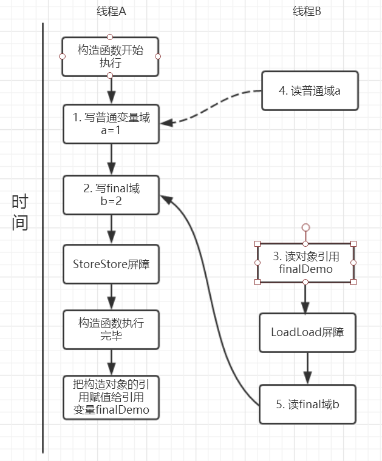

<!-- GFM-TOC -->
* [七、final关键字](#七final关键字)
    * [final的简介](#final的简介)
    * [final的具体使用场景](#final的具体使用场景)
        * [final修饰成员变量](#final修饰成员变量)
        * [final修饰局部变量](#final修饰局部变量)
        * [final修饰方法](#final修饰方法)
        * [final修饰类](#final修饰类)
    * [final在多线程中的使用](#final在多线程中的使用)
        * [final域重排序规则](#final域重排序规则)
            * [final域为基本类型](#final域为基本类型)
            * [final域为引用类型](#final域为引用类型)
<!-- GFM-TOC -->
# 七、final关键字
## final的简介
**final可以修饰变量，方法和类**，用于表示所修饰的内容一旦赋值之后就不会再被改变，比如String类就是一个final类型的类。

## final的具体使用场景
final能够修饰变量，方法和类，也就是final使用范围基本涵盖了java每个地方，
下面就分别以锁修饰的位置：变量，方法和类分别介绍。

### final修饰成员变量
```java
public class FinalExample {
    //声明变量的时候，就进行初始化
    private final int num=6;
    //类变量必须要在静态初始化块中指定初始值或者声明该类变量时指定初始值
    // private final String str; //编译错误：因为非静态变量不可以在静态初始化快中赋初值
    private final static String name;
    private final double score;
    private final char ch;
    //private final char ch2;//编译错误:TODO：因为没有在构造器、初始化代码块和声明时赋值
    
    {
        //实例变量在初始化代码块赋初值
        ch='a';
    }
    
    static {
        name="aaaaa";
    }
    
    public FinalExample(){
        //num=1;编译错误：已经赋值后，就不能再修改了
        score=90.0;
    }
    
    public void ch2(){
        //ch2='c';//编译错误：实例方法无法给final变量赋值
    }
}
```
- 类变量：必须要在静态初始化块中指定初始值或者声明该类变量时指定初始值，而且只能在这两个地方之一进行指定
- 实例变量：必要要在非静态初始化块，声明该实例变量或者在构造器中指定初始值，而且只能在这三个地方进行指定

### final修饰局部变量
final局部变量由程序员进行显式初始化，
如果final局部变量已经进行了初始化则后面就不能再次进行更改，
如果final变量未进行初始化，可以进行赋值，当且仅有一次赋值，一旦赋值之后再次赋值就会出错。

```java
public void test(){
    final int a=1;
    //a=2;//编译错误：final局部变量已经进行了初始化则后面就不能再次进行更改
}
```

> **final基本数据类型 VS final引用数据类型**

如果final修饰的是一个基本数据类型的数据，一旦赋值后就不能再次更改，
那么，如果final是引用数据类型了？这个引用的对象能够改变吗？

```java
public class FinalExample2 {
    private static class Person {
        private String name;
        private int age;

        public void setName(String name) {
            this.name = name;
        }

        public String getName() {
            return name;
        }

        public void setAge(int age) {
            this.age = age;
        }

        public int getAge() {
            return age;
        }

        public Person(String name, int age) {
            this.name=name;
            this.age = age;
        }

        @Override
        public String toString() {
            StringBuilder res=new StringBuilder();
            res.append("[").append("name="+name+",age="+age).append("]");
            return res.toString();
        }
    }

    private static final Person person=new Person("小李子",23);

    public static void main(String[] args) {
        System.out.println(person);
        person.setAge(24);
        System.out.println(person);
    }
}
```
输出结果：
```html
[name=小李子,age=23]
[name=小李子,age=24]
```
当我们对final修饰的引用数据类型变量person的属性改成24，是可以成功操作的。
通过这个实验我们就可以看出来当final修饰基本数据类型变量时，不能对基本数据类型变量重新赋值，
因此基本数据类型变量不能被改变。
而对于引用类型变量而言，它仅仅保存的是一个引用，final只保证这个引用类型变量所引用的地址不会发生改变，
即一直引用这个对象，但这个对象属性是可以改变的。

> **宏变量**

利用final变量的不可更改性，在满足以下三个条件时，该变量就会成为一个“宏变量”，即是一个常量。

- 使用final修饰符修饰
- 在定义该final变量时就指定了初始值；
- 该初始值在编译时就能够唯一确定

注意：当程序中其他地方使用该宏变量的地方，编译器会直接替换成该变量的值。

### final修饰方法
> **重写(Override)**

**被final修饰的方法不能够被子类所重写**。
比如在Object中，getClass()方法就是final的，我们就不能重写该方法，
但是hashCode()方法就不是被final所修饰的，我们就可以重写hashCode()方法。

> **重载(Overload)**

**被final修饰的方法是可以重载的**

### final修饰类
**当一个类被final修饰时，该类是不能被子类继承的**。
子类继承往往可以重写父类的方法和改变父类属性，会带来一定的安全隐患，
因此，当一个类不希望被继承时就可以使用final修饰。

> **不可变类**

final经常会被用作不变类上。我们先来看看什么是不可变类：

- 使用private和final修饰符来修饰该类的成员变量
- 提供带参的构造器用于初始化类的成员变量
- 仅为该类的成员变量提供getter方法，不提供setter方法，因为普通方法无法修改fina修饰的成员变量
- 如果有必要就重写Object类的hashCode()和equals()方法，应该保证用equals()判断相同的两个对象其Hashcode值也是相等的。

JDK中提供的八个包装类和String类都是不可变类。

## final在多线程中的使用
###  final域重排序规则
#### final为基本类型
```java
public class FinalDemo {
    private int a;  //普通域
    private final int b; //final域
    private static FinalDemo finalDemo;

    public FinalDemo() {
        a = 1; // 1. 写普通域
        b = 2; // 2. 写final域
    }

    public static void writer() {
        finalDemo = new FinalDemo();
    }

    public static void reader() {
        FinalDemo demo = finalDemo; // 3.读对象引用
        int a = demo.a;    //4.读普通域
        int b = demo.b;    //5.读final域
    }
}
```
假设线程A在执行writer()方法，线程B执行reader()方法。

> **写final域重排序规则**

> **读final域重排序规则**

#### final为引用类型

<div align="center">  </div><br>
<div align="center">  </div><br>
<div align="center">  </div><br>
<div align="center">  </div><br>