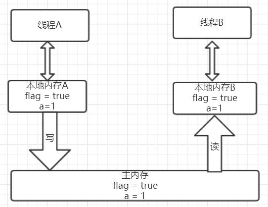
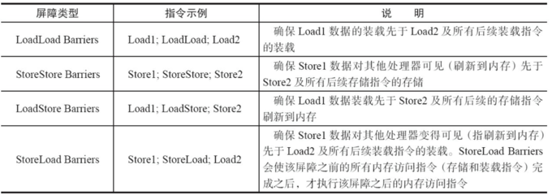
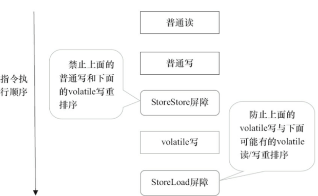

<!-- GFM-TOC -->
* [八、volatile原理](#八volatile原理)
   * [volatile简介](#volatile简介)
   * [volatile实现原理](#volatile实现原理)
   * [volatile的happens-before关系](#volatile的happens-before关系)
   * [volatile的内存语义](#volatile的内存语义)
        * [volatile的内存语义实现](#volatile的内存语义实现)
<!-- GFM-TOC -->

# 八、volatile原理
## volatile简介
Java内存模型告诉我们，各个线程会将共享变量从主内存中拷贝到工作内存，然后执行引擎会基于工作内存中的数据进行操作处理。
线程在工作内存进行操作后何时会写到主内存中？
这个时机对普通变量是没有规定的，而针对volatile修饰的变量给java虚拟机特殊的约定，
线程对volatile变量的修改会立刻被其他线程所感知，、
即不会出现数据脏读的现象，从而保证数据的“可见性”。

一言以蔽之，**被volatile修饰的变量能够保证每个线程能够获取该变量的最新值，从而避免出现数据脏读的现象**。

## volatile实现原理
volatile是怎样实现了？比如一个很简单的Java代码：

```java
instance = new Instancce() //instance是volatile变量
```
在生成汇编代码时会在volatile修饰的共享变量进行写操作的时候会多出**Lock前缀的指令**。
我们想这个Lock指令肯定有神奇的地方，那么Lock前缀的指令在多核处理器下会发现什么事情了？主要有这两个方面的影响：

- 将当前处理器缓存行的数据写回系统内存
- 这个写回内存的操作会使得其他CPU里缓存了该内存地址的数据无效

为了提高处理速度，处理器不直接和内存进行通信，
而是先将系统内存的数据读到内部缓存（L1，L2或其他）后再进行操作，但操作完不知道何时会写到内存。
如果对声明了volatile的变量进行写操作，
JVM就会向处理器发送一条Lock前缀的指令，将这个变量所在缓存行的数据写回到系统内存。
但是，就算写回到内存，如果其他处理器缓存的值还是旧的，再执行计算操作就会有问题。

在多处理器下，为了保证各个处理器的缓存是一致的，
就会实现**缓存一致性协议**，每个处理器通过嗅探在总线上传播的数据来检查自己缓存的值是不是过期了，
当处理器发现自己缓存行对应的内存地址被修改，就会将当前处理器的缓存行设置成无效状态，
当处理器对这个数据进行修改操作的时候，会重新从系统内存中把数据读到处理器缓存里。
因此，经过分析我们可以得出如下结论：

- Lock前缀的指令会引起处理器缓存写回内存
- 一个处理器的缓存回写到内存会导致其他处理器的缓存失效
- 当处理器发现本地缓存失效后，就会从内存中重读该变量数据，即可以获取当前最新值

这样volatile变量通过这样的机制就使得每个线程都能获得该变量的最新值。

## volatile的happens-before关系
happens-before中的volatile 变量规则（Volatile Variable Rule）：对一个 volatile 变量的写操作先行发生于后面对这个变量的读操作。

```java
public class VolatileExample {
    private int a = 0;
    private volatile boolean flag = false;
    public void writer(){
        a = 1;          //1
        flag = true;   //2
    }
    public void reader(){
        if(flag){      //3
            int i = a; //4
        }
    }
}
```

对应的happens-before关系如下:

<div align="center">  </div><br>

加锁线程A先执行writer方法，然后线程B执行reader方法。
图中每一个箭头两个节点就代码一个happens-before关系：

- 黑色的代表根据程序顺序规则推导出来
- 红色的是根据volatile变量的写happens-before 于任意后续对volatile变量的读
- 蓝色的就是根据传递性规则推导出来的
这里的2 happen-before 3，同样根据happens-before规则定义：
如果A happens-before B,则A的执行结果对B可见，并且A的执行顺序先于B的执行顺序，
我们可以知道操作2执行结果对操作3来说是可见的，也就是说当线程A将volatile变量 flag更改为true后线程B就能够迅速感知。

## volatile的内存语义
```java
public class VolatileExample {
    private int a = 0;
    private volatile boolean flag = false;
    public void writer(){
        a = 1;          //1
        flag = true;   //2
    }
    public void reader(){
        if(flag){      //3
            int i = a; //4
        }
    }
}
```

假设线程A先执行writer方法，线程B随后执行reader方法，
初始时线程的本地内存中flag和a都是初始状态，下图是线程A执行volatile写后的状态图：

<div align="center">  </div><br>

当volatile变量写后，线程B中本地内存中共享变量就会置为失效的状态，
因此线程B需要从主内存中去读取该变量的最新值。下图就展示了线程B读取同一个volatile变量的内存变化示意图：

<div align="center">  </div><br>

从横向来看，线程A和线程B之间进行了一次通信，
线程A在写volatile变量时，
实际上就像是给B发送了一个消息告诉线程B你现在的值都是旧的了，
然后线程B读这个volatile变量时就像是接收了线程A刚刚发送的消息。
既然是旧的了，那线程B该怎么办了？自然而然就只能去主内存去取啦。

### volatile的内存语义实现
为了性能优化，JMM在不改变正确语义的前提下，会允许编译器和处理器对指令序列进行重排序，那如果想阻止重排序要怎么办了？
答案是可以添加**内存屏障**。

四类JMM内存屏障：

<div align="center">  </div><br>

**Java编译器会在生成指令系列时在适当的位置会插入内存屏障指令来禁止特定类型的处理器重排序**。
为了实现volatile的内存语义，JMM会限制特定类型的编译器和处理器重排序，JMM会针对编译器制定volatile重排序规则表：

<div align="center">  </div><br>

"NO"表示禁止重排序。
为了实现volatile内存语义时，编译器在生成字节码时，会在指令序列中插入内存屏障来禁止特定类型的处理器重排序。
对于编译器来说，发现一个最优布置来最小化插入屏障的总数几乎是不可能的，为此，JMM采取了保守策略：

- 在每个volatile写操作的前面插入一个StoreStore屏障
- 在每个volatile写操作的后面插入一个StoreLoad屏障

<div align="center">  </div><br>

- 在每个volatile读操作的后面插入一个LoadLoad屏障
- 在每个volatile读操作的后面插入一个LoadStore屏障

<div align="center">  </div><br>

需要注意的是：volatile写是在前面和后面分别插入内存屏障，而volatile读操作是在后面插入两个内存屏障。