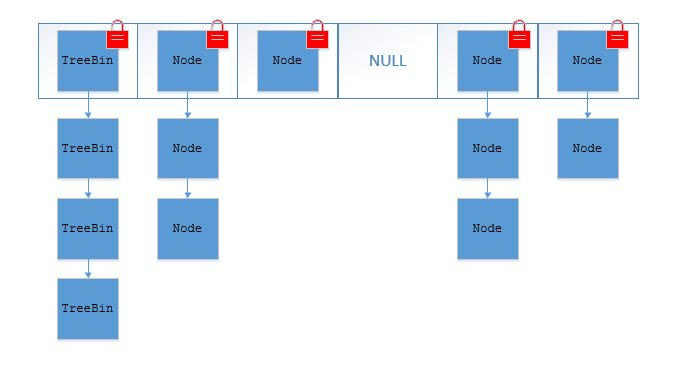

<!-- GFM-TOC -->
* [十七、并发容器](#并发容器)
  * [ConcurrentHashMap](#ConcurrentHashMap)
    * [ConcurrentHashMap底层具体实现](#ConcurrentHashMap底层具体实现)
    * [ConcurrentHashMap和Hashtable的区别](#ConcurrentHashMap和Hashtable的区别)
  * [CopyOnWriteArrayList](#CopyOnWriteArrayList)
    * [CopyOnWriteArrayList的实现机制](#CopyOnWriteArrayList的实现机制)
    * [CopyOnWriteArrayList读取和写入源码简单分析](#CopyOnWriteArrayList读取和写入源码简单分析)
  * [ConcurrentLinkedQueue](#ConcurrentLinkedQueue)
  * [BlockingQueue](#BlockingQueue)
<!-- GFM-TOC -->
# 并发容器
## ConcurrentHashMap
### ConcurrentHashMap底层具体实现
**JDK 1.7底层实现**

<div align="center"></div>

将数据分为一段一段的存储，然后给每一段数据配一把锁，
当一个线程占用锁访问其中一个段数据时，其他段的数据也能被其他线程访问。

ConcurrentHashMap是由**Segment数组结构**和**HashEntry数组结构**组成。
其中Segment 实现了 ReentrantLock,所以**Segment是一种可重入锁**，扮演锁的角色。
HashEntry 用于存储键值对数据。

一个ConcurrentHashMap里包含一个Segment数组。
**Segment结构和HashMap类似**，是一种数组和链表结构，
一个Segment包含一个HashEntry数组，每个HashEntry是一个链表结构的元素，
每个Segment守护着一个HashEntry数组里的元素，当对HashEntry数组的数据进行修改时，必须首先获得对应的Segment的锁。


**JDK 1.8底层实现**

TreeBin: 红黑二叉树节点 Node: 链表节点

<div align="center"></div>

ConcurrentHashMap取消了Segment分段锁，**采用CAS和synchronized来保证并发安全**。
数据结构与HashMap1.8的结构类似，数组+链表/红黑二叉树。

synchronized只锁定当前链表或红黑二叉树的首节点，这样只要**hash值不冲突，就不会产生并发**。

### ConcurrentHashMap和Hashtable的区别
**底层数据结构：**

- JDK1.7 的ConcurrentHashMap底层采用**分段的数组+链表**实现，
JDK1.8 的ConcurrentHashMap底层采用的数据结构与JDK1.8 的HashMap的结构一样，**数组+链表/红黑二叉树**。

- Hashtable和JDK1.8 之前的HashMap的底层数据结构类似都是采用**数组+链表**的形式，
数组是 HashMap 的主体，链表则是主要为了解决哈希冲突而存在的

**实现线程安全的方式**

- JDK1.7的ConcurrentHashMap（分段锁）对整个桶数组进行了分割分段(Segment)，
 每一把锁只锁容器其中一部分数据，多线程访问容器里不同数据段的数据，就不会存在锁竞争，提高并发访问率。
JDK 1.8 采用**数组+链表/红黑二叉树**的数据结构来实现，并发控制使用**synchronized和CAS**来操作。

- Hashtable:使用 synchronized 来保证线程安全，效率非常低下。
当一个线程访问同步方法时，其他线程也访问同步方法，可能会进入阻塞或轮询状态，
如使用 put 添加元素，另一个线程不能使用 put 添加元素，也不能使用 get，竞争会越来越激烈。

HashTable全表锁

<div align="center"></div>

ConcurrentHashMap分段锁

<div align="center"></div>

## CopyOnWriteArrayList
```java
public class CopyOnWriteArrayList<E> extends Object
implements List<E>, RandomAccess, Cloneable, Serializable
```

在很多应用场景中，读操作可能会远远大于写操作。
由于读操作根本不会修改原有的数据，因此对于每次读取都进行加锁其实是一种资源浪费。
我们应该允许多个线程同时访问List的内部数据，毕竟读取操作是安全的。
这和ReentrantReadWriteLock读写锁的思想非常类似，也就是读读共享、写写互斥、读写互斥、写读互斥。
JDK中提供了CopyOnWriteArrayList类比相比于在读写锁的思想又更进一步。
为了将读取的性能发挥到极致，**CopyOnWriteArrayList 读取是完全不用加锁的，并且写入也不会阻塞读取操作**。
只有写入和写入之间需要进行同步等待。这样，读操作的性能就会大幅度提高。

### CopyOnWriteArrayList的实现机制
CopyOnWriteArrayLis 类的所有可变操作（add，set等等）都是通过**创建底层数组的新副本**来实现的。
当 List 需要被修改的时候，我并不修改原有内容，而是对原有数据进行一次复制，将修改的内容写入副本。
写完之后，再将修改完的副本替换原来的数据，这样就可以**保证写操作不会影响读操作**了。

CopyOnWriteArrayList是满足CopyOnWrite的ArrayList，
所谓CopyOnWrite也就是说：
在计算机，如果你想要对一块内存进行修改时，我们不在原有内存块中进行写操作，
而是将内存拷贝一份，在新的内存中进行写操作，写完之后呢，就将指向原来内存指针指向新的内存，
原来的内存就可以被回收掉了。

### CopyOnWriteArrayList读取和写入源码简单分析
- CopyOnWriteArrayList读取操作的实现

读取操作没有任何同步控制和锁操作，
因为内部数组array不会发生修改，只会被另外一个array替换，因此可以保证数据安全。

```java
/** The array, accessed only via getArray/setArray. */
private transient volatile Object[] array;
public E get(int index) {
    return get(getArray(), index);
}
@SuppressWarnings("unchecked")
private E get(Object[] a, int index) {
    return (E) a[index];
}
final Object[] getArray() {
    return array;
}
```

- CopyOnWriteArrayList读取操作的实现

CopyOnWriteArrayList 写入操作 add() 方法在添加集合的时候加了锁，
**保证同步，避免了多线程写的时候会复制出多个副本出来**。

```java
/**
 * Appends the specified element to the end of this list.
 */
public boolean add(E e) {
    final ReentrantLock lock = this.lock;
    lock.lock();//加锁
    try {
        Object[] elements = getArray();
        int len = elements.length;
        Object[] newElements = Arrays.copyOf(elements, len + 1);//拷贝新数组
        newElements[len] = e;
        setArray(newElements);
        return true;
    } finally {
        lock.unlock();//释放锁
    }
}
```

## ConcurrentLinkedQueue
Java提供的线程安全的 Queue 可以分为阻塞队列和非阻塞队列，其中阻塞队列的典型例子是 BlockingQueue，
非阻塞队列的典型例子是ConcurrentLinkedQueue，在实际应用中要根据实际需要选用阻塞队列或者非阻塞队列。 
阻塞队列可以通过加锁来实现，非阻塞队列可以**通过CAS操作**实现。

ConcurrentLinkedQueue使用**链表**作为其数据结构。
ConcurrentLinkedQueue应该算是在高并发环境中性能最好的队列了。
它之所有能有很好的性能，是因为其内部复杂的实现。

ConcurrentLinkedQueue 主要**使用CAS非阻塞算法来实现线程安全**。
适合在对性能要求相对较高，对个线程同时对队列进行读写的场景，
即如果对队列加锁的成本较高则适合使用无锁的ConcurrentLinkedQueue来替代。

## BlockingQueue
java.util.concurrent.BlockingQueue 接口有以下阻塞队列的实现：

- FIFO 队列 ：LinkedBlockingQueue、ArrayBlockingQueue（固定长度）
- 优先级队列 ：PriorityBlockingQueue

提供了阻塞的 take() 和 put() 方法：如果队列为空 take() 将阻塞，直到队列中有内容；
如果队列为满 put() 将阻塞，直到队列有空闲位置。

**使用 BlockingQueue 实现生产者消费者问题**

```java
public class ProducerConsumer {

    private static BlockingQueue<String> queue = new ArrayBlockingQueue<>(5);

    private static class Producer extends Thread {
        @Override
        public void run() {
            try {
                queue.put("product");
            } catch (InterruptedException e) {
                e.printStackTrace();
            }
            System.out.print("produce..");
        }
    }

    private static class Consumer extends Thread {

        @Override
        public void run() {
            try {
                String product = queue.take();
            } catch (InterruptedException e) {
                e.printStackTrace();
            }
            System.out.print("consume..");
        }
    }
}
```
```java
public static void main(String[] args) {
    for (int i = 0; i < 2; i++) {
        Producer producer = new Producer();
        producer.start();
    }
    for (int i = 0; i < 5; i++) {
        Consumer consumer = new Consumer();
        consumer.start();
    }
    for (int i = 0; i < 3; i++) {
        Producer producer = new Producer();
        producer.start();
    }
}
```
```html
produce..produce..consume..consume..produce..consume..produce..consume..produce..consume..
```