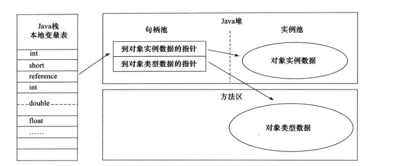

- [返回首页](https://github.com/DuHouAn/Java#art-%E6%A8%A1%E5%9D%97%E4%BA%8C-Java%E8%99%9A%E6%8B%9F%E6%9C%BA)

<!-- GFM-TOC -->
* [一、运行时数据区域](#一运行时数据区域)
    * [程序计数器](#程序计数器)
    * [Java 虚拟机栈](#java-虚拟机栈)
    * [本地方法栈](#本地方法栈)
    * [堆](#堆)
    * [方法区](#方法区)
    * [运行时常量池](#运行时常量池)
    * [直接内存](#直接内存)
* [二、HotSpot虚拟机对象](#二HotSpot虚拟机对象)
    * [对象的创建](#对象的创建)
    * [对象的内存布局](#对象的内存布局)
    * [对象的访问定位](#对象的访问定位)
* [三、String类和常量池](#三String类和常量池)
* [四、8种基本类型的包装类和常量池](#四8种基本类型的包装类和常量池)
<!-- GFM-TOC -->
# 一、运行时数据区域

<div align="center">  </div><br>

- [相应脑图](http://naotu.baidu.com/file/a5959caf412653224d1d967f6d007fa7?token=d2fa05cf3f671e4c)

## 程序计数器

记录正在执行的虚拟机字节码指令的地址（如果正在执行的是本地方法则为空）。

## Java 虚拟机栈

每个 Java 方法在执行的同时会创建一个**栈帧**用于**存储局部变量表**、**操作数栈**、**常量池引用等信息**。
从方法调用直至执行完成的过程，就对应着一个栈帧在 Java 虚拟机栈中入栈和出栈的过程。
对于执行引擎来说，活动线程中，只有栈顶的栈帧是有效的，称为**当前栈帧**，这个栈帧所关联的方法称为**当前方法**。
执行引擎所运行的所有字节码指令都只针对当前栈帧进行操作。

<div align="center">  </div><br>

```html
操作数栈：
一个后进先出（Last-In-First-Out）的操作数栈，也可以称之为表达式栈（Expression Stack）。
操作数栈和局部变量表在访问方式上存在着较大差异，操作数栈并非采用访问索引的方式来进行数据访问的，
而是**通过标准的入栈和出栈操作来完成一次数据访问**。
每一个操作数栈都会拥有一个明确的栈深度用于存储数值，一个32bit的数值可以用一个单位的栈深度来存储，而2个单位的栈深度则可以保存一个64bit的数值，
当然操作数栈所需的容量大小在编译期就可以被完全确定下来，并保存在方法的Code属性中。
```

可以通过 -Xss 这个虚拟机参数来指定每个线程的 Java 虚拟机栈内存大小：

```java
java -Xss512M HackTheJava
```

该区域可能抛出以下异常：

- 当线程请求的栈深度超过最大值，会抛出 StackOverflowError 异常；
- 栈进行动态扩展时如果无法申请到足够内存，会抛出 OutOfMemoryError 异常。

## 本地方法栈

本地方法栈与 Java 虚拟机栈类似，它们之间的区别只不过是本地方法栈为本地方法服务。

本地方法一般是用其它语言（C、C++ 或汇编语言等）编写的，并且被编译为基于本机硬件和操作系统的程序，对待这些方法需要特别处理。

<div align="center">  </div><br>

## 堆

所有对象都在这里分配内存，是垃圾收集的主要区域（"GC 堆"）。

现代的垃圾收集器基本都是采用分代收集算法，其主要的思想是针对不同类型的对象采取不同的垃圾回收算法，可以将堆分成两块：

- 新生代（Young Generation）
- 老年代（Old Generation）

堆不需要连续内存，并且可以动态增加其内存，增加失败会抛出 OutOfMemoryError 异常。

可以通过 -Xms 和 -Xmx 两个虚拟机参数来指定一个程序的堆内存大小，第一个参数设置初始值，第二个参数设置最大值。

```java
java -Xms1M -Xmx2M HackTheJava
```

<div align="center">  </div><br>


## 方法区

用于存放已被加载的类信息、常量、静态变量、即时编译器编译后的代码等数据。

和堆一样不需要连续的内存，并且可以动态扩展，动态扩展失败一样会抛出 OutOfMemoryError 异常。

对这块区域进行垃圾回收的主要目标是**对常量池的回收和对类的卸载**，但是一般比较难实现。

HotSpot 虚拟机把它当成永久代来进行垃圾回收。但是很难确定永久代的大小，因为它受到很多因素影响，并且每次 Full GC 之后永久代的大小都会改变，所以经常会抛出 OutOfMemoryError 异常。为了更容易管理方法区，从 JDK 1.8 开始，移除永久代，并把方法区移至元空间，它位于本地内存中，而不是虚拟机内存中。

## 运行时常量池

运行时常量池是方法区的一部分。

Class 文件中的常量池（编译器生成的各种字面量和符号引用）会在类加载后被放入这个区域。

除了在编译期生成的常量，还允许动态生成，例如 String 类的 intern()。

## 直接内存

在 JDK 1.4 中新加入了 NIO 类，它可以使用 Native 函数库直接分配堆外内存（Native 堆），然后通过一个存储在 Java 堆里的 DirectByteBuffer 对象作为这块内存的引用进行操作。

这样能在一些场景中显著提高性能，**因为避免了在 Java 堆和 Native 堆中来回复制数据**。


# 二、HotSpot虚拟机对象
## 对象的创建
对象的创建步骤：

<div align="center">  </div><br>

1. **类加载检查**

虚拟机遇到一条 new 指令时，首先将去检查这个指令的参数是否能在常量池中定位到这个类的**符号引用**，
并且检查这个符号引用代表的类是否已被加载过、解析和初始化过。
如果没有，那必须先执行相应的类加载过程。

2. **分配内存**

在类加载检查通过后，接下来虚拟机将为新生对象分配内存。
对象所需的内存大小在类加载完成后便可确定，为对象分配空间的任务等同于把一块确定大小的内存从 Java 堆中划分出来。分配方式有 “指针碰撞” 和 “空闲列表” 两种，选择那种分配方式由 Java 堆是否规整决定，
而Java堆是否规整又由所采用的**垃圾收集器是否带有压缩整理功能**决定。

- 内存分配的两种方式

| 内存分配的两种方式 | **指针碰撞** | **空闲列表** |
| :--: | :--: | :--: |
| 适用场景 | 堆内存规整(即没有内存碎片)的情况 | 堆内存不规整的情况 |
| 原理 | 用过的内存全部整合到一边，没有用过的内存放在另一边，中间有一个分界值指针，只需要向着没用过的内存方向将指针移动一段与对象大小相等的距离 | 虚拟机会维护一个列表，在该列表和总分记录哪些内存块是可用的，在分配的时候，找一块足够大的内存块划分给对象示例，然后更新列表记录 |
| GC收集器 | Serial ParNew |  CMS |

- 内存分配并发问题

在创建对象的时候有一个很重要的问题，就是线程安全，因为在实际开发过程中，创建对象是很频繁的事情，
作为虚拟机来说，必须要保证线程是安全的，通常来讲，虚拟机采用两种方式来保证线程安全：

(1)CAS+失败重试： CAS 是乐观锁的一种实现方式。所谓乐观锁就是，
每次不加锁而是假设没有冲突而去完成某项操作，
如果因为冲突失败就重试，直到成功为止。
虚拟机采用CAS配上失败重试的方式保证更新操作的原子性。

(2)TLAB: 每一个线程预先在Java堆中分配一块内存，称为本地线程分配缓冲(Thread Local Allocation Buffer,TLAB)。
哪个线程要分配内存，就在哪个线程的TLAB上分配，只有TLAB用完并分配新的TLAB时，才采用上述的CAS进行内存分配。


3. **初始化零值**

内存分配完成后，虚拟机需要将分配到的内存空间都初始化为零值（不包括对象头），
这一步操作**保证了对象的实例字段在 Java 代码中可以不赋初始值就直接使用**，
程序能访问到这些字段的数据类型所对应的零值。

4. **设置对象头** 

初始化零值完成之后，虚拟机要对对象进行必要的设置，
例如这个对象是那个类的实例、如何才能找到类的元数据信息、对象的哈希吗、对象的 GC 分代年龄等信息。 
这些信息存放在对象头中。 
另外，根据虚拟机当前运行状态的不同，如是否启用偏向锁等，对象头会有不同的设置方式。

5. **执行init方法** 

在上面工作都完成之后，从虚拟机的视角来看，一个新的对象已经产生了，
但从 Java 程序的视角来看，对象创建才刚开始，**\<init\> 方法还没有执行，所有的字段都还为零**。
所以一般来说，执行 new 指令之后会接着执行 \<init \> 方法，
把**对象按照程序员的意愿进行初始化**，这样一个真正可用的对象才算完全产生出来。

## 对象的内存布局
在 Hotspot 虚拟机中，对象在内存中的布局可以分为3块区域：

**(1)对象头**

**(2)实例数据**

**(3)对齐填充**

1. **对象头**

Hotspot虚拟机的对象头包括两部分信息：

一部分用于存储对象自身的运行时数据（哈希码、GC分代年龄、锁状态标志等等），

另一部分是类型指针，即对象指向它的**类元数据的指针**，虚拟机通过这个指针来**确定这个对象是那个类的实例**。

2. **实例数据**

实例数据部分是对象真正存储的有效信息，也是在程序中所定义的各种类型的字段内容。

3. **对齐填充**

对齐填充部分不是必然存在的，也没有什么特别的含义，仅仅起**占位**作用。
 因为Hotspot虚拟机的自动内存管理系统要求对象起始地址必须是8字节的整数倍，
 换句话说就是对象的大小必须是8字节的整数倍。而对象头部分正好是8字节的倍数（1倍或2倍），
 因此，当对象实例数据部分没有对齐时，就需要通过对齐填充来补全。

## 对象的访问定位
建立对象就是为了使用对象，我们的Java程序通过栈上的 reference 数据来操作堆上的具体对象。
对象的访问方式视虚拟机的实现而定，目前主流的访问方式有两种：

(1)**使用句柄**

(2)**直接指针**

1. **使用句柄**

如果使用句柄的话，那么**Java堆**中将会划分出一块内存来作为句柄池，
reference中存储的就是**对象的句柄地址**，而句柄中包含了对象实例数据与类型数据各自的具体地址信息 

<div align="center">  </div><br>

2. **直接指针**

如果使用直接指针访问，那么Java 堆对象的布局中就必须考虑如何放置访问类型数据的相关信息，
而reference中存储的直接就是**对象的地址**。

<div align="center">  </div><br>


这两种对象访问方式各有优势:

(1)使用句柄来访问的最大好处是 reference 中存储的是稳定的句柄地址，
在对象被移动时只会改变句柄中的实例数据指针，而**reference本身不需要修改**。

(2)使用直接指针访问方式最大的好处就是**速度快**，它节省了一次指针定位的时间开销。

# 三、String类和常量池

1. String对象的两种创建方式

```java
String str1 = "abcd";
String str2 = new String("abcd");
System.out.println(str1==str2);//false
```

这两种不同的创建方法是有差别的:

第一种方式是在常量池中获取对象("abcd" 属于字符串字面量，因此编译时期会在常量池中创建一个字符串对象)，

第二种方式一共会创建两个字符串对象（前提是 String Pool 中还没有 "abcd" 字符串对象）。

- "abcd" 属于字符串字面量，因此编译时期会在常量池中创建一个字符串对象，指向这个 "abcd" 字符串字面量；

- 使用 new 的方式会在堆中创建一个字符串对象。

<div align="center">  </div><br>

2. String类型的常量池比较特殊。它的主要使用方法有两种：

- 直接使用双引号声明出来的String对象会**直接存储在常量池**中。

- 如果不是用双引号声明的String对象,可以使用 String 提供的 intern 方法。
String.intern() 是一个 Native 方法，它的作用是：
如果运行时常量池中已经包含一个等于此 String 对象内容的字符串，则**返回常量池中该字符串的引用**；
如果没有，则**在常量池中创建与此 String 内容相同的字符串，并返回常量池中创建的字符串的引用**。

```java
String s1 = new String("计算机");
String s2 = s1.intern();
String s3 = "计算机";
System.out.println(s2);//计算机
System.out.println(s1 == s2);//false，因为一个是堆内存中的String对象一个是常量池中的String对象，
System.out.println(s2 == s3);//true，因为两个都是常量池中的String对象
```

3. 字符串拼接：

```java
String str1 = "str";
String str2 = "ing";
		  
String str3 = "str" + "ing";//常量池中的对象
String str4 = str1 + str2; //TODO:在堆上创建的新的对象	  
String str5 = "string";//常量池中的对象
System.out.println(str3 == str4);//false
System.out.println(str3 == str5);//true
System.out.println(str4 == str5);//false
```

<div align="center">  </div><br>

注意：尽量避免多个字符串拼接，因为这样会重新创建对象。
如果需要改变字符串的话，可以使用 **StringBuilder** 或者 **StringBuffer**。


> 面试题：String s1 = new String("abc");问创建了几个对象？

创建2个字符串对象（前提是 String Pool 中还没有 "abcd" 字符串对象）。

- "abc" 属于字符串字面量，因此编译时期会**在常量池中创建一个字符串对象**，指向这个 "abcd" 字符串字面量；

- 使用 new 的方式会在堆中创建一个字符串对象。

(字符串常量"abc"在**编译期**就已经确定放入常量池，而 Java **堆上的"abc"是在运行期**初始化阶段才确定)。

```java
String s1 = new String("abc");// 堆内存的地址值
String s2 = "abc";
System.out.println(s1 == s2);// 输出false
//因为一个是堆内存，一个是常量池的内存，故两者是不同的。
System.out.println(s1.equals(s2));// 输出true
```

# 四、8种基本类型的包装类和常量池
- Java基本类型的包装类的大部分都实现了常量池技术，
即Byte,Short,Integer,Long,Character,Boolean；
这5种包装类默认创建了数值**[-128，127]**的相应类型的缓存数据，
但是超出此范围仍然会去创建新的对象。

- **两种浮点数类型的包装类Float,Double 并没有实现常量池技术**。

valueOf() 方法的实现比较简单，就是先判断值是否在缓存池中，如果在的话就直接返回缓存池的内容。

Integer的部分源码：

```java
public static Integer valueOf(int i) {
    if (i >= IntegerCache.low && i <= IntegerCache.high)
        return IntegerCache.cache[i + (-IntegerCache.low)];
    return new Integer(i);
}
```
在 Java 8 中，Integer 缓存池的大小默认为 -128~127。

```java
static final int low = -128;
static final int high;
static final Integer cache[];

static {
    // high value may be configured by property
    int h = 127;
    String integerCacheHighPropValue =
        sun.misc.VM.getSavedProperty("java.lang.Integer.IntegerCache.high");
    if (integerCacheHighPropValue != null) {
        try {
            int i = parseInt(integerCacheHighPropValue);
            i = Math.max(i, 127);
            // Maximum array size is Integer.MAX_VALUE
            h = Math.min(i, Integer.MAX_VALUE - (-low) -1);
        } catch( NumberFormatException nfe) {
            // If the property cannot be parsed into an int, ignore it.
        }
    }
    high = h;

    cache = new Integer[(high - low) + 1];
    int j = low;
    for(int k = 0; k < cache.length; k++)
        cache[k] = new Integer(j++);

    // range [-128, 127] must be interned (JLS7 5.1.7)
    assert IntegerCache.high >= 127;
}
```

- 示例1:

```java
Integer i1=40;
//Java 在编译的时候会直接将代码封装成 Integer i1=Integer.valueOf(40);从而使用常量池中的对象。
Integer i2 = new Integer(40);
//创建新的对象。
System.out.println(i1==i2);//输出false
```

- 示例2：Integer有自动拆装箱功能
```java
Integer i1 = 40;
Integer i2 = 40;
Integer i3 = 0;
Integer i4 = new Integer(40);
Integer i5 = new Integer(40);
Integer i6 = new Integer(0);
  
System.out.println("i1=i2   " + (i1 == i2)); //输出 i1=i2  true
System.out.println("i1=i2+i3   " + (i1 == i2 + i3)); //输出 i1=i2+i3  true
//i2+i3得到40,比较的是数值
System.out.println("i1=i4   " + (i1 == i4)); //输出 i1=i4 false
System.out.println("i4=i5   " + (i4 == i5)); //输出 i4=i5 false
//i5+i6得到40，比较的是数值
System.out.println("i4=i5+i6   " + (i4 == i5 + i6)); //输出 i4=i5+i6 true
System.out.println("40=i5+i6   " + (40 == i5 + i6)); //输出 40=i5+i6 true    
```