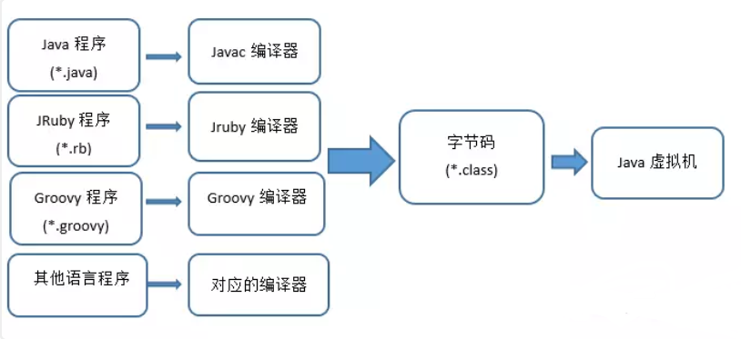
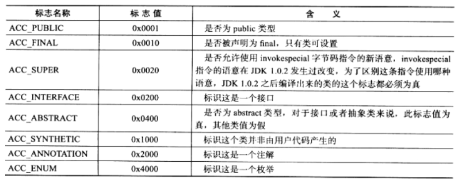
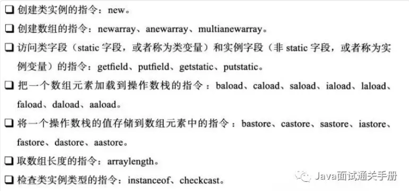
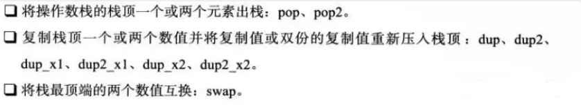

<!-- GFM-TOC -->
* [四、Java类文件结构](#四Java类文件结构)
    * [Class类文件结构](#Class类文件结构)
        * [魔数与Class文件版本](#魔数与Class文件版本)
        * [常量池](#常量池)
        * [访问标志](#访问标志)
        * [类索引、父类索引与接口索引集合](#类索引父类索引与接口索引集合)
        * [字段表集合](#字段表集合)
        * [方法表集合](#方法表集合)
        * [属性表集合](#属性表集合)
    * [字节码指令简介](#字节码指令简介)
        * [字节码与数据类型](#字节码与数据类型)
        * [加载和存储指令](#加载和存储指令)
        * [运算指令](#运算指令)
        * [类型转换指令](#类型转换指令)
        * [对象创建与访问指令](#对象创建与访问指令)
        * [操作数栈管理指令](#操作数栈管理指令)
        * [控制转移指令](#控制转移指令)
        * [方法调用和返回指令](#方法调用和返回指令)
        * [异常处理指令](#异常处理指令)
        * [同步指令](#同步指令)
    * [虚拟机实现的两种方式](#虚拟机实现的两种方式)
    * [Class文件结构的发展](#Class文件结构的发展)
<!-- GFM-TOC -->

# 四、Java类文件结构

Java虚拟机不和包括Java在内的任何语言绑定，只与 "Class文件" 这种特定的二进制文件所关联，
Class文件中包含了Java虚拟机**指令集合符号表**以及若干其它辅助信息。
Java虚拟机作为一个通用的、机器无关的执行平台，任何其他语言都可以将其作为语言的产品交付媒介。

<div align="center">  </div><br>

## Class类文件结构

Class文件是一组以8位字节为基础的**二进制流**，
各个数据项目严格按照顺序紧凑地排列在Class文件之中，中间没有添加任何分隔符，
这使得整个Class文件中存储的内容几乎全部是程序运行的必要数据，没有空隙存在。
当遇到需要占用8位字节以上空间的数据项时，则会按照**高位在前**的方式分割成若干个8位字节进行存储。

Class文件格式采用一种类似于C语言结构体的伪结构来存储数，这种伪结构有两种数据类型：

**无符号数**

**表**

无符号数：属于基本数据类型，以u1、u2、u4、u8来代表1个字节、2个字节、4个字节、8个字节的无符号数，
无符号数可以用来描述数字、索引引用、数量值或者按照UTF-8编码构成字符串值。

表：由多个无符号数或者其他表作为数据项构成的复合数据类型，所有表都习惯性地以"_info"结尾。
表用于描述有层次关系的复合结构的数据，整个Class文件本质上就是一张表。

- 注意：Class文件结构不像XML等描述语言，由于它没有任何分割符号，
所以无论是数量甚至于数据存储的字节序这样的细节都被严格限定，
哪个字节代表什么含义，长度是多少，先后顺序如何，都不允许改变。

### 魔数与Class文件版本
每个Class文件的头四个字节称为魔数（Magic Number）,
它的唯一作用是**确定这个文件是否为一个能被虚拟机接收的Class文件**。
紧接着魔数的四个字节存储的是Class文件的版本号：
第五和第六是次版本号，第七和第八是主版本号。

<div align="center">  </div><br>

### 常量池
紧接着主次版本号之后的是常量池入口，**常量池可以理解为Class文件之中的资源仓库**，
它是Class文件结构中与其他项目关联最多的数据类型，也是占用Class文件空间最大的数据项目之一，
同时它还是在Class文件中第一个出现的表类型数据项目。
常量池主要存放两大常量：**字面量**和**符号引用**。
字面量比较接近于java语言层面的的常量概念，如文本字符串、声明为final的常量值等。
而符号引用则属于**编译原理方面的概念**。包括下面三类常量：

- 类和接口的全限定名

- 字段的名称和描述符

- 方法的名称和描述符

由于常量池中常量的数量是不固定的，所以在常量池的入口需要设置一项u2类型的数据，代表常量池容量计数值。
与Java中语言习惯不一样的是，这个容量技术是从1而不是0开始的，如下图表示，常量池容量（偏移地址：0x00000008）

为十六进制数0x0016，即十进制22，这代表常量池中有21项常量，索引值范围为1~21。在Class文件格式规范制定之时，设计者将第0项常量空出来是有特殊考虑的，这样做的目的在于
满足后面某些指向常量池的索引值的数据在特定情况下需要表达

"不引用任何一个常量池项目"的含义，这种情况就可以把索引值置为0来表示。
**Class文件结构中只有常量池的容量计数从1开始**，
对于其他集合类型，包括接口索引结合，字段表集合，方法表集合等容量技术都与一般习惯相同，从0开始。

<div align="center">  </div><br>

### 访问标志
在常量池结束之后，紧接着的两个字节代表访问标志，
这个标志用于识别一些类或者接口层次的访问信息，
包括：这个Class是类还是接口，是否为public或者abstract类型，如果是类的话是否声明为final等等。
标志位和标志的含义对应如下：

<div align="center">  </div><br>

### 类索引、父类索引与接口索引集合
类索引、父类索引与接口索引集合都按顺序排列在访问标志之后，
Class文件由这三项数据来确定这个**类的继承关系**。
类索引用于确定**这个类的全限定名**，
父类索引用于确定**这个类的父类的全限定名**，由于java语言的单继承，所以父类索引只有一个，
除了java.lang.Object之外，所有的java类都有父类，因此除了java.lang.Object外，所有java类的父类索引都不为0。
接口索引集合用来描述**这个类实现了哪些接口**，这些被实现的接口将按
implents(如果这个类本身是接口的话则是extends)后的接口顺序从左到右排列在
接口索引集合中。

### 字段表集合
字段表（field info）用于描述接口或类中声明的变量。
字段包括**类变量**和**实例变量**，但不包括在方法内部声明的局部变量。

我们可以想一想在Java中描述一个字段可以包含什么信息呢?

字段的作用域（public ,private,protected修饰符），是实例变量还是类变量（static修饰符）、
可变性（final）、并发可见性（volatile修饰符，是否强制从主内存读写）、可否被序列化（transient修饰符）、
字段数据类型、字段名称。

上述这些信息中，各个修饰符都是布尔值，要么有某个修饰符，要么没有，很适合使用标志位来表示。
而字段叫什么名字、字段被定义为什么数据类型这些都是无法固定的，只能引用常量池中常量来描述。

### 方法表集合
Class文件存储格式中对方法的描述与对字段的描述几乎采用了完全一致的方式。
方法表的结构如同字段表一样，依次包括了访问标志、名称索引、描述符索引、属性表集合几项。

- 注意：因为volatile修饰符和transient修饰符不可以修饰方法，
所以方法表的访问标志中没有这两个对应的标志，但是增加了synchronized、native、abstract等关键字修饰方法，
所以也就多了这些关键字对应的标志。

### 属性表集合
在Class文件，**字段表，方法表中都可以携带自己的属性表集合**，以用于描述某些场景专有的信息。
与Class文件中其它的数据项目要求的顺序、长度和内容不同，属性表集合的限制稍微宽松一些，
不再要求各个属性表具有严格的顺序，并且只要不与已有的属性名重复，
任何人实现的编译器都可以向属性表中写入自己定义的属性信息，Java虚拟机运行时会忽略掉它不认识的属性。

## 字节码指令简介
### 字节码与数据类型
在java虚拟机的指令集中，大多数的指令都包含了其操作所对应的数据类型信息，
例如iload指令用于从局部变量表中加载int类型的数据到操作数栈中，而fload指令加载的则是float类型的数据。
这两条指令的操作在虚拟机内部可能是同一段代码实现的，但在Class文件中它们必须拥有各自独立的操作码。

大部分的指令都没有支持整数类型byte、char、short甚至没有任何指令支持boolean类型。
大多数对于byte、char、short、boolean类型的操作，**实际上都是使用相应的int类型作为运算符类型**。

### 加载和存储指令
加载和存储指令用于将数据在栈帧中的**局部变量表**和**操作数栈**之间来回传输。

<div align="center">  </div><br>

### 运算指令
运算或算术指令用于对操作数栈上的值进行某种特定运算，并把结果重新存入操作栈顶。

大体上算术指令可以分为两种：
对**整型数据**和对**浮点数据**进行运算指令。
（由于没有byte、char、short、boolean类型，所以对这类数据的运算应使用int类型指令代替）

### 类型转换指令
类型转换指令可以将两种不同的数值类型进行相互转换。
（比如int类型转换为float类型）
**小范围到大范围类型安全转换**，无需显式的转换指令，否则必须显式的使用转换指令来完成。

### 对象创建与访问指令
虽然类实例和数组都是对象，但java虚拟机对类实例和数组的创建和操作使用了不同的字节码指令。

<div align="center">  </div><br>

### 操作数栈管理指令
如同操作数据结构中的栈一样，Java虚拟机也提供了一些用于直接操作操作数栈的指令。

<div align="center">  </div><br>

### 控制转移指令

可以认为控制转移指令就是在有条件或无条件地修改PC寄存器的值。

### 方法调用和返回指令
```html
invokevirtual 指令用于调用对象的实例方法

invokeinterface 指令用于调用接口方法

invokespecial 指令用于调用一些需要特殊处理的实例方法

invokestatic 指令用于调用类方法（static方法）

invokedynamic 指令用于在运行时动态解析出调用点限定符所使用的方法。
```
方法调用指令与数据类型无关，而方法返回指令是根据返回值的类型区分的。

### 异常处理指令
在java虚拟机中，处理异常（catch语句）不是由字节码指令来实现的，而是采用**异常表**的方式。

### 同步指令
java虚拟机可以支持方法级的同步和方法内部一段指令序列的同步，这两种同步结构使用管程（Monitor）来支持的。

## 虚拟机实现的两种方式
### 方式一
将输入的Java虚拟机代码在加载或执行时翻译成另外一种虚拟机的指令集。

### 方式二
将输入的Java虚拟机代码在加载或执行时翻译成宿主主机CPU的本地指令集。（即JIT代码生成技术）

## Class文件结构的发展
Class文件结构已经有十多年历史了，这10多年间，java技术体系有了翻天覆地的变化，但是Class文件结构一直处于比较稳定的状态，Class文件的主体结构、字节码指令的语义和数量几乎没有出现过变动，
所有Class文件格式的改进，都集中在像**访问标志**、**属性表**这些在设计上就可扩展的数据结构中添加内容。