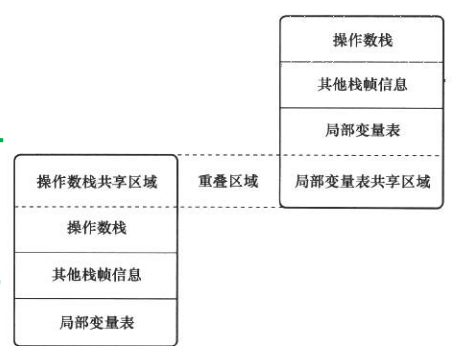

<!-- GFM-TOC -->
* [七、虚拟机字节码执行引擎](#七虚拟机字节码执行引擎)
    * [运行时栈帧结构](#运行时栈帧结构)
        * [局部变量表](#局部变量表)
        * [操作数栈](#操作数栈)
        * [动态连接](#动态连接)
        * [方法返回地址](#方法返回地址)
        * [附加信息](#附加信息)
    * [方法调用](#方法调用)
        * [解析](#解析)
        * [分派](#分派)
    * [基于栈的字节码解释执行引擎](#基于栈的字节码解释执行引擎)
<!-- GFM-TOC -->

# 七、虚拟机字节码执行引擎
所有的Java虚拟机的执行引擎都是一致的：
**输入的是字节码文件，处理过程是字节码解析的等效过程，输出的是执行结果**。

## 运行时栈帧结构
栈帧（Stack Frame） 是用于**支持虚拟机方法调用和方法执行的数据结构**，
它是虚拟机运行时数据区中虚拟机栈（Virtual Machine Stack）的栈元素。
栈帧存储了方法的局部变量表、操作数栈、动态连接和方法返回地址等信息。
每一个方法从调用开始至执行完成的过程，都对应着一个栈帧在虚拟机栈里面从入栈到出栈的过程。

<div align="center">  </div><br>

### 局部变量表
局部变量表是一组变量值存储空间，用于**存放方法参数**和**方法内定义的局部变量**。
局部变量表的容量以**变量槽(Variable Slot)为最小单位**。 
一个Slot可以存放一个**32位**以内(boolean、byte、char、short、int、float、reference和returnAddress)的数据类型，
reference类型表示一个对象实例的引用，returnAddress已经很少见了，可以忽略。

对于64位的数据类型（Java语言中明确的64位数据类型只有long和double），
虚拟机会以**高位对齐**的方式为其分配两个连续的Slot空间。

虚拟机通过**索引定位**的方式使用局部变量表，索引值的范围从0开始至局部变量表最大的Slot数量。
访问的是32位数据类型的变量，索引n就代表了使用第n个Slot,如果是64位数据类型，
就代表会同时使用n和n+1这两个Slot。

为了节省栈帧空间，局部变量Slot可以**重用**，方法体中定义的变量，其作用域并不一定会覆盖整个方法体。
如果当前字节码PC计数器的值超出了某个变量的作用域，那么这个变量的Slot就可以交给其他变量使用。
这样的设计会带来一些额外的副作用，比如：在某些情况下，Slot的复用会直接影响到系统的收集行为。

### 操作数栈
操作数栈(Operand Stack)也常称为操作栈，它是一个**后入先出栈**。
当一个方法执行开始时，这个方法的操作数栈是空的，
在方法执行过程中，会有各种字节码指令往操作数栈中写入和提取内容，也就是出栈/入栈操作。

在概念模型中，一个活动线程中两个栈帧是相互独立的。
但大多数虚拟机实现都会做一些优化处理：让下一个栈帧的部分操作数栈与上一个栈帧的部分局部变量表重叠在一起。
这样的好处是方法调用时可以**共享一部分数据**，而**无需进行额外的参数复制传递**。

<div align="center">  </div><br>

### 动态连接
每个栈帧都包含一个指向**运行时常量池**中该**栈帧所属方法的引用**，
持有这个引用是为了支持方法调用过程中的动态连接；

字节码中方法调用指令是以**常量池中的指向方法的符号引用为参数的**，
有一部分符号引用会在**类加载阶段或第一次使用的时候**转化为直接引用，这种转化称为**静态解析**，
另外一部分在每次的**运行期间**转化为直接引用，这部分称为**动态连接**。

### 方法返回地址
当一个方法被执行后，有两种方式退出这个方法：

- 是执行引擎遇到任意一个**方法返回的字节码指令**，这种退出方法的方式称为**正常完成出口**(Normal Method Invocation Completion)。

- 在方法执行过程中遇到了异常，并且这个异常没有在方法体内得到处理
（即本方法异常处理表中没有匹配的异常处理器），就会导致方法退出，
这种退出方式称为**异常完成出口**(Abrupt Method Invocation Completion)。

注意：这种退出方式不会给上层调用者产生任何返回值。

无论采用何种退出方式，在方法退出后，都需要返回到方法被调用的位置，
程序才能继续执行，方法返回时可能需要在栈帧中保存一些信息，用来帮助恢复它的上层方法的执行状态。
一般来说，方法正常退出时，调用者的**PC计数器**的值可以作为返回地址，栈帧中很可能会保存这个计数器值。
而方法异常退出时，返回地址是通过**异常处理器表**来确定的，栈帧中一般不会保存这部分信息。
方法退出的过程实际上等同于把当前栈帧出栈，因此退出时可能执行的操作有：
恢复上层方法的局部变量表和操作数栈，把返回值（如果有的话）压入调用者栈帧的操作数栈中，
调整PC计数器的值以指向方法调用指令后面的一条指令等。

### 附加信息
虚拟机规范允许虚拟机实现向栈帧中添加一些自定义的附加信息，例如与调试相关的信息等。

## 方法调用
### 解析
"编译期可知，运行期不可变"的方法（静态方法和私有方法），
在类加载的解析阶段，会将其符号引用转化为直接引用（入口地址）。
这类方法的调用称为"解析(Resolution)"。

在Java虚拟机中提供了5条方法调用字节码指令：

- invokestatic : 调用静态方法

- invokespecial:调用实例构造器方法、私有方法、父类方法

- invokevirtual:调用所有的虚方法

- invokeinterface:调用接口方法，会在运行时在确定一个实现此接口的对象

- invokedynamic:先在运行时动态解析出点限定符所引用的方法，然后再执行该方法>

注意：在此之前的4条调用命令的分派逻辑是固化在Java虚拟机内部的，
而invokedynamic指令的分派逻辑是由用户所设定的引导方法决定的。

### 分派
分派调用过程将会揭示多态性特征的一些最基本的体现，如**重载**和**重写**在Java虚拟中是如何实现的。

> 静态分派

所有**依赖静态类型**来定位方法执行版本的分派动作，都称为静态分派。静态分派发生在编译阶段。

**静态分派最典型的应用就是方法重载**。

```java
public class StaticDispatch {
    static abstract class Human {

    }

    static class Man extends Human {

    }

    static class Woman extends Human {

    }

    //sayhello是重载的方法
    public void sayhello(Human guy) {
        System.out.println("Human guy");

    }

    public void sayhello(Woman guy) {
        System.out.println("Woman guy");
    }

    public void sayhello(Man guy) {
        System.out.println("Man guy");

    }
    
    public static void main(String[] args) {
        Human man = new Man();
        Human woman = new Woman();
        StaticDispatch staticDispatch = new StaticDispatch();
        staticDispatch.sayhello(man);
        staticDispatch.sayhello(woman);
    }
}
```
输出结果：
```html
Human guy
Human guy
```

```java
Human man = new Man();
```
其中的Human称为变量的**静态类型**(Static Type),Man称为变量的**实际类型**(Actual Type)。

静态类型和实际类型的区别：

**静态类型在编译器可知，而实际类型到运行期才确定下来**。

在**重载时通过参数的静态类型而不是实际类型作为判定依据**，
因此，在编译阶段，Javac编译器会根据参数的静态类型决定使用哪个重载版本。所以选择了sayhello(Human)作为调用目标，
并把这个方法的符号引用写到main()方法里的两条invokevirtual指令的参数中。

> 动态分派

在运行期根据**实际类型**确定方法执行版本的分派过程称为动态分派。

**动态分派最典型的应用就是方法重写**。

```java
public class DynamicDisptch {
    static abstract class Human {
        abstract void sayhello();
    }

    static class Man extends Human {
        /**
         * 在Human的子类Man中重写sayHello()方法
         */
        @Override
        void sayhello() {
            System.out.println("man");
        }
    }

    static class Woman extends Human {
        /**
         * 在Human的子类Woman中重写sayHello()方法
         */
        @Override
        void sayhello() {
            System.out.println("woman");
        }
    }

    public static void main(String[] args) {
        Human man = new Man();
        Human woman = new Woman();
        man.sayhello();
        woman.sayhello();
        man = new Woman();
        man.sayhello();
    }
}
```
输出结果：
```html
man
woman
woman
```

> 单分派和多分派

方法的接收者、方法的参数都可以称为方法的宗量。
根据分批基于多少种宗量，可以将分派划分为单分派和多分派。
单分派是根据一个宗量对目标方法进行选择的，多分派是根据多于一个的宗量对目标方法进行选择的。

Java在进行静态分派时，选择目标方法要依据两点：
一是变量的**静态类型是哪个类型**，二是**方法参数类型**。
因为要根据两个宗量进行选择，所以Java语言的静态分派属于多分派类型。

运行时阶段的动态分派过程，由于编译器已经确定了目标方法的签名（包括方法参数），
运行时虚拟机只需要确定方法的**接收者的实际类型**，就可以分派。
因为是根据一个宗量作为选择依据，所以Java语言的动态分派属于单分派类型。

注：**到JDK1.7时，Java语言还是静态多分派、动态单分派的语言**，未来有可能支持动态多分派。

> 虚拟机动态分派的实现

由于动态分派是非常频繁的动作，而动态分派在方法版本选择过程中又需要在方法元数据中搜索合适的目标方法，
虚拟机实现出于性能的考虑，通常不直接进行如此频繁的搜索，而是采用**优化方法**。

其中一种“稳定优化”手段是：
在类的方法区中建立一个**虚方法表**（Virtual Method Table, 也称vtable, 与此对应，也存在接口方法表——Interface Method Table，也称itable）。
使用虚方法表索引来代替元数据查找以提高性能。其原理与C++的虚函数表类似。
虚方法表中存放的是各个**方法的实际入口地址**。
如果某个方法在子类中没有被重写，那子类的虚方法表里面的地址入口和父类中该方法相同，
都指向父类的实现入口。**虚方法表一般在类加载的连接阶段进行初始化**。

##  基于栈的字节码解释执行引擎
### 解释执行
Java语言经常被人们定位为 “解释执行”语言，在Java初生的JDK1.0时代，这种定义还比较准确的，
但当主流的虚拟机中都包含了即时编译后，
Class文件中的代码到底会被解释执行还是编译执行，就成了只有虚拟机自己才能准确判断的事情。
再后来，Java也发展出来了直接生成本地代码的编译器[如何GCJ（GNU Compiler for the Java）]，
而C/C++也出现了通过解释器执行的版本（如CINT），这时候再笼统的说“解释执行”，
对于整个Java语言来说就成了几乎没有任何意义的概念，
只有确定了谈论对象是某种具体的**Java实现版本**和**执行引擎运行模式**时，
谈解释执行还是编译执行才会比较确切。


<div align="center">  </div><br>

Java语言中，javac编译器完成了程序代码经过词法分析、语法分析到抽象语法树，
再遍历语法树生成线性的字节码指令流的过程，因为这一部分动作是在Java虚拟机之外进行的，
而解释器在虚拟机内部，所以Java程序的编译就是半独立实现的。


###  基于栈的指令集和基于寄存器的指令集
Java编译器输出的指令流，基本上是一种**基于栈的指令集架构**(Instruction Set Architecture，ISA)，依赖**操作数栈**进行工作。
与之相对应的另一套常用的指令集架构是**基于寄存器的指令集**， 依赖**寄存器**进行工作。

> 两者的不同之处

举个例子，分别使用这两种指令计算1+1的结果。

基于栈的指令集：
```html
iconst_1

iconst_1

iadd

istore_0
```

两条iconst_1指令连续把两个常量1压入栈后，
iadd指令把栈顶的两个值出栈、相加，然后将结果放回栈顶，
最后istore_0把栈顶的值放到局部变量表中的第0个Slot中。

基于寄存器的指令集：
```html
mov eax, 1

add eax, 1
```
mov指令把EAX寄存器的值设置为1，
然后add指令再把这个值加1，将结果就保存在EAX寄存器里面。

基于栈的指令集主要的优点就是可移植，寄存器是由硬件直接提供，
程序直接依赖这些硬件寄存器则不可避免地要受到硬件的约束。

栈架构的指令集还有一些其他的优点，如代码相对更加紧凑，编译器实现更加简单等。 
栈架构指令集的主要缺点是执行速度相对来说会稍微慢一些。