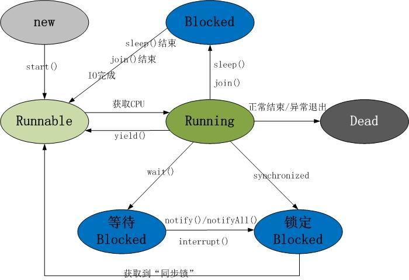

<!-- GFM-TOC -->
* [Java线程生命周期](#Java线程生命周期)
    * [线程生命周期的5种状态](#线程生命周期的5种状态)
        * [新建（New）状态](#新建（New）状态)
        * [就绪（Runnable）状态](#就绪（Runnable）状态)
        * [运行（Running）状态](#运行（Running）状态)
        * [阻塞（Blocked）状态](#阻塞（Blocked）状态)
        * [死亡（Dead）状态](#死亡（Dead）状态)
    * [线程相关方法](#线程相关方法)
        * [线程就绪、运行和死亡状态转换](#线程就绪_运行_死亡状态转换)
        * [run和start](#run和start)
        * [sleep和yield](#sleep和yield)
        * [join](#join)
        * [wait和notify/notifyAll](#wait和notify/notifyAll)
        * [线程优先级](#线程优先级)
        * [守护线程](#守护线程)
        * [如何结束一个线程](#如何结束一个线程)
<!-- GFM-TOC -->
# Java线程生命周期

在线程的生命周期中，它要经过**新建（New）**、**就绪（Runnable）**、
**运行（Running）**、**阻塞（Blocked）**和**死亡（Dead** 5种状态。
尤其是当线程启动以后，它不可能一直"霸占"着CPU独自运行，所以CPU需要在多条线程之间切换，于是 
**线程状态也会多次在运行、阻塞之间切换**。

<div align="center">  </div>

注意：与线程的状态图做好区分。

## 线程生命周期的5种状态
###  新建（New）状态
当程序使用new关键字创建了一个线程之后，该线程就处于**新建状态**，此时的线程情况如下：
```java
此时JVM为其分配内存，并初始化其成员变量的值

此时线程对象没有表现出任何线程的动态特征，程序也不会执行线程的线程执行体
```

### 就绪（Runnable）状态
当线程对象调用了start()方法之后，该线程处于**就绪状态**。此时的线程情况如下：
```java
此时JVM会为其创建方法调用栈和程序计数器

该状态的线程一直处于 线程就绪队列（尽管是采用队列形式，事实上，把它称为可运行池而不是可运行队列。
因为CPU的调度**不一定是按照先进先出的顺序**来调度的），线程并没有开始运行

此时线程等待系统为其分配CPU时间片，并不是说执行了start()方法就立即执行
```

调用start()方法与run()方法，对比如下：
```java
调用start()方法来启动线程，系统会把该run()方法当成线程执行体来处理。
但如果直接调用线程对象的run()方法，则run()方法立即就会被执行，而且在run()方法返回之前其他线程无法并发执行。
也就是说，系统把线程对象当成一个普通对象，而run()方法也是一个普通方法，而不是线程执行体。

需要指出的是，调用了线程的run()方法之后，该线程已经不再处于新建状态，不要再次调用线程对象的start()方法。
因为只能对处于新建状态的线程调用start()方法，否则将引发IllegaIThreadStateExccption异常。
```

如何让子线程调用start()方法之后立即执行而非"等待执行"：
```java
程序可以使用Thread.sleep(1) 来让当前运行的线程（主线程）睡眠1毫秒，1毫秒就够了，因为在这1毫秒内CPU不会空闲，
它会去执行另一个处于就绪状态的线程，这样就可以让子线程立即开始执行。
```

### 运行（Running）状态
当CPU开始调度处于就绪状态的线程时，此时线程获得了**CPU时间片**才得以真正开始执行run()方法的线程执行体，
则该线程处于**运行状态**。
```java
如果计算机只有一个CPU，那么在任何时刻只有一个线程处于运行状态

如果在一个多处理器的机器上，将会有多个线程并行执行，处于运行状态

当线程数大于处理器数时，依然会存在多个线程在同一个CPU上轮换的现象
```

处于**运行状态的线程最复杂**，它不可能一直处于运行状态（除非它的线程执行体足够短，瞬间就执行结束了），
线程在运行过程中需要被中断，目的是使其他线程获得执行的机会，线程调度的细节取决于底层平台所采用的策略。

线程状态可能会变为**阻塞状态**、**就绪状态**和**死亡状态**。比如：
```java
对于采用 抢占式策略 的系统而言:
系统会给每个可执行的线程分配一个时间片来处理任务，
当该时间片用完后，系统就会剥夺该线程所占用的资源，让其他线程获得执行的机会，
线程就会又从运行状态变为就绪状态，重新等待系统分配资源。

对于采用 协作式策略的系统而言：
只有当一个线程调用了它的yield()方法后才会放弃所占用的资源，
也就是必须由该线程主动放弃所占用的资源，线程就会又从运行状态变为就绪状态。
```

### 阻塞（Blocked）状态
处于运行状态的线程在某些情况下，让出CPU并暂时停止自己的运行，进入**阻塞状态**。

当发生如下情况时，线程将会进入阻塞状态：
```java
线程调用sleep()方法，主动放弃所占用的处理器资源，暂时进入中断状态（不会释放持有的对象锁），时间到后等待系统分配CPU继续执行

线程调用一个阻塞式IO方法，在该方法返回之前，该线程被阻塞

线程试图获得一个同步监视器，但该同步监视器正被其他线程所持有

程序调用了线程的suspend方法将线程挂起

线程调用wait，等待notify/notifyAll唤醒时(会释放持有的对象锁)
```

阻塞状态分类：

* 等待阻塞：运行状态中的线程**执行wait()方法**，使本线程进入到等待阻塞状态

* 同步阻塞：线程在**获取synchronized同步锁失败**（因为锁被其它线程占用），它会进入到同步阻塞状态

* 其他阻塞：通过调用线程的 sleep()或join()或发出I/O请求 时，线程会进入到阻塞状态。
当 sleep()状态超时、join()等待线程终止或者超时、或者I/O处理完毕时，线程重新转入就绪状态

<div align="center">  </div>

在阻塞状态的线程只能进入就绪状态，无法直接进入运行状态。
而就绪和运行状态之间的转换通常不受程序控制，而是由**系统线程调度**所决定。
当处于就绪状态的线程获得处理器资源时，该线程进入运行状态；当处于运行状态的线程失去处理器资源时，该线程进入就绪状态。

但有一个方法例外，调用yield()方法可以让运行状态的线程转入就绪状态。

### 等待（WAITING）状态
线程处于无限制等待状态，等待一个特殊的事件来重新唤醒，如：

```java
通过wait()方法进行等待的线程等待一个notify()或者notifyAll()方法

通过join()方法进行等待的线程等待目标线程运行结束而唤醒
```
以上两种一旦通过相关事件唤醒线程，线程就进入了就绪（RUNNABLE）状态继续运行。

#### 时限等待（TIMED_WAITING）状态
线程进入了一个 时限等待状态，如：

sleep(3000)，等待3秒后线程重新进行 就绪（RUNNABLE）状态 继续运行。

### 死亡（Dead）状态
线程会以如下3种方式结束，结束后就处于死亡状态：
```java
run()或call()方法执行完成，线程正常结束

线程抛出一个未捕获的Exception或Error

直接调用该线程stop()方法来结束该线程—该方法容易导致死锁，通常不推荐使用
```
**处于死亡状态的线程对象也许是活的**，但是，它已经不是一个单独执行的线程。
线程一旦死亡，就不能复生。 
如果在一个死去的线程上调用start()方法，会抛出java.lang.IllegalThreadStateException异常。

所以，需要注意的是：

**一旦线程通过start()方法启动后就再也不能回到新建（NEW）状态，线程终止后也不能再回到就绪（RUNNABLE）状态**。

#### 终止（TERMINATED）状态
线程执行完毕后，进入终止（TERMINATED）状态。

##  线程相关方法
```java
public class Thread{
    // 线程的启动
    public void start(); 
    // 执行线程体
    public void run(); 
    // 已废弃
    public void stop(); 
    // 已废弃
    public void resume(); 
    // 已废弃
    public void suspend(); 
    // 在指定的毫秒数内让当前正在执行的线程休眠
    public static void sleep(long millis); 
    // 同上，增加了纳秒参数
    public static void sleep(long millis, int nanos); 
    // 测试线程是否处于活动状态
    public boolean isAlive(); 
    // 中断线程
    public void interrupt(); 
    // 测试线程是否已经中断
    public boolean isInterrupted(); 
    // 测试当前线程是否已经中断
    public static boolean interrupted(); 
    // 等待该线程终止
    public void join() throws InterruptedException; 
    // 等待该线程终止的时间最长为 millis 毫秒
    public void join(long millis) throws InterruptedException; 
    // 等待该线程终止的时间最长为 millis 毫秒 + nanos 纳秒
    public void join(long millis, int nanos) throws InterruptedException; 
}
```
###  线程就绪_运行_死亡状态转换

(1)就绪状态转换为运行状态：此线程得到CPU资源

(2)运行状态转换为就绪状态：此线程主动调用yield()方法或在运行过程中失去CPU资源

(3)运行状态转换为死亡状态：此线程执行执行完毕或者发生了**异常**

<div align="center">  </div>

注意：

当调用线程中的yield()方法时，线程从运行状态转换为就绪状态，
但接下来CPU调度就绪状态中的那个线程具有一定的**随机性**，
因此，可能会出现A线程调用了yield()方法后，接下来CPU仍然调度了A线程的情况。

### run和start
run():仅仅是封装被线程执行的代码，直接调用时普通方法
start():首先启动了线程，然后由JVM去调用线程的run()方法

### sleep和yield
* sleep()

通过sleep(millis)使线程进入休眠一段时间，该方法**在指定的时间内无法被唤醒，同时也不会释放锁对象**

注意：

(1)**sleep是静态方法**，最好不要用Thread的实例对象调用它，
因为它睡眠的始终是当前正在运行的线程，而不是调用它的线程对象，
它**只对正在运行状态的线程对象有效**。

```java
public class SleepMethod {
    public static void main(String[] args) throws InterruptedException {
        MyRunnable t=new MyRunnable();
        Thread myThread=new Thread(t);
        myThread.start();
        // 这里sleep的就是main线程，而非myThread线程
        myThread.sleep(1000);
        Thread.sleep(10);
        System.out.println("Current Thread:"+Thread.currentThread().getName());
        for(int i=0;i<100;i++){
            System.out.println("main"+i);
        }
    }
}
```

(2)Java线程调度是Java多线程的核心，只有良好的调度，才能充分发挥系统的性能，提高程序的执行效率。
但是不管程序员怎么编写调度，只能最大限度的影响线程执行的次序，而不能做到精准控制。
因为使用sleep方法之后，**线程是进入阻塞状态**的，只有当睡眠的时间结束，才会重新进入到就绪状态，
而就绪状态进入到运行状态，是由系统控制的，我们不可能精准的去干涉它，
所以如果调用Thread.sleep(1000)使得线程睡眠1秒，可能结果会大于1秒。
```java
public class MyRunnable implements Runnable{
    @Override
    public void run() {
        for (int i = 0; i < 3; i++) {
            System.out.println(Thread.currentThread().getName()+"线程" + i + "次执行！");
            try {
                Thread.sleep(50);
            } catch (InterruptedException e) {
                e.printStackTrace();
            }
        }
    }
}
```
```java
public class SleepMethod2 {
    public static void main(String[] args) throws InterruptedException {
        MyRunnable myRunnable=new MyRunnable();
        Thread t1=new Thread(myRunnable);
        Thread t2=new Thread(myRunnable);
        t1.start();
        t2.start();
    }
}
```

看某一次的运行结果：可以发现，线程1首先执行，然后线程0执行一次，线程0又了执行一次。发现并不是按照sleep的顺序执行的。
```java
Thread-1线程0次执行！
Thread-0线程0次执行！
Thread-0线程1次执行！
Thread-1线程1次执行！
Thread-0线程2次执行！
Thread-1线程2次执行！
```

* yield()

与sleep类似，也是Thread类提供的一个**静态方法**，它也可以让当前正在执行的线程暂停，让出CPU资源给其他的线程。
但是和sleep()方法不同的是，它不会进入到阻塞状态，而是进入到就绪状态。
yield()方法只是让当前线程暂停一下，重新进入就绪线程池中，让系统的线程调度器重新调度器重新调度一次，
完全可能出现这样的情况：当某个线程调用yield()方法之后，线程调度器又将其调度出来重新进入到运行状态执行。

实际上，当某个线程调用了yield()方法暂停之后，
优先级与当前线程相同，或者优先级比当前线程更高的就绪状态的线程更有可能获得执行的机会，
当然，只是有可能，因为我们不可能精确的干涉cpu调度线程。

sleep()和yield()的比较：

| 方法 | sleep()方法 | yield()方法 |
| :---: | :---: | :---: |
| 状态转化 | 当前线程后，会进入阻塞状态，只有当睡眠时间到了，才会转入就绪状态，sleep方法暂停 | yield方法调用后 ，是直接进入就绪状态，所以有可能刚进入就绪状态，又被调度到运行状态 |
| 异常处理 | 方法声明抛出了InterruptedException，所以调用sleep方法的时候要捕获该异常，或者显示声明抛出该异常 | 没有声明抛出任务异常 |
| 用途 | 有更好的可移植性 | 通常不使用yield方法来控制并发线程的执行 |

### join
线程的合并的含义就是**将几个并行线程的线程合并为一个单线程执行**，
应用场景是当**一个线程必须等待另一个线程执行完毕才能执行**时，
Thread类提供了join方法来完成这个功能，注意，它**不是静态方法**。

join有3个重载的方法：
```java
void join()    
    当前线程等该加入该线程后面，等待该线程终止。    
void join(long millis)    
    当前线程等待该线程终止的时间最长为 millis 毫秒。 
    如果在millis时间内，该线程没有执行完，那么当前线程进入就绪状态，重新等待cpu调度   
void join(long millis,int nanos)    
    等待该线程终止的时间最长为 millis 毫秒 + nanos 纳秒。
    如果在millis时间内，该线程没有执行完，那么当前线程进入就绪状态，重新等待cpu调度
```
```java
public class JoinMethod {
    public static void main(String[] args) throws InterruptedException {
        MyRunnable myRunnable=new MyRunnable();
        Thread t=new Thread(myRunnable);
        t.start();

        //将主线程加入到子线程后面,子线程执行完,主线程才能执行
        //t.join();

        //将主线程加入到子线程后面，不过如果子线程在100毫秒时间内没执行完，则主线程便不再等待它执行完
        t.join(100);

        for(int i=0;i<10;i++){
            System.out.println(Thread.currentThread().getName() + "线程第" + i + "次执行！");
        }
    }
}
```
输出结果：
```java
Thread-0线程0次执行！
Thread-0线程1次执行！
main线程第0次执行！
main线程第1次执行！
main线程第2次执行！
main线程第3次执行！
main线程第4次执行！
main线程第5次执行！
main线程第6次执行！
main线程第7次执行！
main线程第8次执行！
main线程第9次执行！
Thread-0线程2次执行！
```

JDK中的join()方法源码：
```java
public final synchronized void join(long millis)    throws InterruptedException {  
    long base = System.currentTimeMillis();  
    long now = 0;  
  
    if (millis < 0) {  
        throw new IllegalArgumentException("timeout value is negative");  
    }  
          
    if (millis == 0) {  
        while (isAlive()) {  
           wait(0);  
        }  
    } else {  
        while (isAlive()) {  
            long delay = millis - now;  
            if (delay <= 0) {  
                break;  
            }  
            wait(delay);  
            now = System.currentTimeMillis() - base;  
        }  
    }  
}
//join方法实现是通过调用wait方法实现。
//当main线程调用t.join时候，main线程会获得线程对象t的锁（wait 意味着拿到该对象的锁)，
//调用该对象的wait(等待时间)，直到该对象唤醒main线程。
```

```java
/**
 * 虽然 ThreadB线程先启动，但是因为在 ThreadB 线程中调用了 ThreadA 线程的 join() 方法，
 * ThreadB 线程会等待 ThreadA 线程结束才继续执行，因此最后能够保证 ThreadA 线程的输出先于 ThreadB 线程的输出。
 */
public class JoinExample {
    private static class ThreadA extends Thread{
        @Override
        public void run() {
            System.out.println("A");
        }
    }

    private static class ThreadB extends Thread{
        private ThreadA a;

        public ThreadB(ThreadA a){
            this.a=a;
        }

        @Override
        public void run() {
            try {
                a.join();
            } catch (InterruptedException e) {
                e.printStackTrace();
            }
            System.out.println("B");
        }
    }

    public static void main(String[] args) {
        ThreadA a=new ThreadA();
        ThreadB b=new ThreadB(a);
        b.start();
        a.start();
    }
}
//输出结果
//A
//B
```
### wait和notify/notifyAll
wait 和 notify/notifyAll这三个都是Object类的方法。
使用 wait ，notify 和 notifyAll 前提是**先获得调用对象的锁**。

* 等待队列（等待池）和同步队列（锁池）
(1)等待队列

假设一个线程A调用了某个对象的wait()方法，
线程A就会释放该对象的锁（因为wait()方法必须出现在synchronized中，
这样自然在执行wait()方法之前线程A就已经拥有了该对象的锁），
同时线程A就进入到了该对象的**等待队列**（等待池）中，此时线程A**状态为Waiting**。
如果另外的一个线程调用了相同对象的notifyAll()方法，
那么处于该对象的等待池中的线程就会**全部进入该对象的同步队列**（锁池）中，准备争夺锁的拥有权。
如果另外的一个线程调用了相同对象的notify()方法，
那么仅仅有一个处于该对象的等待池中的线程（随机）会进入该对象的同步队列（锁池）。

被notify或notifyAll唤起的线程是有规律的，具体如下：
```java
如果是通过notify来唤起的线程，那先进入wait的线程会先被唤起来

如果是通过nootifyAll唤起的线程，默认情况是 最后进入的会先被唤起来，即LIFO的策略
```
(2)同步队列

假设线程A已经拥有了某个对象（注意:不是类）的锁，
而其它的线程想要调用这个对象的某个synchronized方法(或者synchronized块)，
由于这些线程在进入对象的synchronized方法之前必须先获得该对象的锁的拥有权，
但是该对象的锁目前正被线程A拥有，所以这些线程就进入了该对象的**同步队列（锁池）**中，这些**线程状态为Blocked**。

```java
调用 wait 方法后:
    释放持有的对象锁，线程状态有 Running 变为 Waiting，并将当前线程放置到对象的等待队列

调用notify 或者 notifyAll 方法后:
    等待线程依旧不会从 wait 返回，需要调用 noitfy 的线程释放锁之后，等待线程才有机会从 wait 返回
    notify 方法：将等待队列的一个等待线程从等待队列中移到同步队列中 ，
    notifyAll 方法：将等待队列中所有的线程全部移到同步队列，被移动的线程状态由 Waiting 变为 Blocked。
```

* wait() 和 sleep() 的区别

(1)wait() 是 Object 的方法，而 sleep() 是 Thread 的静态方法

(2)wait() 会释放锁，sleep() 不会。

```java
/**
 * 调用 wait() 使得线程等待某个条件满足，
 * 线程在等待时会被挂起，当其他线程的运行使得这个条件满足时，
 * 其它线程会调用 notify() 或者 notifyAll() 来唤醒挂起的线程。
 * 它们都属于 Object 的一部分，而不属于 Thread。
 *
 * 只能用在同步方法或者同步控制块中使用，否则会在运行时抛出 IllegalMonitorStateExeception。
 * 使用 wait() 挂起期间，线程会释放锁。
 * 这是因为，如果没有释放锁，那么其它线程就无法进入对象的同步方法或者同步控制块中，
 * 那么就无法执行 notify() 或者 notifyAll() 来唤醒挂起的线程，造成死锁。
 */
public class WaitNotifyExample {
    public synchronized void before() {
        System.out.println("before");
        notify();
    }

    public synchronized void after() {
        try {
            wait();
        } catch (InterruptedException e) {
            e.printStackTrace();
        }
        System.out.println("after");
    }

    public static void main(String[] args) {
        ExecutorService executorService = Executors.newCachedThreadPool();
        WaitNotifyExample example = new WaitNotifyExample();
        executorService.execute(new Runnable() {
            @Override
            public void run() {
                example.after();
            }
        });
        executorService.execute(new Runnable() {
            @Override
            public void run() {
                example.before();
            }
        });
        executorService.shutdown();
    }
}
//输出结果
//before
//after
```

### 线程优先级
每个线程执行时都有一个优先级的属性，优先级高的线程可以获得较多的执行机会，而优先级低的线程则获得较少的执行机会。
与线程休眠类似，**线程的优先级仍然无法保障线程的执行次序**。
只不过，优先级高的线程获取CPU资源的概率较大，优先级低的也并非没机会执行。

每个线程默认的优先级都与创建它的父线程具有相同的优先级，在默认情况下，main线程具有普通优先级。

Thread类提供了setPriority(int newPriority)和getPriority()方法来设置和返回一个指定线程的优先级，
其中setPriority方法的参数是一个整数，范围是1~10之间，也可以使用Thread类提供的三个静态常量：

```java
MAX_PRIORITY = 10
MIN_PRIORITY = 1
NORM_PRIORITY = 5
```

```java
/**
 *  每个线程执行时都有一个优先级的属性，优先级高的线程可以获得较多的执行机会，而优先级低的线程则获得较少的执行机会。
 *  与线程休眠类似，**线程的优先级仍然无法保障线程的执行次序**。
 *  只不过，优先级高的线程获取CPU资源的概率较大，优先级低的也并非没机会执行。
 */
public class ThreadPriorityExample {
    private static class A extends Thread{
        public A(String name,int priority){
            super(name);
            this.setPriority(priority);
        }

        @Override
        public void run() {
            for (int i = 0; i < 5; i++) {
                try {
                    Thread.sleep(100);
                } catch (InterruptedException e) {
                    e.printStackTrace();
                }
                System.out.println(this.getName() + "线程第" + i + "次执行！");
            }
        }
    }

    public static void main(String[] args) {
        A t= new A("Thread-1",10);
        A t2=new A("Thread-2",1);
        t2.start();
        t.start();
    }
}
/**
 * 输出结果：
 Thread-1线程第0次执行！
 Thread-2线程第0次执行！
 Thread-1线程第1次执行！
 Thread-2线程第1次执行！
 Thread-1线程第2次执行！
 Thread-2线程第2次执行！
 Thread-1线程第3次执行！
 Thread-2线程第3次执行！
 Thread-1线程第4次执行！
 Thread-2线程第4次执行！
 */
```

### 守护线程
守护线程与普通线程写法上基本没啥区别，
调用线程对象的方法**setDaemon(true)**，则可以将其设置为守护线程。

守护线程使用的情况较少，但并非无用，举例来说，
**JVM的垃圾回收**、**内存管理**等线程都是守护线程。
还有就是在做数据库应用时候，使用的数据库连接池，连接池本身也包含着很多后台线程，监控连接个数、超时时间、状态等等。

* setDaemon方法详细说明：

public final void setDaemon(boolean on)：

将该线程标记为守护线程或用户线程。当正在运行的线程都是守护线程时，Java 虚拟机退出。

该方法必须在启动线程前调用。 

该方法首先调用该线程的 checkAccess 方法，且不带任何参数。这可能抛出 SecurityException（在当前线程中）。

```java
public class DaemonThreadEaxmple {
    private static class DaemonThread extends Thread{
        @Override
        public void run() {
            for(int i=0;i<100;i++){
                System.out.println(this.getName()+":"+i);
            }
        }
    }

    public static void main(String[] args) {
        Thread t1=new DaemonThread();
        Thread t2=new DaemonThread();
        t1.setName("张飞");
        t2.setName("关羽");

        //该方法必须在启动线程前调用。
        t1.setDaemon(true);
        t2.setDaemon(true);

        t1.start();
        t2.start();

        //主线程
        Thread.currentThread().setName("刘备");
        for(int i=0;i<5;i++){
            System.out.println(Thread.currentThread().getName()+":"+i);
        }
    }
}
```

### 如何结束一个线程
想要安全有效的结束一个线程，可以使用下面的方法。

* 正常执行完run方法，然后结束掉

* 控制循环条件和判断条件的标识符来结束掉线程

比如run方法这样写：只要保证在一定的情况下，run方法能够执行完毕即可。而不是while(true)的无限循环。

```java
class MyThread extends Thread {  
    int i=0;  
    @Override  
    public void run() {  
        while (true) {  
            if(i==10)  
                break;  
            i++;  
            System.out.println(i);  
              
        }  
    }  
}  
```
或者
```java
class MyThread extends Thread {  
    int i=0;  
    boolean next=true;  
    @Override  
    public void run() {  
        while (next) {  
            if(i==10)  
                next=false;  
            i++;  
            System.out.println(i);  
        }  
    }  
}  
```
或者
```java
class MyThread extends Thread {  
    int i=0;  
    @Override  
    public void run() {  
        while (true) {  
            if(i==10)  
                return;  
            i++;  
            System.out.println(i);  
        }  
    }  
}
```
使用上面方法的标识符来结束一个线程，是一个不错的方法，但其也有弊端，如果
该线程是处于sleep、wait、join的状态时候，while循环就不会执行，那么我们的标识符就无用武之地了，
当然也不能再通过它来结束处于这3种状态的线程了。
所以，此时可以**使用interrupt结束线程**。

注意：

(1)每个Thread都有一个中断状状态，默认为false。
可以通过Thread对象的isInterrupted()方法来判断该线程的中断状态。
可以通过Thread对象的interrupt()方法将中断状态设置为true。

(2)当一个线程处于sleep、wait、join这三种状态之一的时候，如果此时他的中断状态为true，
那么它就会抛出一个InterruptedException的异常，并将中断状态重新设置为false。

```java
public class InterruptThread {
    private static class A extends Thread {
        int i=1;
        @Override
        public void run() {
            while (true) {
                System.out.println(i);
                //的isInterrupted()方法来判断该线程的中断状态
                System.out.println(this.isInterrupted());
                try {
                    System.out.println("我马上去sleep了");
                    Thread.sleep(2000);
                    //当一个线程处于sleep、wait、join这三种状态之一的时候，如果此时他的中断状态为true，
                    //那么它就会抛出一个InterruptedException的异常，并将中断状态重新设置为false。

                    //终止线程
                    this.interrupt();
                } catch (InterruptedException e) {
                    System.out.println("异常捕获了"+this.isInterrupted());
                    return;
                }
                i++;
            }
        }
    }

    public static void main(String[] args) {
        A a=new A();
        a.start();
    }
}
/**
 * 输出结果
 1
 false
 我马上去sleep了
 2
 true
 我马上去sleep了
 异常捕获了false
 */
```
在第一次循环中，睡眠2秒，然后将中断状态设置为true。
当进入到第二次循环的时候，中断状态就是第一次设置的true，
当它再次进入sleep的时候，马上就抛出了InterruptedException异常，然后被我们捕获了。
然后中断状态又被重新自动设置为false了（从最后一条输出可以看出来）。

```java
public class InterruptThread2 {
    private static class B extends Thread {
        @Override
        public void run() {
            System.out.println("开始执行："+new Date());
            try {
                Thread.sleep(100000);
            } catch (InterruptedException e) {
                System.out.println("线程被终止了");
            }
            System.out.println("执行结束:"+new Date());
        }
    }

    public static void main(String[] args) {
        B b=new B();
        b.start();
        try {
            //超过3s后b线程还没有醒，就终止该线程
            Thread.sleep(3000);
            b.interrupt();
        } catch (InterruptedException e) {
            e.printStackTrace();
        }
    }
}
/**
 * 输出结果:
 开始执行：Thu Nov 22 19:41:33 CST 2018
 线程被终止了
 执行结束:Thu Nov 22 19:41:36 CST 2018
 */
```