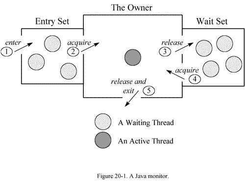

<!-- GFM-TOC -->
*  [Java线程Dump分析](#Java线程Dump分析)]
    * [Thread Dump介绍](#Thread_Dump分析)
    * [Thread Dump分析](#Thread_Dump分析)
    * [案例分析](#案例分析)
    * [JVM重要线程](#JVM重要线程)
<!-- GFM-TOC -->

# Java线程Dump分析
## Thread_Dump介绍
### 什么是Thread Dump
Thread Dump是非常有用的诊断Java应用问题的工具。
每一个Java虚拟机都有及时生成所有线程在某一点状态的thread-dump的能力
，虽然各个 Java虚拟机打印的thread dump略有不同，
但是 大多都提供了**当前活动线程的快照，及JVM中所有Java线程的堆栈跟踪信息**，
堆栈信息一般包含完整的类名及所执行的方法，如果可能的话还有源代码的行数。

### Thread Dump特点
```java
1、能在各种操作系统下使用

2、能在各种Java应用服务器下使用

3、能在生产环境下使用而不影响系统的性能

4、能将问题直接定位到应用程序的代码行上
```
### Thread Dump抓取
一般当服务器挂起，崩溃或者性能低下时，
就需要抓取服务器的线程堆栈（Thread Dump）用于后续的分析。
在实际运行中，往往一次 dump的信息，还不足以确认问题。
为了反映线程状态的动态变化，需要**接连多次做thread dump，每次间隔10-20s**，
建议至少产生三次 dump信息，如果每次 dump都指向同一个问题，我们才确定问题的典型性。

### JVM 自带的工具获取线程堆栈
```java
jps 或 ps –ef | grep java （获取PID）

jstack [-l ] <pid> | tee -a jstack.log（获取ThreadDump）
```

## Thread_Dump分析
### Thread Dump信息
1、头部信息：时间，JVM信息
```java
2011-11-02 19:05:06  
Full thread dump Java HotSpot(TM) Server VM (16.3-b01 mixed mode)
```
 
2、线程INFO信息块：

```java
1. "Timer-0" daemon prio=10 tid=0xac190c00 nid=0xaef in Object.wait() [0xae77d000] 
# 线程名称：Timer-0；线程类型：daemon；优先级: 10，默认是5；
# JVM线程id：tid=0xac190c00，JVM内部线程的唯一标识（通过java.lang.Thread.getId()获取，通常用自增方式实现）。
# 对应系统线程id（NativeThread ID）：nid=0xaef，和top命令查看的线程pid对应，不过一个是10进制，一个是16进制。（通过命令：top -H -p pid，可以查看该进程的所有线程信息）
# 线程状态：in Object.wait()；
# 起始栈地址：[0xae77d000]，对象的内存地址，通过JVM内存查看工具，能够看出线程是在哪儿个对象上等待；
2.  java.lang.Thread.State: TIMED_WAITING (on object monitor)
3.  at java.lang.Object.wait(Native Method)
4.  -waiting on <0xb3885f60> (a java.util.TaskQueue)     # 继续wait 
5.  at java.util.TimerThread.mainLoop(Timer.java:509)
6.  -locked <0xb3885f60> (a java.util.TaskQueue)         # 已经locked
7.  at java.util.TimerThread.run(Timer.java:462)
```
Java thread statck trace：是上面2-7行的信息。到目前为止这是最重要的数据，
Java stack trace提供了大部分信息来精确定位问题根源。

3、Java thread statck trace详解：

堆栈信息应该逆向解读：程序先执行的是第7行，然后是第6行，依次类推。

- locked <0xb3885f60> (a java.util.ArrayList)
- waiting on <0xb3885f60> (a java.util.ArrayList) 
也就是说对象先上锁，锁住对象0xb3885f60，然后释放该对象锁，进入waiting状态。为啥会出现这样的情况呢？看看下面的java代码示例，就会明白：

synchronized(obj) {  
   .........  
   obj.wait();  
   .........  
}

- [参考资料](https://www.jianshu.com/p/f1db856022de)

### Thread状态分析
线程的状态是一个很重要的东西，因此thread dump中会显示这些状态，
通过对这些状态的分析，能够得出线程的运行状况，进而发现可能存在的问题。
线程的状态在Thread.State这个枚举类型中定义：
```java
public enum State   
{  
       /** 
        * Thread state for a thread which has not yet started. 
        */  
       NEW,  
         
       /** 
        * Thread state for a runnable thread.  A thread in the runnable 
        * state is executing in the Java virtual machine but it may 
        * be waiting for other resources from the operating system 
        * such as processor. 
        */  
       RUNNABLE,  
         
       /** 
        * Thread state for a thread blocked waiting for a monitor lock. 
        * A thread in the blocked state is waiting for a monitor lock 
        * to enter a synchronized block/method or  
        * reenter a synchronized block/method after calling 
        * {@link Object#wait() Object.wait}. 
        */  
       BLOCKED,  
     
       /** 
        * Thread state for a waiting thread. 
        * A thread is in the waiting state due to calling one of the  
        * following methods: 
        * <ul> 
        *   <li>{@link Object#wait() Object.wait} with no timeout</li> 
        *   <li>{@link #join() Thread.join} with no timeout</li> 
        *   <li>{@link LockSupport#park() LockSupport.park}</li> 
        * </ul> 
        *  
        * <p>A thread in the waiting state is waiting for another thread to 
        * perform a particular action.   
        * 
        * For example, a thread that has called <tt>Object.wait()</tt> 
        * on an object is waiting for another thread to call  
        * <tt>Object.notify()</tt> or <tt>Object.notifyAll()</tt> on  
        * that object. A thread that has called <tt>Thread.join()</tt>  
        * is waiting for a specified thread to terminate. 
        */  
       WAITING,  
         
       /** 
        * Thread state for a waiting thread with a specified waiting time. 
        * A thread is in the timed waiting state due to calling one of  
        * the following methods with a specified positive waiting time: 
        * <ul> 
        *   <li>{@link #sleep Thread.sleep}</li> 
        *   <li>{@link Object#wait(long) Object.wait} with timeout</li> 
        *   <li>{@link #join(long) Thread.join} with timeout</li> 
        *   <li>{@link LockSupport#parkNanos LockSupport.parkNanos}</li>  
        *   <li>{@link LockSupport#parkUntil LockSupport.parkUntil}</li> 
        * </ul> 
        */  
       TIMED_WAITING,  
  
       /** 
        * Thread state for a terminated thread. 
        * The thread has completed execution. 
        */  
       TERMINATED;  
}
```
#### 新建（New）

创建后尚未启动。

#### 可运行（Runnable）

可能正在运行，也可能正在等待 CPU 时间片。

包含了操作系统线程状态中的 Running 和 Ready。

#### 阻塞（Blocking）

等待获取一个排它锁，如果其线程释放了锁就会结束此状态。

#### 无限期等待（Waiting）

等待其它线程显式地唤醒，否则不会被分配 CPU 时间片。

| 进入方法 | 退出方法 |
| --- | --- |
| 没有设置 Timeout 参数的 Object.wait() 方法 | Object.notify() / Object.notifyAll() |
| 没有设置 Timeout 参数的 Thread.join() 方法 | 被调用的线程执行完毕 |
| LockSupport.park() 方法 | - |

#### 限期等待（Timed Waiting）

无需等待其它线程显式地唤醒，在一定时间之后会被系统自动唤醒。

调用 Thread.sleep() 方法使线程进入限期等待状态时，常常用“使一个线程睡眠”进行描述。

调用 Object.wait() 方法使线程进入限期等待或者无限期等待时，常常用“挂起一个线程”进行描述。

**睡眠和挂起是用来描述行为**，而**阻塞和等待用来描述状态**。

阻塞和等待的区别在于，阻塞是被动的，它是在等待获取一个排它锁。
而等待是主动的，通过调用 Thread.sleep() 和 Object.wait() 等方法进入。

| 进入方法 | 退出方法 |
| --- | --- |
| Thread.sleep() 方法 | 时间结束 |
| 设置了 Timeout 参数的 Object.wait() 方法 | 时间结束 / Object.notify() / Object.notifyAll()  |
| 设置了 Timeout 参数的 Thread.join() 方法 | 时间结束 / 被调用的线程执行完毕 |
| LockSupport.parkNanos() 方法 | - |
| LockSupport.parkUntil() 方法 | - |

#### 死亡（Terminated）

可以是线程结束任务之后自己结束，或者产生了异常而结束。

### 关键状态分析
1、Wait on condition：

The thread is either sleeping or waiting to be notified by another thread.

该状态说明它在等待另一个条件的发生，来把自己唤醒，或者干脆它是调用了 sleep(n)。

此时线程状态大致为以下几种：
```java
java.lang.Thread.State: WAITING (parking)：一直等那个条件发生

java.lang.Thread.State: TIMED_WAITING (parking或sleeping)：定时的，那个条件不到来，也将定时唤醒自己
```

2、Waiting for Monitor Entry 和 in Object.wait()：

The thread is waiting to get the lock for an object (some other thread may be holding the lock). 
This happens if two or more threads try to execute synchronized code. 
Note that the lock is **always for an object and not for individual methods**.
  
在多线程的JAVA程序中，实现线程之间的同步，就要说说 Monitor。 
Monitor是Java中用以实现线程之间的互斥与协作的主要手段，它**可以看成是对象或者Class的锁**。
每一个对象有且仅有一个 Monitor。下面这个图，描述了线程和 Monitor之间关系，以及线程的状态转换图：
  
<div align="center">  </div>

如上图，每个Monitor在某个时刻，只能被一个线程拥有，该线程就是 “ActiveThread”，
而其它线程都是 “Waiting Thread”，分别在两个队列“Entry Set”和“Wait Set”里等候。
在“Entry Set”中等待的线程状态是“Waiting for monitor entry”，
而在“Wait Set”中等待的线程状态是“in Object.wait()”。

先看“Entry Set”里面的线程。我们称被 synchronized保护起来的代码段为临界区。
当一个线程申请进入**临界区**时，它就进入了“Entry Set”队列。对应的 code就像：

```java
synchronized(obj) {
   .......
}
```
这时有两种可能性：
```java
该 monitor不被其它线程拥有， Entry Set里面也没有其它等待线程。本线程即成为相应类或者对象的 Monitor的 Owner，执行临界区的代码。

该 monitor被其它线程拥有，本线程在 Entry Set队列中等待。
```
在第一种情况下，线程将处于 “Runnable”的状态，
而第二种情况下，线程 DUMP会显示处于 “waiting for monitor entry”。

临界区的设置，是为了保证其**内部的代码执行的原子性和完整性**。
但是因为临界区在任何时间**只允许线程串行通过**，
这和我们多线程的程序的初衷是相反的。
如果在多线程的程序中，大量使用 synchronized，
或者不适当的使用了它，会造成大量线程在临界区的入口等待，造成系统的性能大幅下降。
如果在线程 DUMP中发现了这个情况，应该审查源码，改进程序。

再看“Wait Set”里面的线程。
当线程获得了 Monitor，进入了临界区之后，如果发现线程继续运行的条件没有满足，
它则调用对象（一般就是被 synchronized 的对象）的 wait() 方法，放弃 Monitor，进入 “Wait Set”队列。
只有当别的线程在该对象上调用了 notify() 或者 notifyAll()，
“Wait Set”队列中线程才得到机会去竞争，但是只有一个线程获得对象的Monitor，恢复到运行态。
在 “Wait Set”中的线程， DUMP中表现为： in Object.wait()。

综上，一般CPU很忙时，则关注runnable的线程，CPU很闲时，则关注waiting for monitor entry的线程。

3、JDK 5.0 的 Lock

上面提到如果 synchronized和 monitor机制运用不当，可能会造成多线程程序的性能问题。
在 JDK 5.0中，引入了 Lock机制，从而使开发者能更灵活的开发高性能的并发多线程程序，
可以替代以往 JDK中的 synchronized和 Monitor的 机制。
但是，要注意的是，因为 Lock类只是一个普通类，JVM无从得知 Lock对象的占用情况，
所以在线程 DUMP中，也不会包含关于 Lock的信息，
关于死锁等问题，就不如用 synchronized的编程方式容易识别。

### 关键状态示例
1、显示BLOCKED状态
```java

public class BlockState {
    private static Object object = new Object();

    public static void main(String[] args)
    {
        Runnable task = new Runnable() {

            @Override
            public void run()
            {
                synchronized (object)
                {
                    long begin = System.currentTimeMillis();

                    long end = System.currentTimeMillis();

                    // 让线程运行5分钟,会一直持有object的监视器
                    while ((end - begin) <= 5 * 60 * 1000)
                    {

                    }
                }
            }
        };

        new Thread(task, "t1").start();
        new Thread(task, "t2").start();
    }
}
```
先获取object的线程会执行5分钟，这5分钟内会一直持有object的监视器，另一个线程无法执行处在BLOCKED状态

```java
Full thread dump Java HotSpot(TM) Server VM (20.12-b01 mixed mode):  
  
"DestroyJavaVM" prio=6 tid=0x00856c00 nid=0x1314 waiting on condition [0x00000000]  
java.lang.Thread.State: RUNNABLE  

"t2" prio=6 tid=0x27d7a800 nid=0x1350 waiting for monitor entry [0x2833f000]  
java.lang.Thread.State: BLOCKED (on object monitor)  
     at jstack.BlockedState$1.run(BlockedState.java:17)  
     - waiting to lock <0x1cfcdc00> (a java.lang.Object)  
     at java.lang.Thread.run(Thread.java:662)  

"t1" prio=6 tid=0x27d79400 nid=0x1338 runnable [0x282ef000]  
 java.lang.Thread.State: RUNNABLE  
     at jstack.BlockedState$1.run(BlockedState.java:22)  
     - locked <0x1cfcdc00> (a java.lang.Object)  
     at java.lang.Thread.run(Thread.java:662)
```
通过thread dump可以看到：
t2线程确实处在BLOCKED (on object monitor)。
waiting for monitor entry 等待进入synchronized保护的区域。

2、显示WAITING状态
```java
public class WaitingState  
{  
    private static Object object = new Object();  

    public static void main(String[] args)  
    {  
        Runnable task = new Runnable() {  

            @Override  
            public void run()  
            {  
                synchronized (object)  
                {  
                    long begin = System.currentTimeMillis();  
                    long end = System.currentTimeMillis();  

                    // 让线程运行5分钟,会一直持有object的监视器  
                    while ((end - begin) <= 5 * 60 * 1000)  
                    {  
                        try  
                        {  
                            // 进入等待的同时,会进入释放监视器  
                            object.wait();  
                        } catch (InterruptedException e)  
                        {  
                            e.printStackTrace();  
                        }  
                    }  
                }  
            }  
        };  

        new Thread(task, "t1").start();  
        new Thread(task, "t2").start();  
    }  
}
```
```java
Full thread dump Java HotSpot(TM) Server VM (20.12-b01 mixed mode):  

"DestroyJavaVM" prio=6 tid=0x00856c00 nid=0x1734 waiting on condition [0x00000000]  
java.lang.Thread.State: RUNNABLE  

"t2" prio=6 tid=0x27d7e000 nid=0x17f4 in Object.wait() [0x2833f000]  
java.lang.Thread.State: WAITING (on object monitor)  
     at java.lang.Object.wait(Native Method)  
     - waiting on <0x1cfcdc00> (a java.lang.Object)  
     at java.lang.Object.wait(Object.java:485)  
     at jstack.WaitingState$1.run(WaitingState.java:26)  
     - locked <0x1cfcdc00> (a java.lang.Object)  
     at java.lang.Thread.run(Thread.java:662)  

"t1" prio=6 tid=0x27d7d400 nid=0x17f0 in Object.wait() [0x282ef000]  
java.lang.Thread.State: WAITING (on object monitor)  
     at java.lang.Object.wait(Native Method)  
     - waiting on <0x1cfcdc00> (a java.lang.Object)  
     at java.lang.Object.wait(Object.java:485)  
     at jstack.WaitingState$1.run(WaitingState.java:26)  
     - locked <0x1cfcdc00> (a java.lang.Object)  
     at java.lang.Thread.run(Thread.java:662)
```
可以发现t1和t2都处在WAITING (on object monitor)，进入等待状态的原因是调用了in Object.wait()。
通过J.U.C包下的锁和条件队列，也是这个效果，大家可以自己实践下。

3、显示TIMED_WAITING状态
```java
public class TimedWaitingState  
{  
    // java的显示锁,类似java对象内置的监视器  
    private static Lock lock = new ReentrantLock();  
  
    // 锁关联的条件队列(类似于object.wait)  
    private static Condition condition = lock.newCondition();  

    public static void main(String[] args)  
    {  
        Runnable task = new Runnable() {  

            @Override  
            public void run()  
            {  
                // 加锁,进入临界区  
                lock.lock();  
  
                try  
                {  
                    condition.await(5, TimeUnit.MINUTES);  
                } catch (InterruptedException e)  
                {  
                    e.printStackTrace();  
                }  
  
                // 解锁,退出临界区  
                lock.unlock();  
            }  
        };  
  
        new Thread(task, "t1").start();  
        new Thread(task, "t2").start();  
    }  
}
```
```java
Full thread dump Java HotSpot(TM) Server VM (20.12-b01 mixed mode):  

"DestroyJavaVM" prio=6 tid=0x00856c00 nid=0x169c waiting on condition [0x00000000]  
java.lang.Thread.State: RUNNABLE  

"t2" prio=6 tid=0x27d7d800 nid=0xc30 waiting on condition [0x2833f000]  
java.lang.Thread.State: TIMED_WAITING (parking)  
     at sun.misc.Unsafe.park(Native Method)  
     - parking to wait for  <0x1cfce5b8> (a java.util.concurrent.locks.AbstractQueuedSynchronizer$ConditionObject)  
     at java.util.concurrent.locks.LockSupport.parkNanos(LockSupport.java:196)  
     at java.util.concurrent.locks.AbstractQueuedSynchronizer$ConditionObject.await(AbstractQueuedSynchronizer.java:2116)  
     at jstack.TimedWaitingState$1.run(TimedWaitingState.java:28)  
     at java.lang.Thread.run(Thread.java:662)  

"t1" prio=6 tid=0x280d0c00 nid=0x16e0 waiting on condition [0x282ef000]  
java.lang.Thread.State: TIMED_WAITING (parking)  
     at sun.misc.Unsafe.park(Native Method)  
     - parking to wait for  <0x1cfce5b8> (a java.util.concurrent.locks.AbstractQueuedSynchronizer$ConditionObject)  
     at java.util.concurrent.locks.LockSupport.parkNanos(LockSupport.java:196)  
     at java.util.concurrent.locks.AbstractQueuedSynchronizer$ConditionObject.await(AbstractQueuedSynchronizer.java:2116)  
     at jstack.TimedWaitingState$1.run(TimedWaitingState.java:28)  
     at java.lang.Thread.run(Thread.java:662)
```
可以看到t1和t2线程都处在java.lang.Thread.State: TIMED_WAITING (parking)，
这个parking代表是调用的JUC下的工具类，而不是java默认的监视器。
## 案例分析

## JVM重要线程