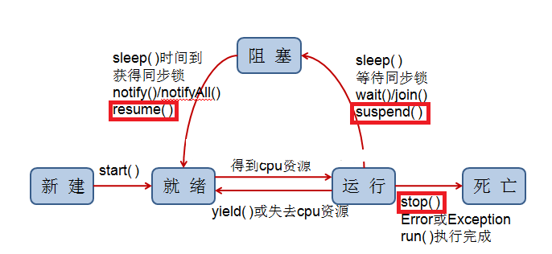
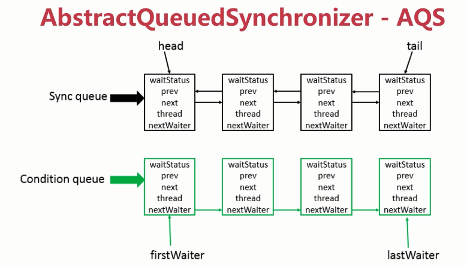

<!-- GFM-TOC -->
*  [Java线程同步与实现](#Java线程同步与实现)
    * [ReentrantLock可重入锁](#ReentrantLock可重入锁)
    * [synchronized](#synchronized)
    * [Condition条件对象](#Condition条件对象)
    * [Java线程的状态转换中线程同步方法](#Java线程的状态转换中线程同步方法)
    * [ThreadLocal](#ThreadLocal)
    * [volatile修饰变量](#volatile修饰变量)
    * [JUC_AQS](#JUC_AQS)
    * [JUC_Others](#JUC_Others)
<!-- GFM-TOC -->
# Java线程同步与实现
为何要使用Java线程同步？ 

Java允许多线程并发控制，当多个线程同时操作一个可共享的资源变量时，
将会导致数据不准确，相互之间产生冲突，因此加入同步锁以避免在该线程没有完成操作之前，
被其他线程的调用，从而保证了该变量的唯一性和准确性。

但其并发编程的根本，就是**使线程间进行正确的通信**。其中两个比较重要的关键点，如下：

```java
线程通信：重点关注线程同步的几种方式

正确通信：重点关注是否有线程安全问题
```
Java中提供了很多线程同步操作，
比如：synchronized关键字、wait/notifyAll、ReentrantLock、Condition、一些并发包下的工具类、
Semaphore，ThreadLocal、AbstractQueuedSynchronizer等。

## ReentrantLock可重入锁
自JDK5开始，新增了Lock接口以及它的一个实现类ReentrantLock。
ReentrantLock可重入锁是J.U.C包内置的一个锁对象，可以用来实现同步。
```java
public class LockThread implements Runnable{
    //ReentrantLock 是 java.util.concurrent包中的锁。
    private Lock lock=new ReentrantLock();
    private int count=0;

    @Override
    public void run() {
        lock.lock();//上锁
        try {
                for(int i=0;i<10;i++) {
                    System.out.println(Thread.currentThread().getName() + "==" + (count++));
                    Thread.sleep(100);
                }
        } catch (InterruptedException e) {
                e.printStackTrace();
        }finally {
            lock.unlock();//确保释放锁，从而避免发生死锁
        }
    }
}
```
```java
//一个线程运行完以后，另一个线程才运行
public class LockThreadTest {
    public static void main(String[] args) {
        LockThread lt=new LockThread();

        Thread t1=new Thread(lt);
        Thread t2=new Thread(lt);

        t1.start();
        t2.start();
    }
}
```
可重入锁中可重入表示的意义在于**对于同一个线程，可以继续调用加锁的方法，而不会被挂起**。
可重入锁内部维护一个计数器，对于同一个线程调用lock方法，计数器+1，调用unlock方法，计数器-1。

## synchronized
跟ReentrantLock一样，也支持可重入锁。
但是它是一个**关键字**，是一种语法级别的同步方式，称为内置锁。
```java
public class SyncThread implements Runnable{
    private static int count=0;

    @Override
    public void run() {
        synchronized(this){ //this指的是当前对象，这里作为锁对象
            //它只是作用于同一个对象，如果调用两个对象上的同步代码块，就不会进行同步。
            //当一个线程进入同步代码块，另一个线程就必须等待。
            for(int i=0;i<10;i++){
                try {
                    System.out.println(Thread.currentThread().getName()+"=="+(count++));
                    Thread.sleep(100);
                } catch (InterruptedException e) {
                    e.printStackTrace();
                }
            }
       }
    }

    public int getCount(){
        return count;
    }
}
```
```java
public class SyncThreadTest {
    public static void main(String[] args) {
        SyncThread st=new SyncThread();

        Thread t1=new Thread(st);
        Thread t2=new Thread(st);

        t2.start();
        t1.start();
    }
}
```
同步是一种高开销的操作，因此应该尽量减少同步的内容。
通常没有必要同步整个方法，使用synchronized代码块同步关键代码即可。

synchronized跟ReentrantLock相比，有几点局限性：

(1)加锁的时候不能设置超时。
ReentrantLock有提供tryLock方法，可以设置超时时间，如果超过了这个时间并且没有获取到锁，
就会放弃，而synchronized却没有这种功能；

(2)ReentrantLock可以使用多个Condition，而synchronized却只能有1个

(3)不能中断一个试图获得锁的线程

(4)ReentrantLock可以选择公平锁和非公平锁

(5)ReentrantLock可以获得正在等待线程的个数，计数器等

所以，Lock的操作与synchronized相比，灵活性更高，而且Lock提供多种方式获取锁，
有Lock、ReadWriteLock接口，以及实现这两个接口的ReentrantLock类、ReentrantReadWriteLock类。

关于Lock对象和synchronized关键字选择的考量：
(1)最好两个都不用，使用一种java.util.concurrent包提供的机制，能够帮助用户处理所有与锁相关的代码。

(2)如果synchronized关键字能满足用户的需求，就用synchronized，因为它能简化代码。

(3)如果需要更高级的功能，就用ReentrantLock类，此时要注意及时释放锁，否则会出现死锁，通常在finally代码释放锁。

在性能考量上来说，如果竞争资源不激烈，两者的性能是差不多的，而当竞争资源非常激烈时（即有大量线程同时竞争），
此时Lock的性能要远远优于synchronized。所以说，在具体使用时要根据适当情况选择。

Reentrant和sunchronized的简单用法(以买票为例)：
```java
//未实现任何同步
public class SellTicket implements Runnable{
    private int tickets = 100; //这一百张票是线程的共有资源

    @Override
    public void run() {
        // 是为了模拟一直有票
        while (true) {
            if (tickets > 0) {
                // 为了模拟更真实的场景，我们稍作休息
                try {
                    Thread.sleep(100); //t1进来了并休息，t2进来了并休息，t3进来了并休息，
                } catch (InterruptedException e) {
                    e.printStackTrace();
                }
                System.out.println(Thread.currentThread().getName() + "正在出售第" + (tickets--) + "张票");
            }
        }
    }
}
```
```java
//使用同步代码块，锁是任意对象
public class SellTicket2 implements Runnable{
    private int tickets = 100; //这一百张票是线程的共有资源

    //创建锁对象
    private Object obj = new Object();

    @Override
    public void run() {
        // 是为了模拟一直有票
        while (true) {
            synchronized (obj){ //同步代码块的锁是任何对象
                if (tickets > 0) {
                    // 为了模拟更真实的场景，我们稍作休息
                    try {
                        Thread.sleep(100); //t1进来了并休息，t2进来了并休息，t3进来了并休息，
                    } catch (InterruptedException e) {
                        e.printStackTrace();
                    }
                    System.out.println(Thread.currentThread().getName() + "正在出售第" + (tickets--) + "张票");
                }
            }
        }
    }
}
```
```java
//使用synchronized修饰方法，锁对象是当前对象
public class SellTicket3 implements Runnable{
    private int tickets = 100; //这一百张票是线程的共有资源

    //创建锁对象
    private Object obj = new Object();

    @Override
    public void run() {
        // 是为了模拟一直有票
        while (true) {
          sellTcicket();
        }
    }

    //锁对象是当前对象
    private synchronized void sellTcicket(){
        if (tickets > 0) {
            // 为了模拟更真实的场景，我们稍作休息
            try {
                Thread.sleep(100); //t1进来了并休息，t2进来了并休息，t3进来了并休息，
            } catch (InterruptedException e) {
                e.printStackTrace();
            }
            System.out.println(Thread.currentThread().getName() + "正在出售第" + (tickets--) + "张票");
        }
    }
}
```
```java
//使用用synchronized修饰静态方法，锁对象是Class对象
public class SellTicket4 implements Runnable{
    private static int tickets = 100; //这一百张票是线程的共有资源

    @Override
    public void run() {
        // 是为了模拟一直有票
        int x=0;
        while (true) {
            if(x%2==0){
                synchronized (SellTicket4.class){
                    sell();
                }
            }else{
                sellTicket(); //这里该同步静态方法的锁是 该类的字节码文件对象，即 SellTicket6.class
            }
            x++;
        }
    }

    private  static void sell(){
        if (tickets > 0) {
            // 为了模拟更真实的场景，我们稍作休息
            try {
                Thread.sleep(100); //t1进来了并休息，t2进来了并休息，t3进来了并休息，
            } catch (InterruptedException e) {
                e.printStackTrace();
            }
            System.out.println(Thread.currentThread().getName() + "正在出售第" + (tickets--) + "张票");
        }
    }

    private synchronized static void sellTicket(){
        //静态同步方法就是该类的	字节码文件对象
        sell();
    }
}
```
```java
//使用可重入锁进行同步
public class SellTicket5 implements Runnable{
    private static int tickets = 100; //这一百张票是线程的共有资源

    //创建锁对象
    private ReentrantLock locker=new ReentrantLock();

    @Override
    public void run() { //同步方法的锁是this
        // 是为了模拟一直有票
        while (true) {
            sell();
        }
    }

    private void sell(){
        try{
            locker.lock();
            if (tickets > 0) {
                // 为了模拟更真实的场景，我们稍作休息
                Thread.sleep(100); //t1进来了并休息，t2进来了并休息，t3进来了并休息，
                System.out.println(Thread.currentThread().getName() + "正在出售第" + (tickets--) + "张票");
            }
        } catch (InterruptedException e) {
            e.printStackTrace();
        }finally {
            locker.unlock();
        }
    }
}
```

## Condition条件对象
Condition条件对象的意义在于
**对于一个已经获取Lock锁的线程**，如果**还需要等待其他条件**才能继续执行的情况下，才会使用Condition条件对象。

Condition可以替代传统的线程间通信，**用await()替换wait()，用signal()替换notify()，
用signalAll()替换notifyAll()**。

```java
为什么方法名不直接叫wait()/notify()/nofityAll()？

因为Object的这几个方法是final的，不可重写！
```

```java
public class ConditionExample {
    private Lock lock = new ReentrantLock();

    //使用 Lock 来获取一个 Condition 对象。
    private Condition condition = lock.newCondition();

    public void before() {
        lock.lock();
        try {
            System.out.println("before");
            condition.signal();
        } finally {
            lock.unlock();
        }
    }

    public void after() {
        lock.lock();
        try {
            condition.await();
            //进行线程一直等待，一直到被唤醒。
            System.out.println("after");
        } catch (InterruptedException e) {
            e.printStackTrace();
        } finally {
            lock.unlock();
        }
    }

    public static void main(String[] args) {
        ExecutorService executorService = Executors.newCachedThreadPool();
        ConditionExample example = new ConditionExample();
        executorService.execute(() -> example.after());//thread2
        executorService.execute(() -> example.before());//thread1
    }
}
//输出结果：
//before
//after
```
thread2执行到condition.await()时，当前线程进入阻塞状态，
直到thread1调用了condition.signalAll()方法之后，thread2才会重新被激活执行。

注意：Condition是被绑定到Lock上的，要创建一个Lock的Condition必须用newCondition()方法。

## Java线程的状态转换中线程同步方法
Java线程的状态转换图:

<div align="center">  </div>

红线框起来的部分可以认为已过时，不再使用。

上图中的方法能够参与到线程同步中的方法，如下：

### 1、wait、notify、notifyAll方法
线程中通信可以使用的方法。线程中调用了wait方法，则进入阻塞状态，
只有等另一个线程调用与wait同一个对象的notify方法。
这里有个特殊的地方，调用wait或者notify，前提是需要获取锁，也就是说，需要在**同步块中做以上操作**。

**wait/notifyAll方式跟ReentrantLock/Condition方式的原理是一样的**。

Java中每个对象都拥有一个内置锁，在内置锁中调用wait，notify方法相当于
调用锁的Condition条件对象的await和signalAll方法。它们都属于 Object 的一部分，而不属于 Thread。

只能用在同步方法或者同步控制块中使用，否则会在运行时抛出 IllegalMonitorStateExeception。

使用 wait() 挂起期间，线程会释放锁。
**这是因为，如果没有释放锁，那么其它线程就无法进入对象的同步方法或者同步控制块中，
那么就无法执行 notify() 或者 notifyAll() 来唤醒挂起的线程，造成死锁**。

### 2、Join方法
在线程中调用另一个线程的join()方法，
会将当前线程挂起，而不是忙等待，直到目标线程结束。
```java
public class JoinMethodExample {
    private static class A extends Thread{
        @Override
        public void run() {
            System.out.println("A");
        }
    }

    private static class B extends Thread{
        private  A a;

        public B(A a){
            this.a=a;
        }

        @Override
        public void run() {
            try {
                a.join();
                //b虽然先启动，但是在b线程中调用了a线程的join()方法，b线程会等待a线程结束才继续执行，
                //因此最后能保证a线程的输出优先于b线程的输出。
            } catch (InterruptedException e) {
                e.printStackTrace();
            }
            System.out.println("B");
        }
    }

    public static void main(String[] args) {
        A a=new A();
        B b=new B(a);

        b.start();
        a.start();
    }
}
```

### 3、Yield方法
静态方法 Thread.yield() 的调用声明了当前线程已经完成了生命周期中最重要的部分，可以切换给其它线程来执行。
(该方法只是对线程调度器的一个建议，而且也只是建议具有相同优先级的其它线程可以运行。)
```java
public class YieldThreadExample {
    private static class YieldThread extends Thread{
        @Override
        public void run() {
            for(int i=0;i<20;i++){
                System.out.println(this.getName()+"\t"+i);
                Thread.yield(); //暂停当前正在执行的线程对象，并执行其他线程。
            }
        }
    }

    public static void main(String[] args) {
        YieldThread yt1=new YieldThread();
        YieldThread yt2=new YieldThread();

        yt1.setName("邓超");
        yt2.setName("孙俪");

        yt1.start();
        yt2.start();
    }
}
```

### 4、Sleep方法
Thread.sleep(millisec)会休眠当前正在执行的线程，millisec单位是毫秒。

sleep()可能会抛出InterruptedException，因为**异常不能跨线程传播回main()中**，因此必须在本地进行处理。
线程中抛出的其他异常也同样需要在本地进行处理。

```java
public class SleepMethodExample {
    public static void main(String[] args) {
        Thread t=new Thread(new Runnable() {
            @Override
            public void run() {
                try {
                    Thread.currentThread().sleep(10000);
                    for(int i=0;i<10;i++){
                        System.out.println(Thread.currentThread().getName()+"\t"+i);
                    }
                } catch (InterruptedException e) {
                    e.printStackTrace();
                }
            }
        });
        t.start();
    }
}
```

**sleep方法并不需要持有任何形式的锁，也就不需要包裹在synchronized中**。

```java
wait()和sleep()的区别？
(1)sleep()必须指定时间；wait()可以不指定时间，也可以指定时间
(2)sleep()不释放锁；wait()释放锁
(3)sleep()是Thread的静态方法；wait()是Object的方法
```

## ThreadLocal
ThreadLocal是一种把变量放到线程本地的方式来实现线程同步的。

对于以下代码，thread1 中设置 threadLocal 为 1，而 thread2 设置 threadLocal 为 2。
过了一段时间之后，thread1 读取 threadLocal 依然是 1，不受 thread2 的影响。
```java
public class ThreadLocalExample {
    public static void main(String[] args) {
        ThreadLocal threadLocal = new ThreadLocal();
        Thread thread1 = new Thread(() -> {
            threadLocal.set(1);
            try {
                Thread.sleep(1000);
            } catch (InterruptedException e) {
                e.printStackTrace();
            }
            System.out.println(threadLocal.get());
            threadLocal.remove();
        });
        Thread thread2 = new Thread(() -> {
            threadLocal.set(2);
            threadLocal.remove();
        });
        thread1.start();
        thread2.start();
    }
}
```
```java
public class ThreadLocalExample1 {
    public static void main(String[] args) {
        ThreadLocal threadLocal1 = new ThreadLocal();
        ThreadLocal threadLocal2 = new ThreadLocal();
        Thread thread1 = new Thread(() -> {
            threadLocal1.set(1);
            threadLocal2.set(1);
        });
        Thread thread2 = new Thread(() -> {
            threadLocal1.set(2);
            threadLocal2.set(2);
        });
        thread1.start();
        thread2.start();
    }
}
```
它所对应的底层结构图为：
<div align="center">  </div>

每个 Thread 都有一个 ThreadLocal.ThreadLocalMap 对象。

```java
/* ThreadLocal values pertaining to this thread. This map is maintained
 * by the ThreadLocal class. */
ThreadLocal.ThreadLocalMap threadLocals = null;
```

当调用一个 ThreadLocal 的 set(T value) 方法时，
先得到当前线程的 ThreadLocalMap 对象，
然后将 ThreadLocal->value 键值对插入到该 Map 中。

```java
public void set(T value) {
    Thread t = Thread.currentThread();
    ThreadLocalMap map = getMap(t);
    if (map != null)
        map.set(this, value);
    else
        createMap(t, value);
}
```
get() 方法类似。
```java
public T get() {
    Thread t = Thread.currentThread();
    ThreadLocalMap map = getMap(t);
    if (map != null) {
        ThreadLocalMap.Entry e = map.getEntry(this);
        if (e != null) {
            @SuppressWarnings("unchecked")
            T result = (T)e.value;
            return result;
        }
    }
    return setInitialValue();
}
```
**ThreadLocal 从理论上讲并不是用来解决多线程并发问题的，因为根本不存在多线程竞争**。

在一些场景 (尤其是使用线程池) 下，由于 ThreadLocal.ThreadLocalMap 的底层数据结构
导致 ThreadLocal 有内存泄漏的情况，应该**尽可能在每次使用 ThreadLocal 后手动调用 remove()**，
以避免出现 ThreadLocal 经典的内存泄漏甚至是造成自身业务混乱的风险。

## volatile修饰变量
volatile关键字为域变量的访问提供了一种免锁机制，
使用**volatile修饰域相当于告诉虚拟机该域可能会被其他线程更新，因此每次使用该域就要重新计算，
而不是使用寄存器中的值**，
volatile不会提供任何原子操作，它也不能用来修饰final类型的变量。
```java
//只给出要修改的代码，其余代码与上同
public class Bank {
    //需要同步的变量加上volatile
    private volatile int account = 100;
    public int getAccount() {
        return account;
    }
    //这里不再需要synchronized 
    public void save(int money) {
        account += money;
    }
｝
```
多线程中的**非同步问题主要出现在对域的读写上**，
如果让域自身避免这个问题，则就不需要修改操作该域的方法。
用final域，有锁保护的域和volatile域可以避免非同步的问题。

## JUC_AQS
java.util.concurrent（J.U.C）大大提高了并发性能，AQS 被认为是 J.U.C 的核心。

AQS：AbstractQueuedSynchronizer，即队列同步器。 
它是构建锁或者其他同步组件的基础框架（如ReentrantLock、ReentrantReadWriteLock、Semaphore等），
JUC并发包的作者（Doug Lea）期望它能够成为实现大部分同步需求的基础。
它是JUC并发包中的核心基础组件。 
其底层的数据结构可以看做一个队列，如下图所示：

<div align="center"></div>

Sync queue：双向链表，同步队列，head节点主要负责后面的调度。

Condition queue：单向链表，不是必须的的，也可以有多个。

具体实现思路：

首先AQS内部维护了一个CLH队列，来管理锁。

线程尝试获取锁，如果获取失败，则将等待信息等包装成一个Node结点，加入到同步队列Sync Queue里。

接着会不断重新尝试获取锁（当前结点为head的直接后继才会尝试），如果获取失败，则会阻塞自己，直到被唤醒。

当持有锁的线程释放锁的时候，会唤醒队列中的后继线程。

### CountdownLatch

用来控制一个线程等待多个线程。

维护了一个计数器 cnt，每次调用 countDown() 方法会让计数器的值减 1，
减到 0 的时候，那些因为调用 await() 方法而在等待的线程就会被唤醒。

<div align="center">  </div>

```java
public class CountdownLatchExample {

    public static void main(String[] args) throws InterruptedException {
        final int totalThread = 10;
        CountDownLatch countDownLatch = new CountDownLatch(totalThread);
        ExecutorService executorService = Executors.newCachedThreadPool();
        for (int i = 0; i < totalThread; i++) {
            executorService.execute(() -> {
                System.out.print("run..");
                countDownLatch.countDown();
            });
        }
        countDownLatch.await();
        System.out.println("end");
        executorService.shutdown();
    }
}
```

```html
run..run..run..run..run..run..run..run..run..run..end
```
**使用场景**：

(1)程序执行需要等待某个条件完成后，才能进行后面的操作。
比如父任务等待所有子任务都完成的时候， 再继续往下进行。

```java
public class CountdownLatchExample2 {
    //线程数量
    private static int threadCount=10;

    public static void main(String[] args) throws InterruptedException {
        ExecutorService executorService = Executors.newCachedThreadPool();

        final CountDownLatch countDownLatch = new CountDownLatch(threadCount);


        for (int i = 0; i < threadCount; i++) {
            final int threadNum = i;
            executorService.execute(() -> {
                try {
                    test(threadNum);
                } catch (InterruptedException e) {
                    e.printStackTrace();
                } finally {
                    countDownLatch.countDown();
                }

            });
        }
        countDownLatch.await();
        //上面的所有线程都执行完了,再执行主线程
        System.out.println("Finished!");
        executorService.shutdown();
    }

    private static void test(int threadNum) throws InterruptedException {
        Thread.sleep(100);
        System.out.println("run: "+threadNum);
    }
}
```
```html
run: 0
run: 1
run: 2
run: 8
run: 6
run: 7
run: 3
run: 9
run: 4
run: 5
Finished!
```

(2)指定线程执行时间的情况，超过这个时间,任务就不继续等待了，完成多少算多少。
```java
public class CountdownLatchExample3 {
    //线程数量
    private static int threadCount=10;

    public static void main(String[] args) throws InterruptedException {
        ExecutorService executorService= Executors.newCachedThreadPool();

        final CountDownLatch countDownLatch=new CountDownLatch(threadCount);

        for (int i = 0; i < threadCount; i++) {
            final int threadNum=i;
            executorService.execute(()->{
                try {
                    test(threadNum);
                } catch (InterruptedException e) {
                    e.printStackTrace();
                }finally {
                    countDownLatch.countDown();
                }
            });
        }
        countDownLatch.await(10, TimeUnit.MILLISECONDS);
        //上面线程如果在10 内未完成，则有可能会执行主线程
        System.out.println("Finished!");
        //不会立马关闭线程池，而是等待当前线程全部执行完再关闭线程池。
        executorService.shutdown();
    }

    private static void test(int threadNum) throws InterruptedException {
        Thread.sleep(10);
        System.out.println("run: "+threadNum);
    }
}
```
```html
run: 5
run: 2
run: 3
run: 4
run: 6
run: 7
run: 1
Finished!
run: 9
run: 8
run: 0
```
子线程执行时间超过10ms了，主线程就执行了，然后再执行剩下的子线程。

### CyclicBarrier
用来控制多个线程互相等待，只有当多个线程都到达时，这些线程才会继续执行。

和 CountdownLatch 相似，都是通过维护计数器来实现的。
线程执行 await() 方法之后计数器会减 1，并进行等待，直到计数器为 0，
所有调用 await() 方法而在等待的线程才能继续执行。

CyclicBarrier 和 CountdownLatch 的一个区别是:

CyclicBarrier 的计数器通过调用 reset() 方法可以循环使用，所以它才叫做**循环屏障**。

CyclicBarrier 有两个构造函数，
其中 parties 指示计数器的初始值，barrierAction 在所有线程都到达屏障的时候会执行一次。

```java
public CyclicBarrier(int parties, Runnable barrierAction) {
    if (parties <= 0) throw new IllegalArgumentException();
    this.parties = parties;
    this.count = parties;
    this.barrierCommand = barrierAction;
}

public CyclicBarrier(int parties) {
    this(parties, null);
}
```

<div align="center">  </div><br>

```java
public class CyclicBarrierExample {
    public static void main(String[] args) {
        final int totalThread = 10;
        CyclicBarrier cyclicBarrier = new CyclicBarrier(totalThread);
        ExecutorService executorService = Executors.newCachedThreadPool();
        for (int i = 0; i < totalThread; i++) {
            executorService.execute(() -> {
                System.out.print("before..");
                try {
                    cyclicBarrier.await();
                } catch (InterruptedException | BrokenBarrierException e) {
                    e.printStackTrace();
                }
                System.out.print("after..");
            });
        }
        executorService.shutdown();
    }
}
```

```html
before..before..before..before..before..before..before..before..before..before..after..after..after..after..after..after..after..after..after..after..
```

```java
public class CyclicBarrierExample2 {
    private static int threadCount = 10;

    public static void main(String[] args) throws InterruptedException {
        CyclicBarrier cyclicBarrier=new CyclicBarrier(5);
        ExecutorService executorService= Executors.newCachedThreadPool();
        for (int i = 0; i < threadCount; i++) {
            int finalI = i;
            executorService.execute(()->{
                try {
                    System.out.println("before..."+ finalI);
                    cyclicBarrier.await();
                    System.out.println("after..."+ finalI);
                } catch (Exception e) {
                    e.printStackTrace();
                }
            });
        }
        executorService.shutdown();
    }
}
```
```html
before...0
before...1
before...2
before...3
before...4
after...4
after...0
after...1
after...3
after...2
before...5
before...6
before...7
before...8
before...9
after...9
after...5
after...7
after...6
after...8
```
## Semaphore

Semaphore 类似于操作系统中的信号量，可以控制对互斥资源的访问线程数。

<div align="center">  </div>

以下代码模拟了对某个服务的并发请求，每次只能有 3 个客户端同时访问，请求总数为 10。

```java
public class SemaphoreExample {

    public static void main(String[] args) {
        final int clientCount = 3;
        final int totalRequestCount = 10;
        Semaphore semaphore = new Semaphore(clientCount);
        ExecutorService executorService = Executors.newCachedThreadPool();
        for (int i = 0; i < totalRequestCount; i++) {
            executorService.execute(()->{
                try {
                    semaphore.acquire();
                    System.out.print(semaphore.availablePermits() + " ");
                } catch (InterruptedException e) {
                    e.printStackTrace();
                } finally {
                    semaphore.release();
                }
            });
        }
        executorService.shutdown();
    }
}
```

```html
2 1 2 2 2 2 2 1 2 2
```

使用场景1：提供有限访问的资源

比如数据库的连接数最大只有20，而上层的并发数远远大于20，
这时候如果不作限制， 可能会由于无法获取连接而导致并发异常，
这时候可以使用Semaphore来进行控制，当信号量设置为1的时候，就和单线程很相似了。

```java
//每次只申请一次许可
public class SemaphoreExample2 {
    private static int clientCount = 3;
    private static int totalRequestCount = 10;

    public static void main(String[] args) {
        ExecutorService executorService= Executors.newCachedThreadPool();

        final Semaphore semaphore=new Semaphore(clientCount);

        for(int i=0;i<totalRequestCount;i++){
            final int threadNum=i;
            executorService.execute(new Runnable() {
                @Override
                public void run() {
                    try{
                        //获取一个许可
                        semaphore.acquire();
                        test(threadNum);
                    }catch (InterruptedException e) {
                        e.printStackTrace();
                    }finally {
                        semaphore.release();
                        //释放一个许可
                    }
                }
            });
        }
        executorService.shutdown();
    }

    private static void test(int threadNum) throws InterruptedException {
        System.out.println("run:"+threadNum);
        Thread.sleep(1000);
    }
}
```
```html
每隔一秒输出3个
 run:0
 run:2
 run:1

 run:4
 run:3
 run:5

 run:6
 run:7
 run:8

 run:9
```
```java
public class SemaphoreExample3 {
    private static int clientCount = 3;
    private static int totalRequestCount = 10;

    public static void main(String[] args) {
        ExecutorService executorService= Executors.newCachedThreadPool();

        final Semaphore semaphore=new Semaphore(clientCount);

        for(int i=0;i<totalRequestCount;i++){
            final int threadNum=i;
            executorService.execute(new Runnable() {
                @Override
                public void run() {
                    try{
                        //获取一个许可
                        semaphore.acquire(3);
                        //并发数是3,一次性获取3个许可，同1s内无其他许可释放，相当于单线程了
                        test(threadNum);
                    }catch (InterruptedException e) {
                        e.printStackTrace();
                    }finally {
                        semaphore.release(3);
                        //释放多个许可
                    }
                }
            });
        }
        executorService.shutdown();
    }

    private static void test(int threadNum) throws InterruptedException {
        System.out.println("run:"+threadNum);
        Thread.sleep(1000);
    }
}
```
```html
 每隔一秒输出1个
 run:0

 run:2

 run:1

 run:4

 run:3

 run:5
 
 run:6

 run:7

 run:8

 run:9
```

```java
public class SemaphoreExample4 {
    private static int clientCount = 2;
    private static int totalRequestCount = 10;

    public static void main(String[] args) {
        ExecutorService executorService= Executors.newCachedThreadPool();

        final Semaphore semaphore=new Semaphore(clientCount);

        for(int i=0;i<totalRequestCount;i++){
            final int threadNum=i;
            executorService.execute(new Runnable() {
                @Override
                public void run() {
                    try{
                        if(semaphore.tryAcquire()){
                            //尝试获取一个许可
                            test(threadNum);
                            semaphore.release();
                        }
                    }catch (InterruptedException e) {
                        e.printStackTrace();
                    }
                }
            });
        }
        executorService.shutdown();
    }

    private static void test(int threadNum) throws InterruptedException {
        System.out.println("run:"+threadNum);
        Thread.sleep(1000);
    }
}
```
```html
run:0
run:1
```

## JUC_Others
### FutureTask
在介绍 Callable 时我们知道它可以有返回值，返回值通过 Future<V> 进行封装。
FutureTask 实现了 RunnableFuture 接口，该接口继承自 Runnable 和 Future<V> 接口，
这使得 FutureTask 既可以当做一个任务执行，也可以有返回值。
```java
public class FutureTask<V> implements RunnableFuture<V>
```

```java
public interface RunnableFuture<V> extends Runnable, Future<V>
```

FutureTask 可用于异步获取执行结果或取消执行任务的场景。
当一个计算任务需要执行很长时间，那么就可以用 FutureTask 来封装这个任务，
主线程在完成自己的任务之后再去获取结果。

```java
public class FutureTaskExample {

    public static void main(String[] args) throws ExecutionException, InterruptedException {
        FutureTask<Integer> futureTask = new FutureTask<Integer>(new Callable<Integer>() {
            @Override
            public Integer call() throws Exception {
                int result = 0;
                for (int i = 0; i < 100; i++) {
                    Thread.sleep(10);
                    result += i;
                }
                return result;
            }
        });

        Thread computeThread = new Thread(futureTask);
        computeThread.start();

        Thread otherThread = new Thread(() -> {
            System.out.println("other task is running...");
            try {
                Thread.sleep(1000);
            } catch (InterruptedException e) {
                e.printStackTrace();
            }
        });
        otherThread.start();
        System.out.println(futureTask.get());
    }
}
```

```html
other task is running...
4950
```

## BlockingQueue
java.util.concurrent.BlockingQueue 接口有以下阻塞队列的实现：

-  **FIFO 队列** ：LinkedBlockingQueue、ArrayBlockingQueue（固定长度）

-  **优先级队列** ：PriorityBlockingQueue

提供了阻塞的 take() 和 put() 方法：

如果队列为空 take() 将阻塞，直到队列中有内容；

如果队列为满 put() 将阻塞，直到队列有空闲位置。

**使用 BlockingQueue 实现生产者消费者问题(以做包子和吃包子为例)** 
```java
//包子是共享资源
public class Baozi {
    private String name;
    private String pie;

    private boolean flag;//默认是 false,表示没有数据

    public synchronized void produce(String name,String pie){
        if(flag){ //表示有数据
            try {
                this.wait();
            } catch (InterruptedException e) {
                e.printStackTrace();
            }
        }

        //生产数据
        this.name=name;
        this.pie=pie;
        System.out.println("做包子");

        this.flag=true;
        this.notify();
    }

    public synchronized void consume(){
        if(!flag){
            try {
                this.wait();
            } catch (InterruptedException e) {
                e.printStackTrace();
            }
        }

        //消费数据
        System.out.println("吃"+this.name+"包子，馅是"+this.pie);

        this.flag=false;
        this.notify();
    }
}
```
```java
public class ProducerConsumer {
    public static class Producer extends Thread{
        private Baozi baozi;

        public Producer(Baozi baozi) {
            this.baozi = baozi;
        }

        @Override
        public void run() {
            baozi.produce("狗不理","肉");
        }
    }

    public static class Consumer extends Thread{
        private Baozi baozi;

        public Consumer(Baozi baozi) {
            this.baozi = baozi;
        }

        @Override
        public void run() {
            baozi.consume();
        }
    }

    public static void main(String[] args) {
            Baozi baozi=new Baozi();
            Consumer consumer = new Consumer(baozi);
            consumer.start();
            Producer producer = new Producer(baozi);
            producer.start();
    }
}
```

```html
做包子
吃狗不理包子，馅是肉
```

```java
public class Baozi2 {
    private String name;
    private String pie;

    public void produce(String name,String pie){
        //生产数据
        this.name=name;
        this.pie=pie;
        System.out.println("做包子");
    }

    public void consume(){
        //消费数据
        System.out.println("吃"+this.name+"包子，馅是"+this.pie);
    }
}
```
```java
public class ProducerConsumer2 {
    private static BlockingQueue<Baozi2> queue = new ArrayBlockingQueue<>(5);

    public static class Producer extends Thread {
        private Baozi2 baozi;

        public Producer(Baozi2 baozi) {
            this.baozi = baozi;
        }

        @Override
        public void run() {
            queue.add(baozi);
            baozi.produce("狗不理","肉");
        }
    }

    public static class Consumer extends Thread{
        @Override
        public void run() {
            Baozi2 baozi= null;
            try {
                baozi = queue.take();
            } catch (InterruptedException e) {
                e.printStackTrace();
            }
            baozi.consume();
        }
    }

    public static void main(String[] args) {
        Baozi2 baozi=new Baozi2();

        for (int i = 0; i < 2; i++) {
            Producer producer = new Producer(baozi);
            producer.start();
        }
        for (int i = 0; i < 5; i++) {
            Consumer consumer = new Consumer();
            consumer.start();
        }
        for (int i = 0; i < 3; i++) {
            Producer producer = new Producer(baozi);
            producer.start();
        }
    }
}
```
```html
做包子
做包子
吃狗不理包子，馅是肉
吃狗不理包子，馅是肉
做包子
做包子
吃狗不理包子，馅是肉
吃狗不理包子，馅是肉
做包子
吃狗不理包子，馅是肉
```

### ForkJoin

主要用于并行计算中，和 MapReduce 原理类似，都是把大的计算任务拆分成多个小任务并行计算。

```java
public class ForkJoinExample extends RecursiveTask<Integer> {

    private final int threshold = 5;
    private int first;
    private int last;

    public ForkJoinExample(int first, int last) {
        this.first = first;
        this.last = last;
    }

    @Override
    protected Integer compute() {
        int result = 0;
        if (last - first <= threshold) {
            // 任务足够小则直接计算
            for (int i = first; i <= last; i++) {
                result += i;
            }
        } else {
            // 拆分成小任务
            int middle = first + (last - first) / 2;
            ForkJoinExample leftTask = new ForkJoinExample(first, middle);
            ForkJoinExample rightTask = new ForkJoinExample(middle + 1, last);
            leftTask.fork();
            rightTask.fork();
            result = leftTask.join() + rightTask.join();
        }
        return result;
    }
}
```

```java
public static void main(String[] args) throws ExecutionException, InterruptedException {
    ForkJoinExample example = new ForkJoinExample(1, 10000);
    ForkJoinPool forkJoinPool = new ForkJoinPool();
    Future result = forkJoinPool.submit(example);
    System.out.println(result.get());
}
```

ForkJoin 使用 ForkJoinPool 来启动，它是一个特殊的线程池，线程数量取决于 CPU 核数。

```java
public class ForkJoinPool extends AbstractExecutorService
```

ForkJoinPool 实现了工作窃取算法来提高 CPU 的利用率。每个线程都维护了一个双端队列，用来存储需要执行的任务。工作窃取算法允许空闲的线程从其它线程的双端队列中窃取一个任务来执行。窃取的任务必须是最晚的任务，避免和队列所属线程发生竞争。例如下图中，Thread2 从 Thread1 的队列中拿出最晚的 Task1 任务，Thread1 会拿出 Task2 来执行，这样就避免发生竞争。但是如果队列中只有一个任务时还是会发生竞争。

<div align="center">  </div>