<!-- GFM-TOC -->
*  [内存模型基础概论](#内存模型基础概论)
    * [为什么要有内存模型](#为什么要有内存模型)
        * [CPU和缓存一致性](#CPU和缓存一致性)
        * [处理器优化和指令重排](#处理器优化和指令重排)
        * [并发编程的问题](#并发编程的问题)
    * [什么是内存模型](#什么是内存模型)
    * [什么是Java内存模型](#什么是Java内存模型)
        * [Java内存模型抽象](#Java内存模型抽象)
        * [重排序](#重排序)
        * [处理器重排序](#处理器重排序)
        * [内存屏障指令](#内存屏障指令)
        * [happens_before](#happens_before)
        * [数据依赖性](#数据依赖性)
        * [as_if_serial语义](#as_if_serial语义)
    * [Java内存模型实现](#Java内存模型实现)
<!-- GFM-TOC -->
# 内存模型基础概论
在并发编程中，需要解决两个关键问题：

线程之间如何通信

线程之间如何同步

**线程通信是指线程之间以何种机制来交换信息**。
在命令式编程中，线程之间的通信机制有两种：**共享内存和消息传递**。

```java
在共享内存的并发模型里，线程之间共享程序的公共状态，
线程之间通过写-读内存中的公共状态来隐式进行通信。

在消息传递的并发模型里，线程之间没有公共状态，
线程之间必须通过明确的发送消息来显式进行通信。
```

**线程同步是指程序用于控制不同线程之间操作发生相对顺序的机制**。
```java
在共享内存的并发模型里，同步是显式进行的。
程序员必须显式指定某个方法或某段代码需要在线程之间互斥执行。

在消息传递的并发模型里，由于消息的发送必须在消息的接收之前，因此同步是隐式进行的。
```
Java的并发采用的是**共享内存模型**，
Java线程之间的通信总是隐式进行，整个通信过程对程序员完全透明 — **隐式通信、显示同步**。

## 为什么要有内存模型
### CPU和缓存一致性
计算机在执行程序的时候，每条指令都是在CPU中执行的，而执行的时候，又免不了要和数据打交道。
而计算机上面的数据，是存放在主存当中的。

刚开始，还相安无事的，但是随着CPU技术的发展，CPU的执行速度越来越快。
而由于内存的技术并没有太大的变化，所以从内存中读取和写入数据的过程和CPU的执行速度比起来差距就会越来越大，
这就导致**CPU每次操作内存都要耗费很多时间来等待**。

举个例子：
```java
这就像一家创业公司，刚开始，创始人和员工之间工作关系其乐融融，
但是随着创始人的能力和野心越来越大，逐渐和员工之间出现了差距，普通员工原来越跟不上CEO的脚步。
老板的每一个命令，传到到基层员工之后，由于基层员工的理解能力、执行能力的欠缺，就会耗费很多时间。
这也就无形中拖慢了整家公司的工作效率。
```

可是，不能因为内存的读写速度慢，就不发展CPU技术了吧，总不能让内存成为计算机处理的瓶颈吧。

所以，人们想出来了一个好的办法，就是**在CPU和内存之间增加高速缓存**。
缓存的概念大家都知道，就是保存一份数据拷贝。它的特点是**速度快，内存小，价格贵**。
那么，程序的执行过程就变成了：

当程序在运行过程中，会**将运算需要的数据从主存复制一份到CPU的高速缓存当中**，
那么CPU进行计算时就可以直接从它的高速缓存读取数据和向其中写入数据，
当运算结束之后，再将高速缓存中的数据刷新到主存当中。

接着上个例子：
```java
之后，这家公司开始设立中层管理人员，管理人员直接归CEO领导，
领导有什么指示，直接告诉管理人员，然后就可以去做自己的事情了。
管理人员负责去协调底层员工的工作。
因为管理人员是了解手下的人员以及自己负责的事情的。
所以，大多数时候，公司的各种决策，通知等，CEO只要和管理人员之间沟通就够了。
```
而随着CPU能力的不断提升，一层缓存就慢慢的无法满足要求了，就逐渐的衍生出多级缓存。

按照数据读取顺序和与CPU结合的紧密程度，
CPU缓存可以分为**一级缓存（L1），二级缓存（L3），部分高端CPU还具有三级缓存（L3）**，
每一级缓存中所储存的全部数据都是下一级缓存的一部分。
这三种缓存的技术难度和制造成本是相对递减的，所以其容量也是相对递增的。

那么，在有了多级缓存之后，程序的执行就变成了：

当CPU要读取一个数据时，首先从一级缓存中查找，
如果没有找到再从二级缓存中查找，如果还是没有就从三级缓存或内存中查找。

```java
随着公司越来越大，老板要管的事情越来越多，公司的管理部门开始改革，
开始出现高层，中层，底层等管理者。一级一级之间逐层管理。
```
**单核CPU只含有一套L1，L2，L3缓存**。

**多核CPU，则每个核都含有一套L1（甚至和L2）缓存，而共享L3（或者和L2）缓存**。

公司也分很多种，有些公司只有一个大Boss，他一个人说了算。
但是有些公司有比如联席总经理、合伙人等机制。

```java
单核CPU就像一家公司只有一个老板，所有命令都来自于他，
那么就只需要一套管理班底就够了。

多核CPU就像一家公司是由多个合伙人共同创办的，那么，
就需要给每个合伙人都设立一套供自己直接领导的高层管理人员，
多个合伙人共享使用的是公司的底层员工。

还有的公司，不断壮大，开始拆分出各个子公司。
各个子公司就是多个CPU了，之前没有共用的资源。互不影响。
```

一个单CPU双核的缓存结构:

<div align="center">  </div>

随着计算机能力不断提升，开始支持多线程。那么问题就来了。
我们分别来分析下单线程、多线程在单核CPU、多核CPU中的影响：

(1)单线程：

CPU核心的缓存只被一个线程访问。
缓存独占，不会出现访问冲突等问题。

(2)单核CPU，多线程：

进程中的多个线程会同时访问进程中的共享数据，CPU将某块内存加载到缓存后，
不同线程在访问相同的物理地址的时候，都会映射到相同的缓存位置，
这样即使发生线程的切换，缓存仍然不会失效。
但由于**任何时刻只能有一个线程在执行，因此不会出现缓存访问冲突**。

(3)多核CPU，多线程：

每个核都至少有一个L1 缓存。
多个线程访问进程中的某个共享内存，
且这多个线程分别在不同的核心上执行，
则每个核心都会在各自的caehe中保留一份共享内存的缓冲。
由于**多核是可以并行的，可能会出现多个线程同时写各自的缓存的情况**，
而各自的cache之间的数据就有可能不同。

在CPU和主存之间增加缓存，在多线程场景下就可能存在缓存一致性问题，
也就是说，**在多核CPU中，每个核的自己的缓存中，关于同一个数据的缓存内容可能不一致**。

```java
如果这家公司的命令都是串行下发的话，那么就没有任何问题。

如果这家公司的命令都是并行下发的话，
并且这些命令都是由同一个CEO下发的，这种机制是也没有什么问题。
因为他的命令执行者只有一套管理体系。

如果这家公司的命令都是并行下发的话，并且这些命令是由多个合伙人下发的，这就有问题了。
因为每个合伙人只会把命令下达给自己直属的管理人员，
而多个管理人员管理的底层员工可能是公用的。

比如，合伙人1要辞退员工a，合伙人2要给员工a升职，
升职后的话他再被辞退需要多个合伙人开会决议。
两个合伙人分别把命令下发给了自己的管理人员。
合伙人1命令下达后，管理人员a在辞退了员工后，他就知道这个员工被开除了。
而合伙人2的管理人员2这时候在没得到消息之前，
还认为员工a是在职的，他就欣然的接收了合伙人给他的升职a的命令。
```

多核CPU多线程场景下缓存不一致问题:
<div align="center"> 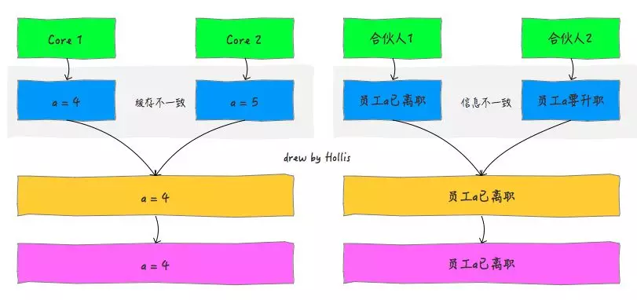 </div>

### 处理器优化和指令重排
上面提到在CPU和主存之间增加缓存，在多线程场景下会存在缓存一致性问题。
除了这种情况，还有一种硬件问题也比较重要。
那就是**为了使处理器内部的运算单元能够尽量的被充分利用，
处理器可能会对输入代码进行乱序执行处理**。这就是**处理器优化**。

除了现在很多流行的处理器会对代码进行优化乱序处理，很多编程语言的编译器也会有类似的优化，
比如：**Java虚拟机的即时编译器（JIT）也会做指令重排**。

可想而知，如果任由**处理器优化**和**编译器对指令重排**的话，就可能导致各种各样的问题。
```java
关于员工组织调整的情况，如果允许人事部在接到多个命令后进行随意拆分乱序执行或者重排的话，
那么对于这个员工以及这家公司的影响是非常大的。
```

### 并发编程的问题
原子性问题，可见性问题和有序性问题，是人们抽象定义出来的。
而这个抽象的底层问题就是前面提到的缓存一致性问题、处理器优化问题和指令重排问题等。

**缓存一致性问题其实就是可见性问题**

**处理器优化是可以导致原子性问题**

**指令重排即会导致有序性问题**

- [原子性、可见性、有序性](https://github.com/DuHouAn/Java/blob/master/JavaConcurrentProgramming/notes/04Java%E7%BA%BF%E7%A8%8B%E5%AE%89%E5%85%A8%E7%89%B9%E6%80%A7%E4%B8%8E%E9%97%AE%E9%A2%98.md)

## 什么是内存模型
缓存一致性问题、处理器器优化的指令重排问题是硬件的不断升级导致的。

为了保证并发编程中可以满足原子性、可见性及有序性。

有一个重要的概念，那就是——内存模型，
**定义了共享内存系统中多线程程序读写操作行为的规范**。

通过这些规则来规范对内存的读写操作，从而保证指令执行的正确性。
它与处理器有关、与缓存有关、与并发有关、与编译器也有关。
它解决了CPU多级缓存、处理器优化、指令重排等导致的内存访问问题，
保证了并发场景下的一致性、原子性和有序性。

内存模型解决并发问题主要采用两种方式：

**限制处理器优化**

**使用内存屏障**

## 什么是Java内存模型
Java程序是需要运行在Java虚拟机上面的，Java内存模型（Java Memory Model ,JMM）
就是一种符合内存模型规范的，屏蔽了各种硬件和操作系统的访问差异的，
**保证了Java程序在各种平台下对内存的访问都能保证效果一致的机制及规范**。

Java内存模型规定了**所有的变量都存储在主内存中**，
**每条线程还有自己的工作内存**，
线程的工作内存中保存了该线程中用到的变量的**主内存副本拷贝**，
**线程对变量的所有操作都必须在工作内存中进行，而不能直接读写主内存**。
不同的线程之间也无法直接访问对方工作内存中的变量，
线程间变量的传递均需要自己的工作内存和主存之间进行数据同步进行。

**JMM就作用于工作内存和主存之间数据同步过程**。
他规定了如何做数据同步以及什么时候做数据同步。

<div align="center"> 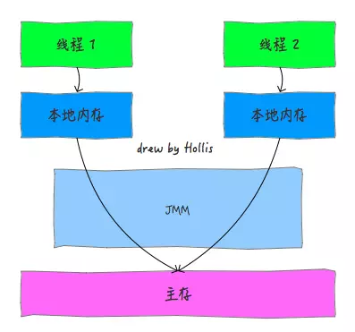 </div>

特别需要注意的是，主内存和工作内存
与JVM内存结构中的Java堆、栈、方法区等并不是同一个层次的内存划分，无法直接类比。

再来总结下，JMM是**一种规范**，规范了Java虚拟机与计算机内存是如何协同工作的，
目的是解决由于多线程通过共享内存进行通信时，存在的本地内存数据不一致、编译器会对代码指令重排序、处理器会对代码乱序执行等带来的问题。
目的是保证并发编程场景中的原子性、可见性和有序性。
所以，如果你想设计表现良好的并发程序，理解Java内存模型是非常重要的。
Java内存模型规定了如何和何时可以看到由其他线程修改过后的共享变量的值，
以及在必须时如何同步的访问共享变量。

### Java内存模型抽象
在Java中，所有**实例域、静态域和数组元素存储在堆内存中，堆内存在线程之间共享**。
**局部变量（Local variables），方法定义参数（formal method parameters）和
异常处理器参数（exception handler parameters）不会在线程之间共享**，
它们不会有内存可见性问题，也不受内存模型的影响。
Java线程之间的通信由Java内存模型（JMM）控制，
JMM决定一个线程对共享变量的写入何时对另一个线程可见。
从抽象的角度来看，**JMM定义了线程和主内存之间的抽象关系**：

<div align="center"> 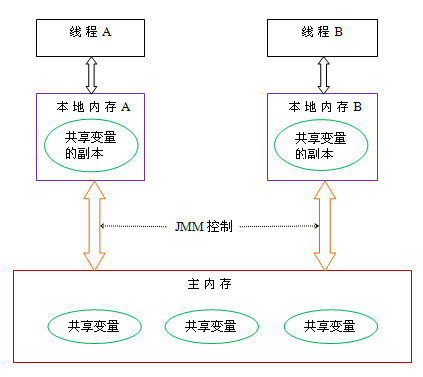 </div>

从上图来看，线程A与线程B之间如要通信的话，必须要经历下面2个步骤：

首先，线程A把本地内存A中更新过的共享变量刷新到主内存中去

然后，线程B到主内存中去读取线程A之前已更新过的共享变量

下面通过示意图来说明这两个步骤：

<div align="center"> 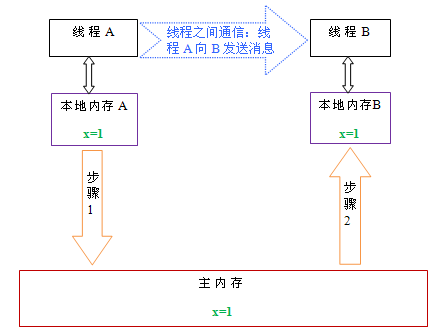 </div>

如上图所示，本地内存A和B有主内存中共享变量x的副本。
假设初始时，这三个内存中的x值都为0。线程A在执行时，
把更新后的x值（假设值为1）临时存放在自己的本地内存A中。

当线程A和线程B需要通信时：

**线程A首先会把自己本地内存中修改后的x值刷新到主内存中，此时主内存中的x值变为了1**。

**随后，线程B到主内存中去读取线程A更新后的x值，此时线程B的本地内存的x值也变为了1**。

从整体来看，这两个步骤实质上是线程A在向线程B发送消息，而且这个通信过程必须要经过主内存。
**JMM通过控制主内存与每个线程的本地内存之间的交互，来为Java程序员提供内存可见性保证**。

### 重排序
在执行程序时为了提高性能，编译器和处理器常常会对指令做重排序。重排序分三种类型：

(1)编译器优化的重排序。
编译器在不改变单线程程序语义的前提下，可以重新安排语句的执行顺序。

(2)指令级并行的重排序。
现代处理器采用了指令级并行技术（Instruction-Level Parallelism， ILP）来将多条指令重叠执行。如果不存在数据依赖性，处理器可以改变语句对应机器指令的执行顺序。

(3)内存系统的重排序。
由于处理器使用缓存和读/写缓冲区，这使得加载和存储操作看上去可能是在乱序执行。

从Java源代码到最终实际执行的指令序列，会分别经历下面三种重排序：

<div align="center"> 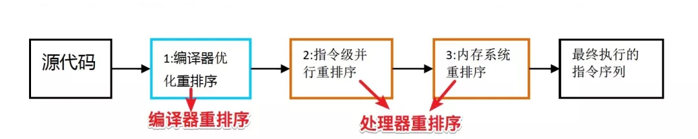 </div>

这些重排序都可能会导致多线程程序出现内存可见性问题。

(1)对于编译器，
JMM的编译器重排序规则会禁止特定类型的编译器重排序（不是所有的编译器重排序都要禁止）。

(2)对于处理器重排序，J
MM的处理器重排序规则会要求Java编译器在生成指令序列时，
插入特定类型的**内存屏障（memory barriers，intel称之为memory fence）指令**，
通过内存屏障指令来禁止特定类型的处理器重排序（不是所有的处理器重排序都要禁止）。

JMM属于**语言级的内存模型**，它确保在不同的编译器和不同的处理器平台之上，
通过**禁止特定类型的编译器重排序和处理器重排序，为程序员提供一致的内存可见性保证**。

### 处理器重排序
现代的处理器使用**写缓冲区**来临时保存向内存写入的数据。
写缓冲区可以保证指令流水线持续运行，
它可以避免由于处理器停顿下来等待向内存写入数据而产生的延迟。
同时，通过**以批处理的方式刷新写缓冲区**，
以及**合并写缓冲区中对同一内存地址的多次写，可以减少对内存总线的占用**。
虽然写缓冲区有这么多好处，但每个处理器上的写缓冲区，仅仅**对它所在的处理器可见**。
这个特性会对内存操作的执行顺序产生重要的影响：

**处理器对内存的读/写操作的执行顺序，不一定与内存实际发生的读/写操作顺序一致！**

<div align="center"> 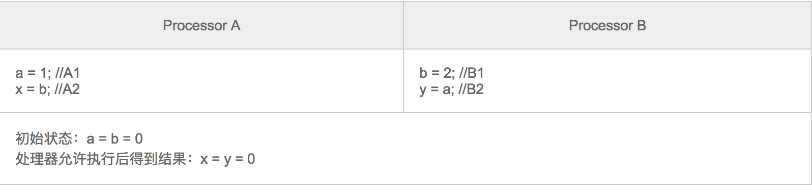 </div>

假设处理器A和处理器B按程序的顺序并行执行内存访问，最终却可能得到 x = y = 0。具体的原因如下图所示：

<div align="center"> 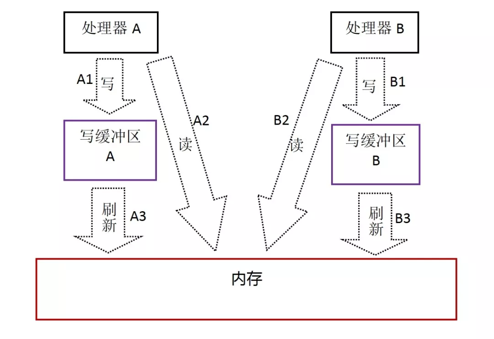 </div>

处理器 A 和 B 同时把共享变量写入在写缓冲区中（A1、B1），
然后再从内存中读取另一个共享变量（A2、B2），
最后才把自己写缓冲区中保存的脏数据刷新到内存中（A3、B3）。
当以这种时序执行时，程序就可以得到 x = y = 0 的结果。

从内存操作实际发生的顺序来看，直到处理器 A 执行 A3 来刷新自己的写缓存区，写操作 A1 才算真正执行了。
虽然处理器 A 执行内存操作的顺序为：A1 -> A2，
但内存操作实际发生的顺序却是：A2 -> A1。
此时，处理器 A 的内存操作顺序被重排序了。

这里的关键是，由于**写缓冲区仅对自己的处理器可见**，
它会导致**处理器执行内存操作的顺序可能会与内存实际的操作执行顺序不一致**。
由于**现代的处理器都会使用写缓冲区，因此现代的处理器都会允许对内存写-读操作重排序**。

### 内存屏障指令
**常见的处理器都允许Store-Load重排序**

**常见的处理器都不允许对存在数据依赖的操作做重排序**

为了保证内存可见性，
**Java 编译器在生成指令序列的适当位置会插入内存屏障指令来禁止特定类型的处理器重排序**。
JMM 把内存屏障指令分为下列四类：

<div align="center">  </div>

### happens_before
#### 1. 单一线程原则

> Single Thread rule

在一个线程内，在程序前面的操作先行发生于后面的操作。

<div align="center">  </div><br>

#### 2. 管程锁定规则

> Monitor Lock Rule

一个 unlock 操作先行发生于后面对同一个锁的 lock 操作。

<div align="center">  </div><br>

#### 3. volatile 变量规则

> Volatile Variable Rule

对一个 volatile 变量的写操作先行发生于后面对这个变量的读操作。

<div align="center">  </div><br>

#### 4. 线程启动规则

> Thread Start Rule

Thread 对象的 start() 方法调用先行发生于此线程的每一个动作。

<div align="center">  </div><br>

#### 5. 线程加入规则

> Thread Join Rule

Thread 对象的结束先行发生于 join() 方法返回。

<div align="center">  </div><br>

#### 6. 线程中断规则

> Thread Interruption Rule

对线程 interrupt() 方法的调用先行发生于被中断线程的代码检测到中断事件的发生，

可以通过 interrupted() 方法检测到是否有中断发生。

#### 7. 对象终结规则

> Finalizer Rule

一个对象的初始化完成（构造函数执行结束）先行发生于它的 finalize() 方法的开始。

#### 8. 传递性

> Transitivity

如果操作 A 先行发生于操作 B，操作 B 先行发生于操作 C，那么操作 A 先行发生于操作 C。

两个操作之间具有happens-before关系，
并不意味着前一个操作必须要在后一个操作之前执行！
happens-before仅仅要求前一个操作（执行的结果）对后一个操作可见，
且前一个操作按顺序排在第二个操作之前
（the first is visible to and ordered before the second）。

<div align="center"> 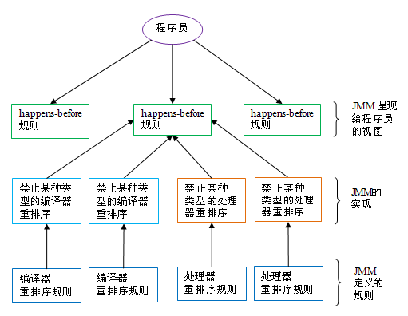 </div>

**一个happens-before规则通常对应于多个编译器和处理器重排序规则**。
对于Java程序员来说，happens-before规则简单易懂，
它避免java程序员为了理解JMM提供的内存可见性保证而去学习复杂的重排序规则以及这些规则的具体实现。

### 数据依赖性
如果两个操作访问同一个变量，且这两个操作中有一个为写操作，
此时这两个操作之间就存在数据依赖性。
数据依赖分下列三种类型：

<div align="center"> 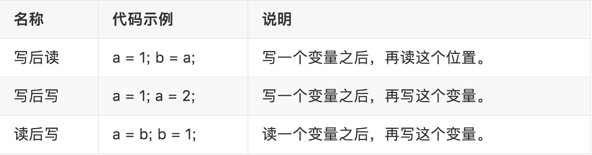 </div>

上面三种情况，只要重排序两个操作的执行顺序，程序的执行结果将会被改变。

前面提到过，编译器和处理器可能会对操作做重排序。
**编译器和处理器在重排序时，会遵守数据依赖性，
编译器和处理器不会改变存在数据依赖关系的两个操作的执行顺序**。
注意，这里所说的数据依赖性仅针对**单个处理器**中执行的指令序列和**单个线程**中执行的操作，
不同处理器之间和不同线程之间的数据依赖性不被编译器和处理器考虑。

### as_if_serial 语义
as-if-serial 语义的意思指：不管怎么重排序（编译器和处理器为了提高并行度），（单线程）程序的执行结果不能被改变。
编译器，runtime 和处理器都必须遵守 as-if-serial 语义。

为了遵守 as-if-serial 编译器和处理器不会对存在数据依赖关系的操作做重排序，因为这种重排序会改变执行结果。
但是如果操作之间没有数据依赖关系，这些操作就可能被编译器和处理器重排序。

举个例子：
```java
double pi = 3.14; // A

double r = 1.0; // B

double area = pi * r * r; // C
```

<div align="center"> 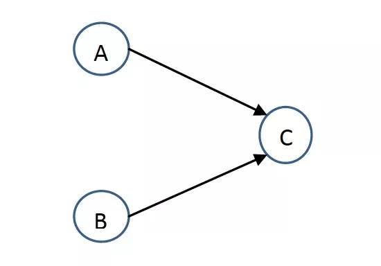 </div>

如上图所示，A 和 C 之间存在数据依赖关系，同时 B 和 C 之间也存在数据依赖关系。
因此在最终执行的指令序列中，C 不能被重排序到 A 和 B 的前面（C 排到 A 和 B 的前面，程序的结果将会被改变）。
但 A 和 B 之间没有数据依赖关系，编译器和处理器可以重排序 A 和 B 之间的执行顺序。
下图是该程序的两种可能执行顺序：

<div align="center"> 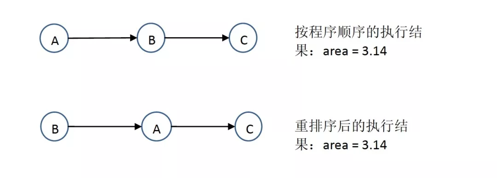 </div>

## Java内存模型实现
了解Java多线程的朋友都知道，在Java中提供了一系列和并发处理相关的关键字，
比如：volatile、synchronized、final、concurrent包等。
其实这些就是 Java内存模型封装了底层的实现后提供给程序员使用的一些关键字。
在开发多线程的代码的时候，我们可以直接使用 synchronized 等关键字来控制并发，
从来就不需要关心底层的编译器优化、缓存一致性等问题。
所以，Java内存模型，除了定义了一套规范，
还提供了一系列原语，封装了底层实现后，供开发者直接使用。

### 原子性
在Java中，为了保证原子性，提供了两个高级的字节码指令 monitor enter 和 monitor exit，
这两个字节码，在Java中对应的关键字就是 synchronized。

因此，在Java中可以使用**synchronized 来保证方法和代码块内的操作是原子性的**。

### 可见性
Java内存模型是通过在变量修改后将新值同步回主内存，
在变量读取前从主内存刷新变量值的这种依赖主内存作为传递媒介的方式来实现的。
Java中的 volatile 关键字提供了一个功能，那就是被其修饰的变量在被修改后可以立即同步到主内存，被其修饰的变量在每次是用之前都从主内存刷新。
因此，可以使用 volatile 来保证多线程操作时变量的可见性。
除了 volatile，Java中的 synchronized 和 final 两个关键字也可以实现可见性。

### 有序性
可以使用 synchronized 和 volatile 来保证多线程之间操作的有序性。实现方式有所区别：

**volatile关键字会禁止指令重排**

**synchronized关键字保证同一时刻只允许一条线程操作**