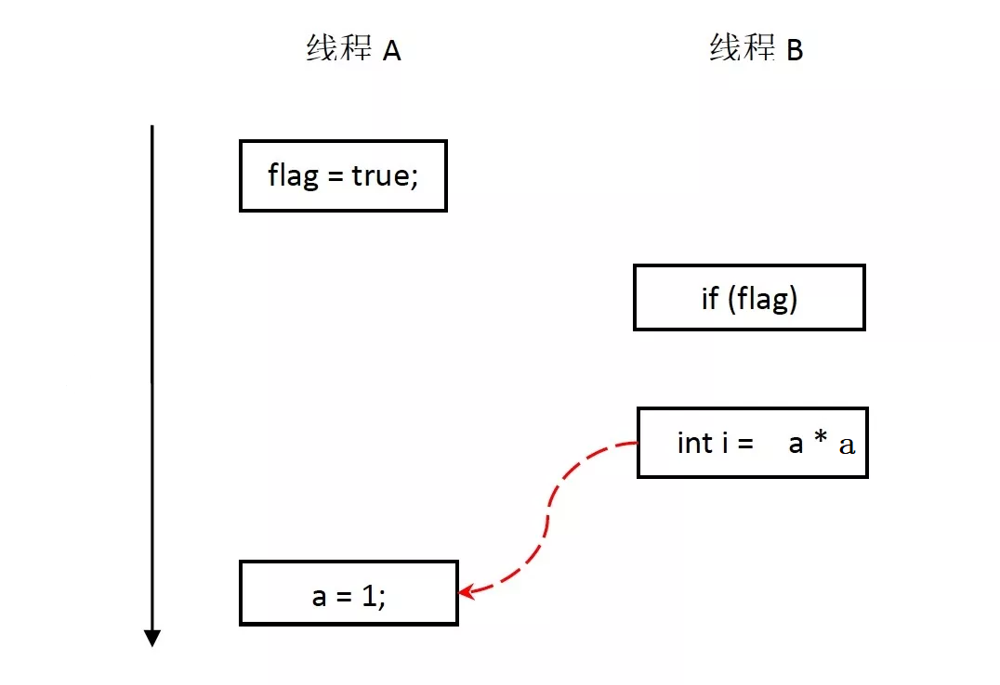
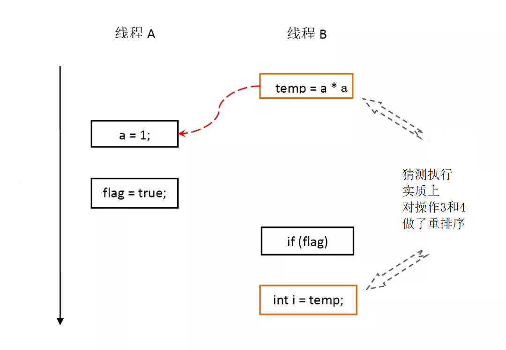

<!-- GFM-TOC -->
*  [内存模型之重排序](#内存模型之重排序)
   * [编译器重排序](#编译器重排序)
   * [处理器重排序](#处理器重排序)
    * [指令并行重排序](#指令并行重排序)
    * [指令乱序重排序](#指令乱序重排序)
<!-- GFM-TOC -->
# 内存模型之重排序
## 编译器重排序
编译器在不改变单线程程序语义的前提下，可以重新安排语句的执行顺序，
**在不改变程序语义的前提下，尽可能减少寄存器的读取、存储次数，充分复用寄存器的存储值**。

假设第一条指令计算一个值赋给变量A并存放在寄存器中，
第二条指令与A无关但需要占用寄存器（假设它将占用A所在的那个寄存器），
第三条指令使用A的值且与第二条指令无关。
那么如果按照顺序一致性模型，
A在第一条指令执行过后被放入寄存器，在第二条指令执行时A不再存在，
第三条指令执行时A重新被读入寄存器，而这个过程中，A的值没有发生变化。

**通常编译器都会交换第二和第三条指令的位置，
这样第一条指令结束时A存在于寄存器中，接下来可以直接从寄存器中读取A的值，
降低了重复读取的开销**。

另一种编译器优化：**在循环中读取变量的时候，为提高存取速度，
编译器会先把变量读取到一个寄存器中**；
以后再取该变量值时，就直接从寄存器中取，不会再从内存中取值了。
这样能够减少不必要的访问内存。
但是提高效率的同时，也引入了新问题。**如果别的线程修改了内存中变量的值，
那么由于寄存器中的变量值一直没有发生改变，很有可能会导致循环不能结束**。
编译器进行代码优化，会提高程序的运行效率，但是也可能导致错误的结果。
所以程序员需要防止编译器进行错误的优化。

## 处理器重排序
### 指令并行重排序
编译器和处理器可能会对操作做重排序，但是要遵守**数据依赖关系，
编译器和处理器不会改变存在数据依赖关系的两个操作的执行顺序**。

如果两个操作访问同一个变量，且这两个操作中有一个为写操作，
此时这两个操作之间就存在数据依赖性。数据依赖分下列三种类型：

<div align="center">  </div>

上面三种情况，只要重排序两个操作的执行顺序，程序的执行结果将会被改变。
像这种有直接依赖关系的操作，是不会进行重排序的。
特别注意：这里说的依赖关系仅仅是在**单个线程内**。

举例：
```java
class Demo {
    int a = 0;
    boolean flag = false;

    public void write() {
        a = 1; // 1
        flag = true; // 2
    }

    public void read() {
        if (flag) { // 3
            int i = a * a; // 4
        }
    }
}
```
操作 1 和 2 没有数据依赖关系，编译器和处理器可以对这两个操作重排序；

操作 3 和操作 4 没有数据依赖关系，编译器和处理器也可以对这两个操作重排序。

(1)当操作 1 和操作 2 重排序时，可能会产生什么效果？

<div align="center">  </div>

如上图所示，操作 1 和操作 2 做了重排序。
程序执行时，线程 A 首先写标记变量 flag，随后线程 B 读这个变量。
由于条件判断为真，线程 B 将读取变量 a。
此时，变量 a 还根本没有被线程 A 写入，在这里多线程程序的语义被重排序破坏了！

(2)当操作 3 和操作 4 重排序时，可能会产生什么效果?（借助这个重排序，可以顺便说明控制依赖性）

<div align="center">  </div>

在程序中，操作 3 和操作 4 存在控制依赖关系。当代码中存在控制依赖性时，
会影响指令序列执行的并行度。
为此，编译器和处理器会采用**猜测（Speculation）执行**来克服控制相关性对并行度的影响。
以处理器的猜测执行为例：

执行线程 B 的处理器可以提前读取并计算 a * a，
然后把计算结果临时保存到一个名为重排序缓冲（reorder buffer ROB）的硬件缓存中。
当接下来操作 3 的条件判断为真时，就把该计算结果写入变量 i 中。

从图中我们可以看出，猜测执行实质上对操作3和4做了重排序。重排序在这里破坏了多线程程序的语义！

结论：

在单线程程序中，对存在控制依赖的操作重排序，
不会改变执行结果（这也是 as-if-serial 语义允许对存在控制依赖的操作做重排序的原因）

在多线程程序中，对存在控制依赖的操作重排序，可能会改变程序的执行结果。

### 指令乱序重排序
现在的CPU一般采用流水线来执行指令。’
一个指令的执行被分成：取指、译码、访存、执行、写回、等若干个阶段。
然后，多条指令可以同时存在于流水线中，同时被执行。

**指令流水线并不是串行的**，并不会因为一个耗时很长的指令在“执行”阶段呆很长时间，

而导致后续的指令都卡在“执行”之前的阶段上。

相反，**流水线是并行的**，多个指令可以同时处于同一个阶段，
只要CPU内部相应的处理部件未被占满即可。
比如：CPU有一个加法器和一个除法器，
那么一条加法指令和一条除法指令就可能同时处于“执行”阶段，
而两条加法指令在“执行”阶段就只能串行工作。

然而，这样一来，乱序可能就产生了。
比如：一条加法指令原本出现在一条除法指令的后面，但是由于除法的执行时间很长，
在它执行完之前，加法可能先执行完了。
再比如两条访存指令，可能由于第二条指令命中了cache而导致它先于第一条指令完成。
一般情况下，指令乱序并不是CPU在执行指令之前刻意去调整顺序。
CPU总是顺序的去内存里面取指令，然后将其顺序的放入指令流水线。
但是**指令执行时的各种条件，指令与指令之间的相互影响**，
可能导致顺序放入流水线的指令，最终乱序执行完成。
这就是所谓的**顺序流入，乱序流出**。

指令流水线除了在资源不足的情况下会卡住之外（如前所述的一个加法器应付两条加法指令的情况），
指令之间的相关性也是导致流水线阻塞的重要原因。
CPU的乱序执行并不是任意的乱序，而是以保证程序上下文因果关系为前提的。
有了这个前提，CPU执行的正确性才有保证。

```java
a++; 
b=f(a); 
c--;
```
由于 b=f(a) 这条指令依赖于前一条指令 a++ 的执行结果，
所以 b=f(a) 将在 “执行” 阶段之前被阻塞，直到 a++ 的执行结果被生成出来；
而 c-- 跟前面没有依赖，它可能在 b=f(a) 之前就能执行完。
（注意，这里的 f(a) 并不代表一个以 a 为参数的函数调用，而是代表以 a 为操作数的指令。
C语言的函数调用是需要若干条指令才能实现的，情况要更复杂些）。
像这样有依赖关系的指令如果挨得很近，后一条指令必定会因为等待前一条执行的结果，
而在流水线中阻塞很久，占用流水线的资源。
而编译器的重排序，作为编译优化的一种手段，
则试图通过指令重排将这样的两条指令拉开距离，
以至于后一条指令进入CPU的时候，前一条指令结果已经得到了，那么也就不再需要阻塞等待了。

比如，将指令重排序为：
```java
a++; 
c--; 
b=f(a);
```
相比于CPU指令的乱序，编译器的乱序才是真正对指令顺序做了调整。
但是编译器的乱序也必须保证程序上下文的因果关系不发生改变。

由于重排序和乱序执行的存在，如果在并发编程中，
没有做好共享数据的同步，很容易出现各种看似诡异的问题。