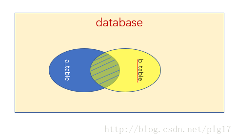
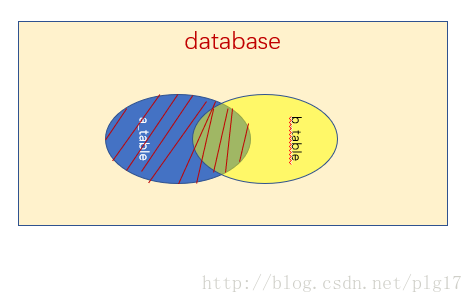
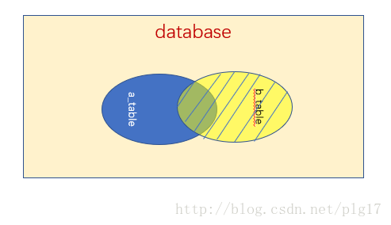

# 1、大的国家(595)

[595. 大的国家](https://leetcode-cn.com/problems/big-countries/)

- 问题描述

```html
+-----------------+------------+------------+--------------+---------------+
| name            | continent  | area       | population   | gdp           |
+-----------------+------------+------------+--------------+---------------+
| Afghanistan     | Asia       | 652230     | 25500100     | 20343000      |
| Albania         | Europe     | 28748      | 2831741      | 12960000      |
| Algeria         | Africa     | 2381741    | 37100000     | 188681000     |
| Andorra         | Europe     | 468        | 78115        | 3712000       |
| Angola          | Africa     | 1246700    | 20609294     | 100990000     |
+-----------------+------------+------------+--------------+---------------+
```

查找面积超过 3,000,000 或者人口数超过 25,000,000 的国家。

```html
+--------------+-------------+--------------+
| name         | population  | area         |
+--------------+-------------+--------------+
| Afghanistan  | 25500100    | 652230       |
| Algeria      | 37100000    | 2381741      |
+--------------+-------------+--------------+
```

- SQL  Schema

```sql
DROP TABLE
IF
    EXISTS World;
CREATE TABLE World ( NAME VARCHAR ( 255 ), continent VARCHAR ( 255 ), area INT, population INT, gdp INT );
INSERT INTO World ( NAME, continent, area, population, gdp )
VALUES
    ( 'Afghanistan', 'Asia', '652230', '25500100', '203430000' ),
    ( 'Albania', 'Europe', '28748', '2831741', '129600000' ),
    ( 'Algeria', 'Africa', '2381741', '37100000', '1886810000' ),
    ( 'Andorra', 'Europe', '468', '78115', '37120000' ),
    ( 'Angola', 'Africa', '1246700', '20609294', '1009900000' );
```

- 解题

```sql
# 思路：
# 1、根据样例，我们知道。查询字段是 name population 和 area
# 2、查询条件是 area > 3000000 || population > 25000000
SELECT name,population,area
FROM World 
WHERE area > 3000000 || population > 25000000;
```

#  2、交换工资(627)

[627. 交换工资](https://leetcode-cn.com/problems/swap-salary/)

- 问题描述

```html
| id | name | sex | salary |
|----|------|-----|--------|
| 1  | A    | m   | 2500   |
| 2  | B    | f   | 1500   |
| 3  | C    | m   | 5500   |
| 4  | D    | f   | 500    |
```

只用一个 SQL 查询，将 sex 字段反转。

```html
| id | name | sex | salary |
|----|------|-----|--------|
| 1  | A    | f   | 2500   |
| 2  | B    | m   | 1500   |
| 3  | C    | f   | 5500   |
| 4  | D    | m   | 500    |
```

- SQL Schema

```sql
DROP TABLE
IF
    EXISTS salary;
CREATE TABLE salary ( id INT, NAME VARCHAR ( 100 ), sex CHAR ( 1 ), salary INT );
INSERT INTO salary ( id, NAME, sex, salary )
VALUES
    ( '1', 'A', 'm', '2500' ),
    ( '2', 'B', 'f', '1500' ),
    ( '3', 'C', 'm', '5500' ),
    ( '4', 'D', 'f', '500' );
```

- 解题

```sql
# 思路：
# l、利用位运算：比如若 x^b^a = a，则判断 x=b
# 2、利用 ASCII 函数将字符转换为数值进行运算，然后再利用 CHAR 函数将数值转换为字符
UPDATE 
salary
SET sex = CHAR(ASCII(sex)^ASCII('m')^ASCII('f'));
```

# 3、有趣的电影(62)

[620. 有趣的电影](https://leetcode-cn.com/problems/not-boring-movies/)

- 问题描述


```html
+---------+-----------+--------------+-----------+
|   id    | movie     |  description |  rating   |
+---------+-----------+--------------+-----------+
|   1     | War       |   great 3D   |   8.9     |
|   2     | Science   |   fiction    |   8.5     |
|   3     | irish     |   boring     |   6.2     |
|   4     | Ice song  |   Fantacy    |   8.6     |
|   5     | House card|   Interesting|   9.1     |
+---------+-----------+--------------+-----------+
```

查找 id 为奇数，并且 description 不是 boring 的电影，按 rating 降序。

```html
+---------+-----------+--------------+-----------+
|   id    | movie     |  description |  rating   |
+---------+-----------+--------------+-----------+
|   5     | House card|   Interesting|   9.1     |
|   1     | War       |   great 3D   |   8.9     |
+---------+-----------+--------------+-----------+
```

- SQL Schema

```sql
DROP TABLE
IF
    EXISTS cinema;
CREATE TABLE cinema ( id INT, movie VARCHAR ( 255 ), description VARCHAR ( 255 ), rating FLOAT ( 2, 1 ) );
INSERT INTO cinema ( id, movie, description, rating )
VALUES
    ( 1, 'War', 'great 3D', 8.9 ),
    ( 2, 'Science', 'fiction', 8.5 ),
    ( 3, 'irish', 'boring', 6.2 ),
    ( 4, 'Ice song', 'Fantacy', 8.6 ),
    ( 5, 'House card', 'Interesting', 9.1 );
```

- 解题

```sql
#思路：
#1、观察测试用例的查询结果，我们知道，其实查询的是所有的字段
#2、id 为奇数，则查询条件为 id % 2 = 1
SELECT id,movie,description,rating
FROM cinema
WHERE id%2=1 AND description != 'boring'
ORDER BY rating DESC;
```

# 4、超过5名学生的课(596)

[596. 超过5名学生的课](https://leetcode-cn.com/problems/classes-more-than-5-students/)

- 问题描述

```html
+---------+------------+
| student | class      |
+---------+------------+
| A       | Math       |
| B       | English    |
| C       | Math       |
| D       | Biology    |
| E       | Math       |
| F       | Computer   |
| G       | Math       |
| H       | Math       |
| I       | Math       |
+---------+------------+
```

查找有五名及以上 student 的 class。

```html
+---------+
| class   |
+---------+
| Math    |
+---------+
```

- SQL Schema

```sql
DROP TABLE
IF
    EXISTS courses;
CREATE TABLE courses ( student VARCHAR ( 255 ), class VARCHAR ( 255 ) );
INSERT INTO courses ( student, class )
VALUES
    ( 'A', 'Math' ),
    ( 'B', 'English' ),
    ( 'C', 'Math' ),
    ( 'D', 'Biology' ),
    ( 'E', 'Math' ),
    ( 'F', 'Computer' ),
    ( 'G', 'Math' ),
    ( 'H', 'Math' ),
    ( 'I', 'Math' );
```

- 解答

```sql
# 思路：
# 1、很显然要按照 class 进行分组
# 2、然后按照分组后的 class 来统计学生的人数
SELECT class
FROM courses
GROUP BY class
HAVING COUNT( DISTINCT student) >= 5;
```

# 5、查找重复的电子邮箱(182)

[182. 查找重复的电子邮箱](https://leetcode-cn.com/problems/duplicate-emails/)

- 问题描述

邮件地址表：

```html
+----+---------+
| Id | Email   |
+----+---------+
| 1  | a@b.com |
| 2  | c@d.com |
| 3  | a@b.com |
+----+---------+
```

查找重复的邮件地址：

```html
+---------+
| Email   |
+---------+
| a@b.com |
+---------+
```

- SQL Schema

```sql
DROP TABLE
IF
    EXISTS Person;
CREATE TABLE Person ( Id INT, Email VARCHAR ( 255 ) );
INSERT INTO Person ( Id, Email )
VALUES
    ( 1, 'a@b.com' ),
    ( 2, 'c@d.com' ),
    ( 3, 'a@b.com' );
```

- 解题

```sql
# 思路：与 596 题类似
# 1、按照 mail 进行分组
# 2、统计出现次数 >=2 就是重复的邮件
SELECT Email
FROM Person
GROUP BY EMAIL
HAVING COUNT(id) >= 2;
```

# *6、删除重复的电子邮箱(196)

[196. 删除重复的电子邮箱](https://leetcode-cn.com/problems/delete-duplicate-emails/)

- 问题描述

邮件地址表：

```html
+----+---------+
| Id | Email   |
+----+---------+
| 1  | a@b.com |
| 2  | c@d.com |
| 3  | a@b.com |
+----+---------+
```

删除重复的邮件地址：

```html
+----+------------------+
| Id | Email            |
+----+------------------+
| 1  | john@example.com |
| 2  | bob@example.com  |
+----+------------------+
```

- SQL Schema

与 182 相同。

- 解题：

```sql
# 思路一：将一张表看成两张表来进行操作
DELETE p1
FROM
    Person p1,
    Person p2
WHERE
    p1.Email = p2.Email
    AND p1.Id > p2.Id
```

```sql
# 思路二：
# 第一步：根据 email 进行分组，获取 email 对应的最小 id，一个 email 对应一个最小的 id
SELECT min( id ) AS id FROM Person GROUP BY email;

# 第二步：删除不在该 id 集合中的数据
DELETE
FROM
    Person
WHERE
    id NOT IN ( SELECT id FROM ( SELECT min( id ) AS id FROM Person GROUP BY email ) AS m );
# 应该注意的是上述解法额外嵌套了一个 SELECT 语句。
# 如果不这么做，会出现错误：You can't specify target table 'Person' for update in FROM clause。
```

```sql
DELETE
FROM
    Person
WHERE
    id NOT IN ( SELECT id FROM ( SELECT min( id ) AS id FROM Person GROUP BY email ) AS m );
# 发生 You can't specify target table 'Person' for update in FROM clause。
```

参考：[pMySQL Error 1093 - Can't specify target table for update in FROM clause](https://stackoverflow.com/questions/45494/mysql-error-1093-cant-specify-target-table-for-update-in-from-clause)

# 7、组合两个表(175)

[175. 组合两个表](https://leetcode-cn.com/problems/combine-two-tables/)

- 问题描述：

Person 表：

```html
+-------------+---------+
| Column Name | Type    |
+-------------+---------+
| PersonId    | int     |
| FirstName   | varchar |
| LastName    | varchar |
+-------------+---------+
PersonId is the primary key column for this table.
```

Address 表：

```html
+-------------+---------+
| Column Name | Type    |
+-------------+---------+
| AddressId   | int     |
| PersonId    | int     |
| City        | varchar |
| State       | varchar |
+-------------+---------+
AddressId is the primary key column for this table.
```

查找 FirstName, LastName, City, State 数据，而不管一个用户有没有填地址信息。

- SQL Schema

```sql
DROP TABLE
IF
    EXISTS Person;
CREATE TABLE Person ( PersonId INT, FirstName VARCHAR ( 255 ), LastName VARCHAR ( 255 ) );
DROP TABLE
IF
    EXISTS Address;
CREATE TABLE Address ( AddressId INT, PersonId INT, City VARCHAR ( 255 ), State VARCHAR ( 255 ) );
INSERT INTO Person ( PersonId, LastName, FirstName )
VALUES
    ( 1, 'Wang', 'Allen' );
INSERT INTO Address ( AddressId, PersonId, City, State )
VALUES
    ( 1, 2, 'New York City', 'New York' );
```

- 解题：

```sql
# 思路：左外连接
SELECT p.FirstName,p.LastName,a.City,a.State
FROM Person p
LEFT JOIN Address a 
ON p.PersonId=a.PersonId;
```

- 扩展：

  * 内连接：返回两张表的交集部分。

  <div align="center"></div>

  * 左连接：

  <div align="center"></div>

  * 右连接：

  <div align="center"></div>

# *8、超过经理收入的员工(181)

[181. 超过经理收入的员工](https://leetcode-cn.com/problems/employees-earning-more-than-their-managers/)

- 问题描述：

Employee 表：

```html
+----+-------+--------+-----------+
| Id | Name  | Salary | ManagerId |
+----+-------+--------+-----------+
| 1  | Joe   | 70000  | 3         |
| 2  | Henry | 80000  | 4         |
| 3  | Sam   | 60000  | NULL      |
| 4  | Max   | 90000  | NULL      |
+----+-------+--------+-----------+
```

查找薪资大于其经理薪资的员工信息。

- SQL Schema

```sql
DROP TABLE
IF
    EXISTS Employee;
CREATE TABLE Employee ( Id INT, NAME VARCHAR ( 255 ), Salary INT, ManagerId INT );
INSERT INTO Employee ( Id, NAME, Salary, ManagerId )
VALUES
    ( 1, 'Joe', 70000, 3 ),
    ( 2, 'Henry', 80000, 4 ),
    ( 3, 'Sam', 60000, NULL ),
    ( 4, 'Max', 90000, NULL );
```

- 解题：

```sql
# 思路：Employee e1 INNER JOIN Employee e2 ON e1.managerid = e2.id 比如

+----+-------+--------+-----------+
| Id | Name  | Salary | ManagerId |
+----+-------+--------+-----------+
| 1  | Joe   | 70000  | 3         |
| 2  | Henry | 80000  | 4         |
| 3  | Sam   | 60000  | NULL      |
| 4  | Max   | 90000  | NULL      |
+----+-------+--------+-----------+

根据 e1.managerid = e2.id 条件进行内连接后，得到

+----+-------+--------+-----------+-------+--------+-----------+
| Id | Name  | Salary | ManagerId | Name  | Salary | ManagerId |
+----+-------+--------+-----------+-------+--------+-----------+
| 1  | Joe   | 70000  | 3         | Sam   | 60000  | NULL      |
| 2  | Henry | 80000  | 4         | Max   | 90000  | NULL      |
+----+-------+--------+-----------+-------+--------+-----------+
```

```sql
SELECT 
	e1.name AS Employee # 注意：这里的 Employee 是给该字段起的别名，实际上查找的是姓名
FROM 
	Employee e1
	INNER JOIN Employee e2
	ON e1.managerid = e2.id
	AND e1.salary > e2.salary;
```

# 9、从不订购的客户(183)

[181. 超过经理收入的员工](https://leetcode-cn.com/problems/employees-earning-more-than-their-managers/)

- 问题描述：

Curstomers 表：

```html
+----+-------+
| Id | Name  |
+----+-------+
| 1  | Joe   |
| 2  | Henry |
| 3  | Sam   |
| 4  | Max   |
+----+-------+
```

Orders 表：

```html
+----+------------+
| Id | CustomerId |
+----+------------+
| 1  | 3          |
| 2  | 1          |
+----+------------+
```

查找没有订单的顾客信息：

```html
+-----------+
| Customers |
+-----------+
| Henry     |
| Max       |
+-----------+
```

- SQL Schema

```sql
DROP TABLE
IF
    EXISTS Customers;
CREATE TABLE Customers ( Id INT, NAME VARCHAR ( 255 ) );
DROP TABLE
IF
    EXISTS Orders;
CREATE TABLE Orders ( Id INT, CustomerId INT );
INSERT INTO Customers ( Id, NAME )
VALUES
    ( 1, 'Joe' ),
    ( 2, 'Henry' ),
    ( 3, 'Sam' ),
    ( 4, 'Max' );
INSERT INTO Orders ( Id, CustomerId )
VALUES
    ( 1, 3 ),
    ( 2, 1 );
```

- 解答

```sql
# 解法一：左外连接
SELECT
    c.Name AS Customers
FROM
    Customers c
    LEFT JOIN Orders o
    ON c.Id = o.CustomerId
WHERE
    o.CustomerId IS NULL;
```

```sql
# 解法二：子查询方式
SELECT Name AS Customers
FROM 
    Customers
WHERE 
    Id NOT IN (SELECT CustomerId  FROM Orders);
```

# *10、部门工资最高的员工(184)

[184. 部门工资最高的员工](https://leetcode-cn.com/problems/department-highest-salary/)

- 问题描述：

Employee 表：

```html
+----+-------+--------+--------------+
| Id | Name  | Salary | DepartmentId |
+----+-------+--------+--------------+
| 1  | Joe   | 70000  | 1            |
| 2  | Henry | 80000  | 2            |
| 3  | Sam   | 60000  | 2            |
| 4  | Max   | 90000  | 1            |
+----+-------+--------+--------------+
```

Department 表：

```html
+----+----------+
| Id | Name     |
+----+----------+
| 1  | IT       |
| 2  | Sales    |
+----+----------+
```

查找一个 Department 中收入最高者的信息：

```html
+------------+----------+--------+
| Department | Employee | Salary |
+------------+----------+--------+
| IT         | Max      | 90000  |
| Sales      | Henry    | 80000  |
+------------+----------+--------+
```

- SQL Schema

```sql
DROP TABLE IF EXISTS Employee;
CREATE TABLE Employee ( Id INT, NAME VARCHAR ( 255 ), Salary INT, DepartmentId INT );
DROP TABLE IF EXISTS Department;
CREATE TABLE Department ( Id INT, NAME VARCHAR ( 255 ) );
INSERT INTO Employee ( Id, NAME, Salary, DepartmentId )
VALUES
    ( 1, 'Joe', 70000, 1 ),
    ( 2, 'Henry', 80000, 2 ),
    ( 3, 'Sam', 60000, 2 ),
    ( 4, 'Max', 90000, 1 );
INSERT INTO Department ( Id, NAME )
VALUES
    ( 1, 'IT' ),
    ( 2, 'Sales' );
```

- 解题:

```sql
# 创建一个临时表，包含了部门员工的最大薪资。
# 可以对部门进行分组，然后使用 MAX() 汇总函数取得最大薪资。

SELECT DepartmentId, MAX( Salary ) Salary FROM Employee GROUP BY DepartmentId;

# 结果：
+--------------+--------+
| DepartmentId | Salary |
+--------------+--------+
|            1 |  90000 |
|            2 |  80000 |
+--------------+--------+
```

使用连接找到一个部门中薪资等于临时表中最大薪资的员工。

```sql
SELECT d.name as Department,  e.name as Employee, m.Salary 
FROM 
	Employee e,
	Department d,
	(SELECT DepartmentId, MAX( Salary ) Salary FROM Employee GROUP BY DepartmentId) m
WHERE 
		e.DepartmentId=d.Id
    AND e.DepartmentId=m.DepartmentId
    AND e.Salary=m.Salary;
```

# 11、第二高的薪水(176)

[176. 第二高的薪水](https://leetcode-cn.com/problems/second-highest-salary/)

- 问题描述：

```html
+----+--------+
| Id | Salary |
+----+--------+
| 1  | 100    |
| 2  | 200    |
| 3  | 300    |
+----+--------+
```

查找工资第二高的员工。

```html
+---------------------+
| SecondHighestSalary |
+---------------------+
| 200                 |
+---------------------+
```

没有找到返回 null 而不是不返回数据。

- SQL Schema

```sql
DROP TABLE
IF
    EXISTS Employee;
CREATE TABLE Employee ( Id INT, Salary INT );
INSERT INTO Employee ( Id, Salary )
VALUES
    ( 1, 100 ),
    ( 2, 200 ),
    ( 3, 300 );
```

- 解题：

```sql
# 查询所有 salary 按照降序排列
SELECT DISTINCT Salary FROM Employee ORDER BY Salary DESC;
```

```sql
# 要获取第二高的的薪水，就是获取第二个元素，
# 使用  limit start,count; start:开始查询的位置，count 是查询多少条语句
SELECT DISTINCT Salary FROM Employee ORDER BY Salary DESC LIMIT 1,1;
```

```sql
# 为了在没有查找到数据时返回 null，需要在查询结果外面再套一层 SELECT。
SELECT
    ( SELECT DISTINCT Salary FROM Employee ORDER BY Salary DESC LIMIT 1, 1 ) SecondHighestSalary;
```

# 12、第N高的薪水(177)

[177. 第N高的薪水](https://leetcode-cn.com/problems/nth-highest-salary/)

- 问题描述：

查找工资第 N 高的员工。

- SQL Schema

同 176。

- 解题：

```sql
# 思路：其实与 176题目类似
CREATE FUNCTION getNthHighestSalary ( N INT ) RETURNS INT BEGIN

SET N = N - 1; #注意 LIMIT 的 start 是从 0 开始的,第 N 实际上是第 (N-1)
RETURN ( SELECT ( SELECT DISTINCT Salary FROM Employee ORDER BY Salary DESC LIMIT N, 1 ) );

END
```

# 13、分数排名(178)

[178. 分数排名](https://leetcode-cn.com/problems/rank-scores/)

- 问题描述：

得分表：

```html
+----+-------+
| Id | Score |
+----+-------+
| 1  | 3.50  |
| 2  | 3.65  |
| 3  | 4.00  |
| 4  | 3.85  |
| 5  | 4.00  |
| 6  | 3.65  |
+----+-------+
```

将得分排序，并统计排名。

```html
+-------+------+
| Score | Rank |
+-------+------+
| 4.00  | 1    |
| 4.00  | 1    |
| 3.85  | 2    |
| 3.65  | 3    |
| 3.65  | 3    |
| 3.50  | 4    |
+-------+------+
```

- SQL Schema

```sql
DROP TABLE
IF
    EXISTS Scores;
CREATE TABLE Scores ( Id INT, Score DECIMAL ( 3, 2 ) );
INSERT INTO Scores ( Id, Score )
VALUES
    ( 1, 3.5 ),
    ( 2, 3.65 ),
    ( 3, 4.0 ),
    ( 4, 3.85 ),
    ( 5, 4.0 ),
    ( 6, 3.65 );
```

- 解题：

```sql
#思路：关键在于如何统计 Rank 
#这里使用同一张表进行内连接，注意连接的条件 S1.score <= S2.score 就是为了方便统计 Rank
SELECT
    S1.score,
    COUNT( DISTINCT S2.score ) Rank
FROM
    Scores S1
    INNER JOIN Scores S2
    ON S1.score <= S2.score
GROUP BY
    S1.id
ORDER BY
    S1.score DESC;
```

# *14、连续出现的数字（180）

[180. 连续出现的数字](https://leetcode-cn.com/problems/consecutive-numbers/)

- 问题描述：

数字表：

```html
+----+-----+
| Id | Num |
+----+-----+
| 1  |  1  |
| 2  |  1  |
| 3  |  1  |
| 4  |  2  |
| 5  |  1  |
| 6  |  2  |
| 7  |  2  |
+----+-----+
```

查找连续出现三次的数字。

```html
+-----------------+
| ConsecutiveNums |
+-----------------+
| 1               |
+-----------------+
```

- SQL Schema

```sql
DROP TABLE
IF
    EXISTS LOGS;
CREATE TABLE LOGS ( Id INT, Num INT );
INSERT INTO LOGS ( Id, Num )
VALUES
    ( 1, 1 ),
    ( 2, 1 ),
    ( 3, 1 ),
    ( 4, 2 ),
    ( 5, 1 ),
    ( 6, 2 ),
    ( 7, 2 );
```

- 解题：


```sql
# 思路：要求是连续出现 3 次，可使用 3 张该表
SELECT L1.Num ConsecutiveNums
FROM
	Logs L1,
	Logs L2,
	Logs L3
WHERE
	L1.Id = L2.Id-1
	AND L2.ID = L3.Id-1
	AND L1.Num = L2.Num
  AND L2.Num = L3.Num;
# 判断条件 Id 是不相同的，但是 Num 是相同的，并且 Id 是连续变化的
```

```sql
# 由于要求是至少出现 3 次，所以需要 DISTINCT 进行去重
SELECT DISTINCT L1.Num ConsecutiveNums
FROM
	Logs L1,
	Logs L2,
	Logs L3
WHERE
	L1.Id = L2.Id-1
	AND L2.ID = L3.Id-1
	AND L1.Num = L2.Num
  AND L2.Num = L3.Num;
```

```sql
# 另外一种写法
SELECT DISTINCT L1.Num ConsecutiveNums 
FROM 
	Logs L1
	LEFT JOIN Logs L2 ON L1.Id = L2.Id-1
	LEFT JOIN Logs L3 ON L1.Id = L3.Id-2
WHERE L1.Num = L2.Num 
	AND L2.Num = L3.Num;
```

# 15、换座位(626)(了解)

[626. 换座位](https://leetcode-cn.com/problems/exchange-seats/)

- 问题描述：

seat 表存储着座位对应的学生。

```html
+---------+---------+
|    id   | student |
+---------+---------+
|    1    | Abbot   |
|    2    | Doris   |
|    3    | Emerson |
|    4    | Green   |
|    5    | Jeames  |
+---------+---------+
```

要求交换相邻座位的两个学生，如果最后一个座位是奇数，那么不交换这个座位上的学生。

```html
+---------+---------+
|    id   | student |
+---------+---------+
|    1    | Doris   |
|    2    | Abbot   |
|    3    | Green   |
|    4    | Emerson |
|    5    | Jeames  |
+---------+---------+
```

- SQL Schema

```sql
DROP TABLE
IF
    EXISTS seat;
CREATE TABLE seat ( id INT, student VARCHAR ( 255 ) );
INSERT INTO seat ( id, student )
VALUES
    ( '1', 'Abbot' ),
    ( '2', 'Doris' ),
    ( '3', 'Emerson' ),
    ( '4', 'Green' ),
    ( '5', 'Jeames' );
```

- 解题：

使用多个 union。

```sql
SELECT
    s1.id - 1 AS id,
    s1.student
FROM
    seat s1
WHERE
    s1.id MOD 2 = 0 UNION
SELECT
    s2.id + 1 AS id,
    s2.student
FROM
    seat s2
WHERE
    s2.id MOD 2 = 1
    AND s2.id != ( SELECT max( s3.id ) FROM seat s3 ) UNION
SELECT
    s4.id AS id,
    s4.student
FROM
    seat s4
WHERE
    s4.id MOD 2 = 1
    AND s4.id = ( SELECT max( s5.id ) FROM seat s5 )
ORDER BY
    id;
```
