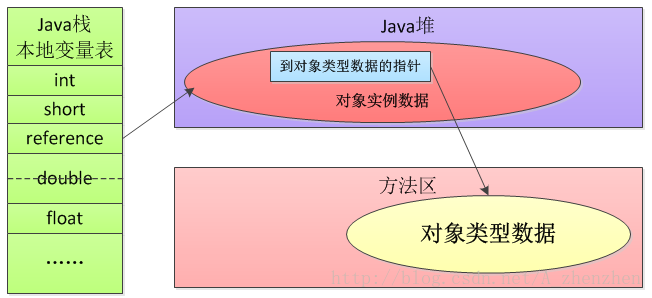

# HotSpot 虚拟机对象

## 对象的创建

对象的创建步骤：

  

1. **类加载检查**

虚拟机遇到一条 new 指令时，首先将去检查这个指令的参数是否能在常量池中定位到这个类的**符号引用**，
并且检查这个符号引用代表的类是否已被加载过、解析和初始化过。
如果没有，那必须先执行相应的类加载过程。

2. **分配内存**

在类加载检查通过后，接下来虚拟机将为新生对象分配内存。
对象所需的内存大小在类加载完成后便可确定，为对象分配空间的任务等同于把一块确定大小的内存从 Java 堆中划分出来。分配方式有 “指针碰撞” 和 “空闲列表” 两种，选择那种分配方式由 Java 堆是否规整决定，
而Java堆是否规整又由所采用的**垃圾收集器是否带有压缩整理功能**决定。

- 内存分配的两种方式

| 内存分配的两种方式 |                         **指针碰撞**                         |                         **空闲列表**                         |
| :----------------: | :----------------------------------------------------------: | :----------------------------------------------------------: |
|      适用场景      |               堆内存规整(即没有内存碎片)的情况               |                      堆内存不规整的情况                      |
|        原理        | 用过的内存全部整合到一边，没有用过的内存放在另一边，中间有一个分界值指针，只需要向着没用过的内存方向将指针移动一段与对象大小相等的距离 | 虚拟机会维护一个列表，在该列表和总分记录哪些内存块是可用的，在分配的时候，找一块足够大的内存块划分给对象示例，然后更新列表记录 |
|      GC收集器      |                        Serial ParNew                         |                             CMS                              |

- 内存分配并发问题

在创建对象的时候有一个很重要的问题，就是线程安全，因为在实际开发过程中，创建对象是很频繁的事情，
作为虚拟机来说，必须要保证线程是安全的，通常来讲，虚拟机采用两种方式来保证线程安全：

(1)CAS+失败重试： CAS 是乐观锁的一种实现方式。所谓乐观锁就是，每次不加锁而是假设没有冲突而去完成某项操作，如果因为冲突失败就重试，直到成功为止。虚拟机采用CAS配上失败重试的方式保证更新操作的原子性。

(2)TLAB: 每一个线程预先在Java堆中分配一块内存，称为本地线程分配缓冲(Thread Local Allocation Buffer,TLAB)。哪个线程要分配内存，就在哪个线程的TLAB上分配，只有TLAB用完并分配新的TLAB时，才采用上述的CAS进行内存分配。

3. **初始化零值**

内存分配完成后，虚拟机需要将分配到的内存空间都初始化为零值（不包括对象头），这一步操作**保证了对象的实例字段在 Java 代码中可以不赋初始值就直接使用**，程序能访问到这些字段的数据类型所对应的零值。

4. **设置对象头** 

初始化零值完成之后，虚拟机要对对象进行必要的设置，例如这个对象是那个类的实例、如何才能找到类的元数据信息、对象的哈希吗、对象的 GC 分代年龄等信息。 
这些信息存放在对象头中。 
另外，根据虚拟机当前运行状态的不同，如是否启用偏向锁等，对象头会有不同的设置方式。

5. **执行init方法** 

在上面工作都完成之后，从虚拟机的视角来看，一个新的对象已经产生了，
但从 Java 程序的视角来看，对象创建才刚开始，**\<init\> 方法还没有执行，所有的字段都还为零**。
所以一般来说，执行 new 指令之后会接着执行 \<init \> 方法，
把**对象按照程序员的意愿进行初始化**，这样一个真正可用的对象才算完全产生出来。

## 对象的内存布局

在 Hotspot 虚拟机中，对象在内存中的布局可以分为 3 块区域：对象头、实例数据、对齐填充。

  

- **对象头**

Hotspot虚拟机的对象头包括两部分信息：

一部分用于存储对象自身的运行时数据（哈希码、GC分代年龄、锁状态标志等等），

另一部分是类型指针，即对象指向它的**类元数据的指针**，虚拟机通过这个指针来**确定这个对象是哪个类的实例**。

- **实例数据**

实例数据部分是对象真正存储的有效信息，也是在程序中所定义的各种类型的字段内容。

- **对齐填充**

对齐填充部分不是必然存在的，也没有什么特别的含义，仅仅起**占位**作用。
 因为Hotspot虚拟机的自动内存管理系统要求对象起始地址必须是8字节的整数倍，
 换句话说就是对象的大小必须是8字节的整数倍。而对象头部分正好是8字节的倍数（1倍或2倍），
 因此，当对象实例数据部分没有对齐时，就需要通过对齐填充来补全。

## 对象的访问定位

建立对象就是为了使用对象，我们的Java程序通过栈上的 reference 数据来操作堆上的具体对象。
对象的访问方式视虚拟机的实现而定，目前主流的访问方式有两种：使用句柄、直接指针。

- **使用句柄**

如果使用[句柄](https://zh.wikipedia.org/wiki/%E5%8F%A5%E6%9F%84)的话，那么 **Java 堆**中将会划分出一块内存来作为句柄池，reference 中存储的就是**对象的句柄地址**，而句柄中包含了对象实例数据与类型数据各自的具体地址信息 。

  

- **直接指针**

如果使用直接指针访问，那么 Java 堆对象的布局中就必须考虑如何放置访问类型数据的相关信息，而 reference 中存储的直接就是**对象的地址**。

  

这两种对象访问方式各有优势:

1、使用句柄来访问的最大好处是 reference 中存储的是稳定的句柄地址，在对象被移动时只会改变句柄中的实例数据指针，而**reference本身不需要修改**。

2、使用直接指针访问方式最大的好处就是**速度快**，它节省了一次指针定位的时间开销。
