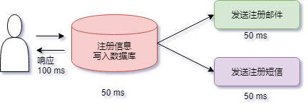

# 消息队列

消息队列中间件是**分布式系统**中重要的组件，主要用于：异步处理，应用解耦，流量削锋，消息通讯等问题，实现高性能，高可用，可伸缩和最终一致性架构。目前使用较多的消息队列有 ActiveMQ，RabbitMQ，ZeroMQ，Kafka，MetaMQ，RocketMQ。

## 消息模型

### 1. 点对点

消息生产者向消息队列中发送了一个消息之后，只能被一个消费者消费一次。

### 2. 发布/订阅

消息生产者向频道发送一个消息之后，多个消费者可以从该频道订阅到这条消息并消费。

发布与订阅模式和观察者模式有以下不同：

- 观察者模式中，观察者和主题都知道对方的存在；而在发布与订阅模式中，发布者与订阅者不知道对方的存在，它们之间通过频道进行通信。
- 观察者模式是同步的，当事件触发时，主题会调用观察者的方法，然后等待方法返回；而发布与订阅模式是异步的，发布者向频道发送一个消息之后，就不需要关心订阅者何时去订阅这个消息，可以立即返回。

## 使用场景

### 1、异步处理

发送者将消息发送给消息队列之后，**不需要同步等待消息接收者处理完毕，而是立即返回进行其它操作**。消息接收者从消息队列中订阅消息之后异步处理。

比如：用户注册时，需要发注册邮件和注册短信。传统的做法有两种：

> 1、串行方式

将注册信息写入数据库成功后，发送注册邮件，再发送注册短信。以上三个任务全部完成后，返回给客户端。

> 2、并行方式

将注册信息写入数据库成功后，发送注册邮件的同时，发送注册短信。以上三个任务完成后，返回给客户端。与串行的差别是，并行的方式可以减少处理的时间。

引入消息队列，将不是必须的业务逻辑异步处理，注册邮件，发送短信写入消息队列后，直接返回，因此写入消息队列的速度很快，基本可以忽略，因此用户的响应时间可能是 50 ms。比串行提高了 3 倍，比并行提高了2 倍。

只有在**业务流程允许异步处理的情况**下才能这么做，例如上面的注册流程中，如果要求用户对验证邮件进行点击之后才能完成注册的话，就不能再使用消息队列。

### 2、应用解耦

如果模块之间不直接进行调用，模块之间耦合度就会很低，那么修改一个模块或者新增一个模块对其它模块的影响会很小，从而实现可扩展性。

通过使用消息队列，一个模块只需要向消息队列中发送消息，其它模块可以**选择性地从消息队列中订阅消息**从而完成调用。

### 3、流量削峰

在高并发的场景下，如果短时间有大量的请求到达会压垮服务器。

可以将请求发送到消息队列中，服务器按照其处理能力从消息队列中订阅消息进行处理。

### 4、消息通讯

消息队列一般都内置了高效的通信机制，因此也可以用在纯消息通讯。比如实现点对点消息队列，或者聊天室等，也就是消息队列的两种消息模式：点对点或发布 / 订阅模式。

## 消费方式

在 JMS (Java Message Service，Java 消息服务) 中，消息的产生和消费都是异步的。对于消费来说，JMS 的消费者可以通过两种方式来消费消息：同步方式和异步方式。

### 1、同步方式

订阅者或消费者通过 receive() 方法来接收消息，receive() 方法在接收到消息之前（或超时之前）将一直阻塞。

### 2、异步方式

订阅者或消费者可以注册为一个消息监听器。当消息到达之后，系统自动调用监听器的 onMessage() 方法。

## 可靠性

### 发送端的可靠性

发送端完成操作后一定能将消息成功发送到消息队列中。

实现方法：在本地数据库建一张消息表，将**消息数据与业务数据保存在同一数据库实例**里，这样就可以利用本地数据库的**事务机制**。事务提交成功后，将消息表中的消息转移到消息队列中，若转移消息成功则删除消息表中的数据，否则继续重传。

### 接收端的可靠性

接收端能够从消息队列成功消费一次消息。

两种实现方法：

- 保证接收端处理消息的业务逻辑具有幂等性：只要具有幂等性，那么消费多少次消息，最后处理的结果都是一样的。（幂等性：**被执行一次与连续执行多次的效果是一样的**。）
- 保证消息具有唯一编号，并使用一张日志表来记录已经消费的消息编号。

## 带来的问题

### 1、系统可用性降低

系统可用性在某种程度上降低，为什么这样说呢？

在加入消息队列之前，不用考虑消息丢失或者说消息队列挂掉等等的情况，但是，引入消息队列之后你就需要去考虑了。

### 2、系统复杂性提高

加入消息队列之后，你需要保证消息没有被重复消费、处理消息丢失的情况、保证消息传递的顺序性等问题。

### 3、一致性问题

消息队列可以实现异步，消息队列带来的异步确实可以提高系统响应速度。但是，消息的真正消费者并没有正确消费消息，就会导致数据不一致的情况。
