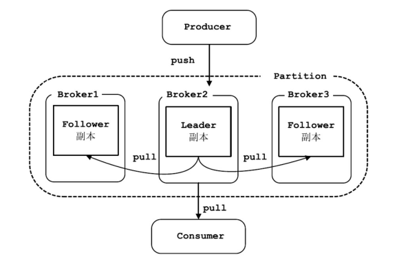

# Kafka的架构

## Kafka 的基本组成

Kafka 集群由若干个 Broker 组成，Topic 由若干个 Partition 组成，每个 Partition 里面的消息通过 Offset 来获取。

### 1. Message

消息（Message）是 Kafka 中**最基本的数据单元**。

Kafka 消息由一个**定长的 Header 和变长的字节数组**组成，其中主要由 key 和 value 构成，key 和 value 也都是字节数组。

### 2. Broker

Kafka 集群包含一个或多个服务器，这种服务器被称为 Broker。

### 3. Topic

Kafka 根据主题（Topic）对消息进行归类，**发布到 Kafka 集群的每条消息（Message）都需要指定一个 Topic**。

### 4. Partition

**物理概念**，每个 Topic 包含一个或多个分区（Partition）。

消息发送时都被发送到一个 Topic，其本质就是一个目录，而 Topic 由是由一些 Partition Logs（分区日志）组成,其组织结构如下：

**每个 Partition 中的消息都是有序的**，生产的消息被不断追加到 Partition Log 上，其中的每一个消息都被赋予了一个唯一的 offset 值，Kafka 通过 **offset 保证消息在分区内的顺序**，offset 的顺序性不跨分区，即 Kafka 只保证在同一个分区内的消息是有序的；同一 Topic 的多个分区内的消息，Kafka 并不保证其顺序性。

**Kafka 集群会保存所有的消息，不管消息有没有被消费**；

我们可以设定消息的过期时间，只有过期的数据才会被自动清除以释放磁盘空间。比如我们设置消息过期时间为 2 天，那么这 2天内的所有消息都会被保存到集群中，数据只有超过了两天才会被清除。

Kafka 需要维持的元数据只有一个，即消费消息在 Partition 中的 offset 值，Consumer 每消费一个消息，offset就会 +1。其实消息的状态完全是由 Consumer 控制的，**Consumer 可以跟踪和重设这个 offset 值，Consumer 就可以读取任意位置的消息**。

把消息日志以 Partition 的形式存放有多重考虑：

- 第一，方便在集群中扩展，每个 Partition 可以通过调整以适应它所在的机器，而一个 Topic 又可以由多个Partition 组成，因此整个集群就可以适应任意大小的数据了；
- 第二，就是可以提高并发，因为是以 Partition 为单位进行读写。

注意：Partition 并不是越多越好的

原因：

- 分区越多，服务端和客户端需要使用的内存就越多
- 会降低一定的可用性。某个 Leader 挂了，相比较较少分区的情况，重新选出 Leader，花的时间就会更长。

### 5. Replication

Kafka 中每个 Partition 可以有多个副本（Replication），每个副本中包含的消息是一样的。

每个分区的副本集合中，都会选举出一个副本作为 Leader 副本，Kafka 在不同的场景下会采用不同的选举策略。所有的读写请求都由选举出的 Leader 副本处理，其他都作为 Follower 副本，**Follower 副本仅仅是从 Leader 副本处把数据拉取（pull）到本地之后，同步更新到自己的 Log 中**。

一般情况下，同一分区的多个副本会被分配到不同的 Broker上。当 Leader 所在的 Broker 宕机之后，可以重新选举新的 Leader，继续对外提供服务。

### 6. Producer

消息生产者（Producer），向 Broker 发送消息的客户端。

Producer 直接发送消息到 Broker上的 Leader Partition，不需要经过任何中介或其他路由转发。

**Producer 客户端自己控制着消息被推送（push）到哪些 Partition**。实现方式可以是随机分配、实现一类随机负载均衡算法，或者指定一些分区算法。Kafka 提供了接口供用户实现自定义的 Partition，用户可以为每个消息指定一个 Partition Key，通过这个 key 来实现一些 Hash 分区算法。比如，把 userid 作为 Partition Key 的话，相同 userid 的消息将会被推送到同一个 Partition。

Kafka Producer 可以将消息在内存中累计到一定数量后作为一个**批量发送请求**。批量发送的数量大小可以通过Producer 的参数控制，参数值可以设置为累计的消息的数量（如 500 条）、累计的时间间隔（如 100ms ）或者累计的数据大小(64 KB)。通过增加 Batch的大小，可以减少网络请求和磁盘 I / O 的次数，当然具体参数设置需要在**效率**和**时效性**方面做一个权衡。

Producer 可以**异步地并行地**向 Kafka发送消息，但是通常 Producer 在发送完消息之后会得到一个 future响应，返回的是 offset 值或者发送过程中遇到的错误。通过 request.required.acks 参数来设置 Leader Partition 收到确认的副本个数：

| ack  |                             说明                             |
| :--: | :----------------------------------------------------------: |
|  0   | Producer **不会等待 Broker 的响应** Producer 无法知道消息是否发送成功， 这样**可能会导致数据丢失**，但会得到最大的系统吞吐量。 |
|  1   | Producer 会在 **Leader Partition** 收到消息时得到 Broker 的一个确认  这样会有更好的可靠性，因为客户端会等待直到 Broker 确认收到消息。 |
|  -1  | Producer 会在**所有备份的 Partition** 收到消息时得到 Broker 的确认  这个设置可以得到最高的可靠性保证。 |

发布消息时，Kafka Client 先构造一条消息，将消息加入到消息集 set 中（Kafka支持批量发布，可以往消息集合中添加多条消息，一次行发布），send 消息时，Producer Client 需指定消息所属的 Topic。

### 7. Consumer

消息消费者（Consumer），从 Broker 读取消息的客户端。

消费者（Consumer）的主要工作是从 Topic 中拉取消息，并对消息进行消费。某个消费者消费到 Partition 的哪个位置（offset）的相关信息，是 Consumer 自己维护的。Consumer 可以自己决定如何读取 Kafka 中的数据。比如，Consumer 可以通过重设 offset 值来重新消费已消费过的数据。不管有没有被消费，Kafka 会保存数据一段时间，这个时间周期是可配置的，只有到了过期时间，Kafka 才会删除这些数据。

这样设计非常巧妙，**避免了 Kafka Server 端维护消费者消费位置的开销**，尤其是在消费数量较多的情况下。另一方面，如果是由 Kafka Server 端管理每个 Consumer 消费状态，一旦 Kafka Server 端出现延时或是消费状态丢失，将会影响大量的 Consumer。另一方面，这一设计也提高了 Consumer 的灵活性，Consumer 可以按照自己需要的顺序和模式拉取消息进行消费。例如：Consumer 可以通过修改其消费的位置实现针对某些特殊 key 的消息进行反复消费，或是跳过某些消息的需求。

Kafka 提供了两套 Consumer Api，分为 Simple Api 和 High-Level Api。

- Simple Api 是一个底层的 API，它维持了一个和单一 Broker 的连接，并且这个 API 是完全无状态的，每次请求都需要指定 offset 值，因此，这套 API 也是最灵活的。

- High-Level API 封装了对集群中一系列 Broker 的访问，可以透明的消费一个 Topic。它自己维持了已消费消息的状态，即每次消费的都是下一个消息。

  High-Level API 还支持以组的形式消费 Topic，如果 Consumers 有同一个组名，那么 Kafka 就相当于一个队列消息服务，而各个 Consumer 均衡地消费相应 Partition 中的数据。若 Consumers 有不同的组名，那么此时 Kafka 就相当于一个广播服务，会把 Topic 中的所有消息广播到每个 Consumer。

  

### 8. Consumer Group

在 Kafka 中，多个 Consumer 可以组成一个 Consumer Group，一个 Consumer 只能属于一个 Consumer Group。**Consumer Group 保证其订阅的 Topic 的每个 Partition 只会被此 Consumer Group 中的一个 Consumer 处理**。如果不同 Consumer Group 订阅了同一 Topic，Consumer Group 彼此之间不会干扰。这样，如果要实现一个消息可以被多个消费者同时消费（“广播”）的效果，则将每个消费者放入单独的一个 Consumer Group；如果要实现一个消息只被一个消费者消费（“独占”）的效果，则将所有的 Consumer 放入一个 Consumer Group 中。

注意：Consumer Group 中消费者的数量并不是越多越好，当其中消费者数量超过分区的数量时，会导致有消费者分配不到分区，从而造成消费者的浪费。

Producer、Consumer 和 Consumer Group 之间的关系：

### 9. Zookeeper

存放 Kafka 集群相关元数据的组件。在 Zookeeper 集群中会

- **保存 Topic 的状态信息**，例如分区的个数、分区的组成、分区的分布情况等；
- **保存 Broker 的状态信息**；
- **保存 Consumer 的消费信息**

通过这些信息，Kafka 很好地将消息生产、消息存储、消息消费的过程结合起来。

## Kafka 的拓扑结构

### 典型的 Kafka 集群的拓扑结构

Kafka 集群包含若干个 Producer，若干个 Broker （Kafka 集群支持水平扩展，一般 Broker 数量越多，整个 Kafka 集群的吞吐率也就越高），若干个 Consumer Group，以及一个 Zookeeper 集群。

Kafka 通过 Zookeeper 管理集群配置。

Producer 使用 Push 模式将消息发布到 Broker 上，Consumer 使用 Pull 模式从 Broker 上订阅并消费消息。

### Kafka 数据流

Producers 往 Brokers 中指定的 Topic Push 消息，Consumers 从 Brokers 里面 Pull 指定 Topic 的消息，然后进行业务处理。 

图中有两个 Topic：

- Topic-0 有两个 Partition，Partition-0 和 Partition-1；
- Topic-1 有一个 Partition。

可以看到 Consumer-Group-1 中的 Consumer-2 没有分到 Partition 处理，这是有可能出现的。
