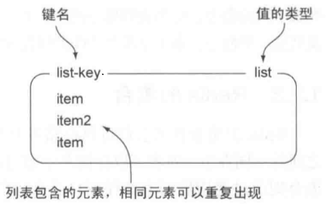
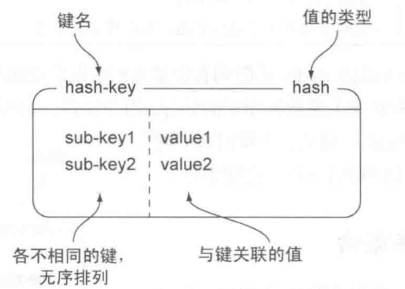
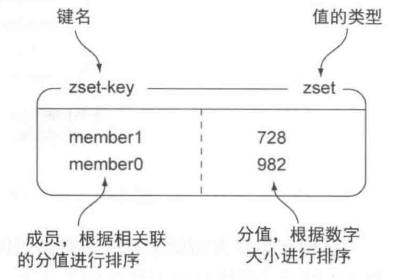

# 初探 Redis

## Redis 简介

Redis 是一个速度非常快的非关系型数据库（non-relational database）/ NoSQL 数据库。

Redis 不使用表，也不会预定义或者强制去要求用户对 Redis 存储不同的数据进行关联。

> **Redis 为什么速度非常快？**

- **纯内存操作**

  数据存在内存中，类似于 HashMap。HashMap 的优势就是查找和操作的时间复杂度都是 O(1)

- **数据结构简单**

  不仅数据结构简单，而且对数据操作也简单

- **单线程**

  避免了频繁的上下文切换，也不存在多进程或者多线程导致的切换而消耗 CPU 资源，不用去考虑各种锁的问题，不存在加锁释放锁操作，没有因为可能出现死锁而导致的性能消耗

## Redis 数据结构

Redis 存储键（key）和 5 种不同类型的值（value）之间的映射。这 5 中类型分别为：

STRING（字符串）、LIST（列表）、HASH（散列）、SET（集合）和 ZSET（有序集合）。

| 结构类型 |                         结构存储的值                         |
| :------: | :----------------------------------------------------------: |
|  STRING  |                    字符串、整数或者浮点数                    |
|   LIST   |         一个链表，链表上的每个节点都包含了一个字符串         |
|   HASH   |                    包含键值对的无序散列表                    |
|   SET    |                    包含字符串的无序收集器                    |
|   ZSET   | 字符串成员（member）与浮点数（score）分值之间的有序映射，<br/>元素的排列顺序由分值大小决定 |


### 1. STRING（字符串）

字符串示例，键为 hello，值为 world：

<div align="center"></div>

- 字符串命令：

  | 命令 |                        行为                        | 时间复杂度 |
  | :--: | :------------------------------------------------: | :--------: |
  | GET  |               获取存储在给定键中的值               |    O(1)    |
  | SET  |               设置存储在给定键中的值               |    O(1)    |
  | DEL  | 删除存储在给定键中的值（这个命令可以用于所有类型） |    O(1)    |
  | INCR |                        自增                        |    O(1)    |
  | DECR |                        自减                        |    O(1)    |

- 使用

  ```html
  127.0.0.1:6379> set hello world
  OK
  127.0.0.1:6379> get hello
  "world"
  127.0.0.1:6379> del hello
  (integer) 1
  127.0.0.1:6379> get hello
  (nil)
  ```

  ```html
  127.0.0.1:6379> set num 1
  OK
  127.0.0.1:6379> incr num
  (integer) 2
  127.0.0.1:6379> get num
  "2"
  ```


### 2. LIST（列表）

list-key 是一个包含 3 个元素的列表键，列表中的元素是可以重复的：

<div align="center"></div>

- 列表命令：

  |  命令  |                   行为                   | 时间复杂度 |
  | :----: | :--------------------------------------: | :--------: |
  | LPUSH  |          将给定值推入链表的左端          |    O(N)    |
  | RPUSH  |          将给定值推入链表的右端          |    O(N)    |
  | LRANGE |       获取列表在给定范围上的所有值       |    O(N)    |
  | LINDEX |      获取列表在给定位置上的单个元素      |    O(N)    |
  |  LPOP  | 从链表的左端弹出一个值，并返回被弹出的值 |    O(1)    |

- 使用

  ```html
  127.0.0.1:6379> rpush list-key item
  (integer) 1
  127.0.0.1:6379> rpush list-key item2
  (integer) 2
  127.0.0.1:6379> rpush list-key item
  (integer) 3 # 返回的列表长度
  ```

  ```html
  127.0.0.1:6379> lrange list-key 0 -1
  1) "item"
  2) "item2"
  3) "item"
  # 使用 0 为范围的开始索引，-1 为范围索引的结束索引，可以去除列表包含的所有元素
  127.0.0.1:6379> lindex list-key 1
  "item2"
  ```

  ```html
  127.0.0.1:6379> lpop list-key
  "item"
  127.0.0.1:6379> lrange list-key 0 -1
  1) "item2"
  2) "item"
  ```


### 3. HASH（散列）

hash-key 是一个包含两个键值对的散列键：

<div align="center"></div>

- 散列命令：

  |  命令   |                   行为                   | 时间复杂度 |
  | :-----: | :--------------------------------------: | :--------: |
  |  HSET   |       在散列表中关联其给定的键值对       |    O(1)    |
  |  HGET   |            获取指定散列键的值            |    O(1)    |
  | HGETALL |         获取散列包含的所有键值对         |    O(N)    |
  |  HDEL   | 如果给定键存在于散列表中，那么移除这个键 |    O(N)    |

- 使用

  ```html
  127.0.0.1:6379> hset hash-key sub-key1 value1
  (integer) 1
  127.0.0.1:6379> hset hash-key sub-key2 value2
  (integer) 1
  127.0.0.1:6379> hset hash-key sub-key1 value2
  (integer) 0
  127.0.0.1:6379> hgetall hash-key
  1) "sub-key1"
  2) "value2"
  3) "sub-key2"
  4) "value2"
  ```

  ```html
  127.0.0.1:6379> hdel hash-key sub-key2
  (integer) 1
  127.0.0.1:6379> hdel hash-key sub-key2
  (integer) 0
  127.0.0.1:6379> hget hash-key sub-key1
  "value2"
  127.0.0.1:6379> hgetall hash-key
  1) "sub-key1"
  2) "value2"
  ```


### 4. SET（集合）

set-key 是一个包含 3 个元素的集合键：

<div align="center"></div>


- 集合命令：

  |   命令    |                     行为                     | 时间复杂度 |
  | :-------: | :------------------------------------------: | :--------: |
  |   SADD    |             将给定元素添加到集合             |    O(N)    |
  | SMEMBERS  |            返回集合包含的所有元素            |    O(N)    |
  |   SREM    | 如果给定的元素存在于集合中，那么一处这个元素 |    O(N)    |
  | SISMEMBER |         检查给定元素是否存在于集合中         |    O(1)    |

- 使用

  ```html
  127.0.0.1:6379> sadd set-key item
  (integer) 1
  127.0.0.1:6379> sadd set-key item2
  (integer) 1
  127.0.0.1:6379> sadd set-key item3
  (integer) 1
  127.0.0.1:6379> sadd set-key item
  (integer) 0
  127.0.0.1:6379> smembers set-key
  1) "item"
  2) "item3"
  3) "item2"
  ```

  ```html
  127.0.0.1:6379> sismember set-key item4
  (integer) 0
  127.0.0.1:6379> sismember set-key item
  (integer) 1
  ```

  ```html
  127.0.0.1:6379> srem set-key item
  (integer) 1
  127.0.0.1:6379> srem set-key item
  (integer) 0
  127.0.0.1:6379> smembers set-key
  1) "item3"
  2) "item2"
  ```


### 5. ZSET（有序集合）

zset-key 是已一个包含 2 个元素的有序集合键：

<div align="center"></div>

- 有序集合命令：

  |     命令      |                           行为                           | 时间复杂度  |
  | :-----------: | :------------------------------------------------------: | :---------: |
  |     ZADD      |        将一个带有给定分值的成员添加到有序集合里面        | O(Mlog(N))  |
  |    ZRANGE     | 根据元素在有序排列中所处的位置，从有序集合中获取多个元素 | O(log(N)+M) |
  | ZRANGEBYSCORE |            获取有序集合在给定范围内的所有元素            | O(log(N)+M) |
  |     ZREM      |       如果给定成员存在于有序集合，那么移除这个成员       | O(Mlog(N))  |

- 使用

  ```html
  127.0.0.1:6379> zadd zset-key 728 member1
  (integer) 1
  127.0.0.1:6379> zadd zset-key 982 member2
  (integer) 1
  127.0.0.1:6379> zadd zset-key 982 member2
  (integer) 0
  127.0.0.1:6379> zrange zset-key 0 -1 withscores
  1) "member1"
  2) "728"
  3) "member2"
  4) "982"
  ```

  ```html
  127.0.0.1:6379> zrangebyscore zset-key 0 800 withscores
  1) "member1"
  2) "728"
  ```

  ```html
  127.0.0.1:6379> zrem zset-key member1
  (integer) 1
  127.0.0.1:6379> zrem zset-key member1
  (integer) 0
  127.0.0.1:6379> zrange zset-key 0 -1 withscores
  1) "member2"
  2) "982"
  ```


> **扩展**

- [Redis 常用命令时间复杂度](https://blog.csdn.net/zzm848166546/article/details/80360665)
- [Redis 命令大全](https://redis.io/commands)


## Redis 与 Memcached

两者都是非关系型内存键值数据库，主要有以下不同：

### 数据类型

- Redis 支持五种不同的数据类型，可以更灵活地解决问题

- Memcached 仅支持字符串类型

### 数据持久化

- Redis 支持两种持久化策略：RDB 快照和 AOF 日志

- Memcached 不支持持久化。

### 分布式

- Redis Cluster 实现了分布式的支持

- Memcached 不支持分布式，只能通过在客户端使用一致性哈希来实现分布式存储，这种方式在存储和查询时都需要先在客户端计算一次数据所在的节点。

### 内存管理机制

- 在 Redis 中，并不是所有数据都一直存储在内存中，可以将一些很久没用的 value 交换到磁盘，而 Memcached 的数据则会一直在内存中。
- Memcached 将内存分割成特定长度的块来存储数据，以完全解决内存碎片的问题。但是这种方式会使得内存的利用率不高，例如块的大小为 128 bytes，只存储 100 bytes 的数据，那么剩下的 28 bytes 就浪费掉了。

### 线程模型

- Redis 使用单线程的多路 IO 复用模型

- Memcached 是多线程，非阻塞IO复用的网络模型
