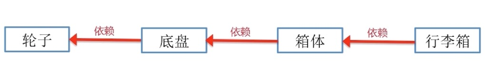
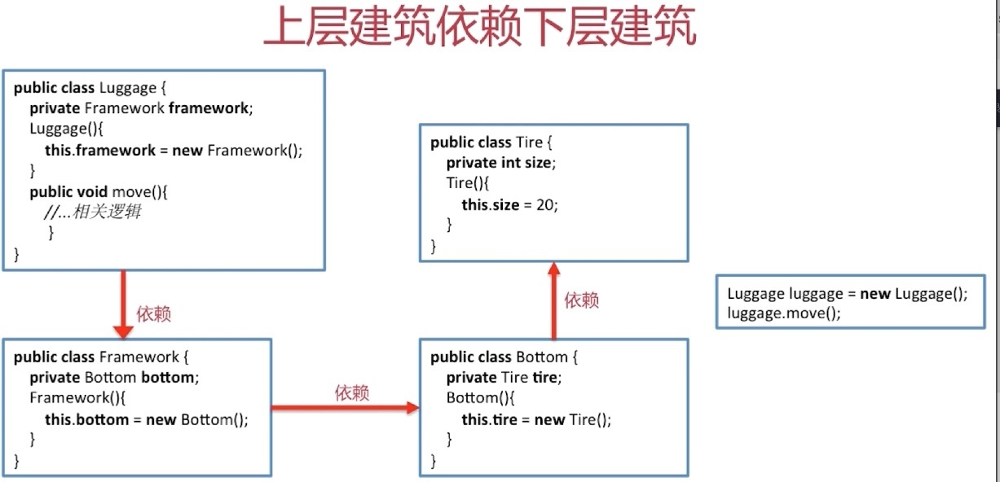
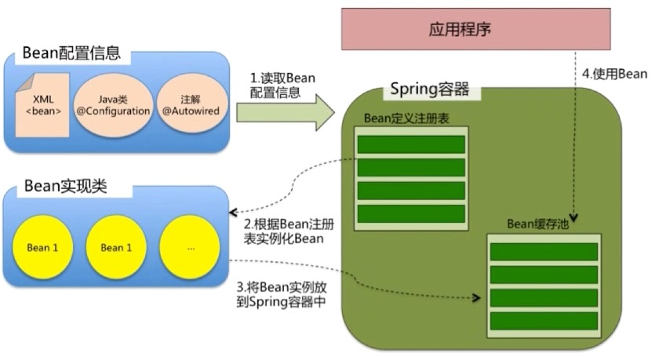

# SpringIOC

## IOC

### IOC 概念

IOC，即控制反转（Iversion of Control）是一种**设计思想**。

- **控制**

  控制对象的创建及销毁(生命周期)。

- **反转**

  将对象的控制权交给 IoC 容器。

所有的类都会在 Spring 容器中注册，告诉 Spring 你是个什么东西，你需要什么东西，然后 Spring 会在系统运行到适当的时候，把你需要的东西主动给你

**所有类的创建、销毁都由 Spring 来控制，也就是说控制对象生命周期的不是引用它的对象，而是 Spring**。对于某个具体对象而言，以前是它控制其他对象，现在所有对象都被 Spring 控制。

### 依赖注入

说到控制反转，则不得不说依赖注入(Dependency Injection,DI) 。

所谓依赖注入就是**将底层类作为参数传递给上层类，实现上层对下层的控制**，**依赖注入实现控制反转**。

举例说明依赖注入：以生产行李箱为例。

> 传统设计思路：

先设计轮子，然后根据轮子 size 来设计底盘，再根据底盘来设计箱体，最后设计好行李箱。

可这样表示：

相应的代码如下：

size 是固定值，可以进行相应的改进：

> 使用 DI 方式进行改进：

先设计行李箱的大概样子，再根据行李箱的样子设计箱体，根据箱体去设计底盘，然后去设计轮子。

改进后相应的代码如下：

不难理解，依赖注入就是**将底层类作为参数传递给上层类，实现上层对下层的控制**。

### IoC 和 DI 的关系

使用 DI 去实现 IoC。

DI 的 4 中方式：

- setter 注入
- 构造器注入
- 注解注入
- 接口注入

依赖倒置原则、IoC、DI 和 IoC 容器的关系：

使用 IoC 容器的好处：

- 避免在各处使用 new 来创建类，并且可统一维护
- 创建实例时，不需要了解其中的细节

## SpringIOC

### IoC 容器的初始化过程

- Resource 定位（即 BeanDefinition 的资源定位，Resource 为各种形式的 BeanDefinition 的使用都提供了统一的接口）
- BeanDefinition 的载入
- 向 IoC 容器中注册 BeanDefinition （实际上 IoC 容器内部维护一个 HashMap，注册过程就是将 BeanDefinition 添加至 HashMap 中）

## IoC 加载过程

IoC 容器其实就是一个大工厂，它用来管理我们所有的对象以及依赖关系：

- 根据 Bean 配置信息在容器内部创建 Bean 定义注册表
- 根据注册表加载，实例化 Bean，**建立 Bean 与 Bean 之间的依赖关系**
- 将 Bean 实例放入 Spring IoC 容器中，等待应用程序调用

## BeanFactory 和 ApplicationContext

### BeanFactory

- IoC 容器要实现的最基础的接口
- 采用**延迟初始化策略**(容器初始化完成后并不会创建 Bean 对象，只有当收到初始化请求时才进行初始化)
- 由于是延迟初始化策略，因此启动速度较快，占用资源较少

### ApplicationConext

- 在 BeanFactory 基础上，增加了更为高级的特性：事件发布、国际化等。
- 在容器启动时，完成所有 Bean 的创建
- 启动时间较长，占用资源较多

> **注意：BeanFactory 和 FactoryBean 的区别**

- BeanFactory 是 IoC 最基本的容器，负责生产和管理 Bean，为其他具体的 IoC 容器提供了最基本的规范。

- FactoryBean 是一个 Bean，是一个接口，当 IoC 容器中的 Bean 实现了 FactoryBean 后，通过 getBean(String beanName)  获取到的 Bean 对象并不是 FactoryBean 的实现类对象，而是这个实现类中的 getObject() 方法返回的对象。

  要想获取 FactoryBean 的实现类对象，就是在 beanName 前面加上 "&"。

## getBean 代码逻辑

- 获取参数 name 转化为 beanName
- 从缓存中加载实例
- 实例化 Bean
- 检测 parentBeanFactory（若无缓存数据，直接到 parentBeanFactory 中去加载）
- 初始化依赖的 Bean
- 返回 Bean

## Spring 中循环依赖

### 类的实例化和类的初始化

- 类的实例化是指创建一个类的实例(对象)的过程
- 类的初始化是指为类中各个类成员(被static修饰的成员变量)赋初始值的过程，是**类生命周期中的一个阶段**。

在 Spring 容器中我们的类又是什么时候进行初始化和实例化的呢？

- Spring 中**所有 Bean 默认都是单例模式**，所以 Bean 的初始化和实例化都是在加载进入 Bean 容器时做的
-  如果想使用时再初始化，那么可以把类定义为原型模式

### 循环依赖

若 A 中有 B 的属性，B 中有 A 的属性，则当进行依赖注入时，就会产生 A 还未创建完，因为对 B 的创建再次返回创建 A。

### 解决循环依赖

单例对象，在 Spring IoC 容器中，有且仅有一个对象，将对象放入缓存中。Spring 中使用“三级缓存”：

- SingletonObjects：单例对象的缓存（存储实例化完成的 Bean）
- earlySingletonObjects：提前曝光的单例对象的缓存（存储正在实例化的 Bean）
- SingletonFactories：单例 ObjectFactory 的缓存

举例说明解决循环依赖（A 中有B，B 中有 A）的具体过程：

Spring 中单例对象的初始化主要分为 3 步：

第一步：createBeanInstance 

第二步：populateBean 填充属性

第三步：intializeBean 初始化

在进行 createBeanInstance 后，该单例对象此时已被创建，Spring 将该对象**提前曝光到 SingeltonFacoties 中**。

- A 完成 createBeanInstance ，并且提前曝光到 SingeltonFacoties 中
- A 进行第二步，发现需要依赖 B，尝试获取 B
- B 开始创建，B 完成  createBeanInstance，发现需要依赖 A，尝试获取 A：先尝试从 SingletonObjects 中获取，发现不存在，因为 A 未初始化完全；再尝试从 earlySingletonObjects 中获取；再去 SingeltonFacoties 中获取，此时 B 获取 A，并将 A 放入 earlySingletonObjects 中，再删除 A 在 SingeltonFacoties 中对应的 ObjectFactory。
- B 获取 A，顺利完成第二、三步，并将初始化完成的 B 放入 SingletonObjects 中。
- 此时返回创建 A，A 可获取 B，顺利完成第二、三步，A 初始化完成， 将 A 放入 SingletonObjects 中。

注意：Spring 中循环依赖有 2 种：

- 构造器循环依赖：因为提前曝光到 SingletonFactories 中的前提是需要执行构造方法，所以使用 “三级缓存” 无法解决
- setter 循环依赖

### 总结

- 尽量不要使用基于构造器的 DI，使用基于 setter 的 DI
- 使用 @Autowired 注解，让 Spring 决定合适的时机
