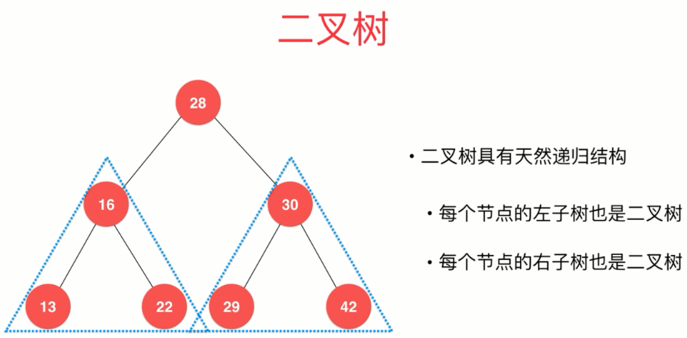
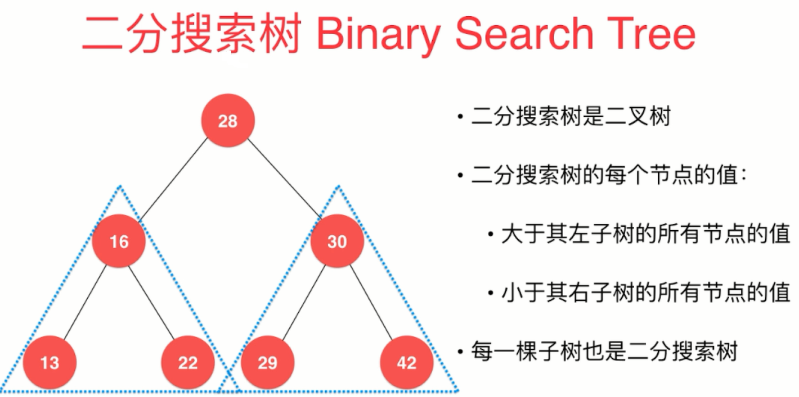
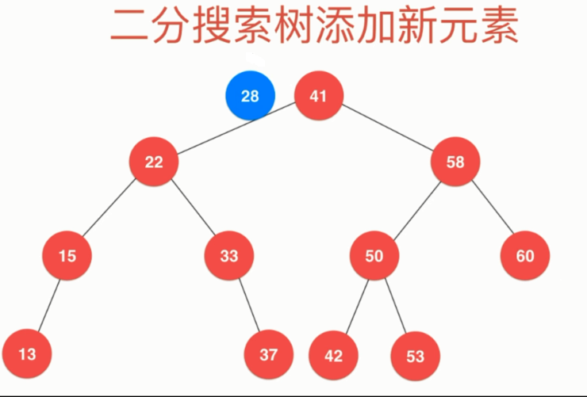
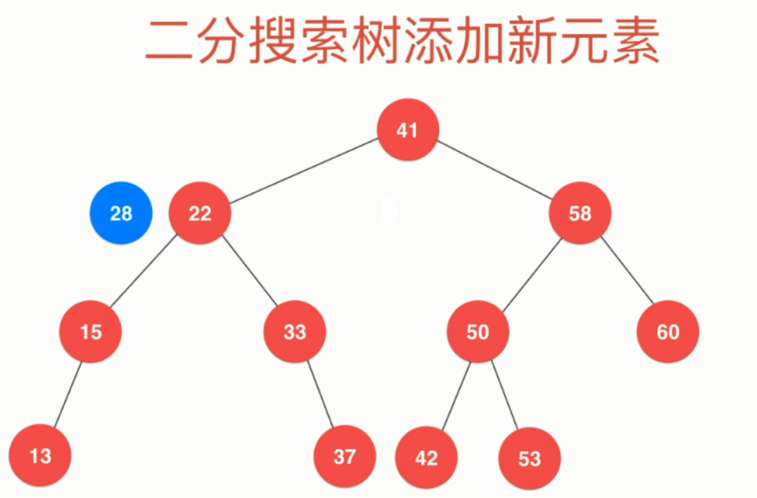
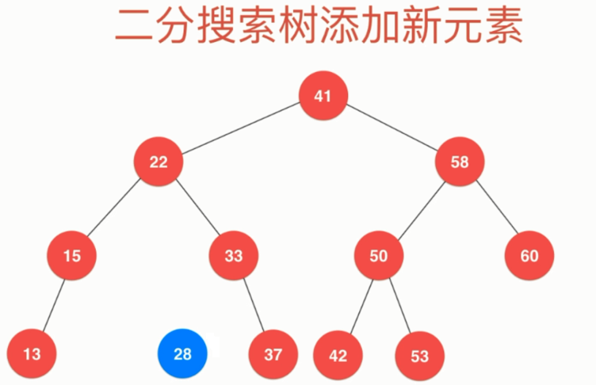
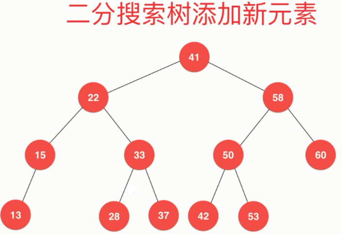
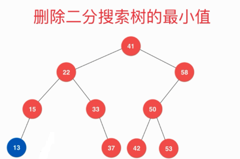
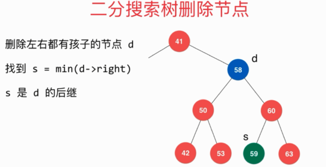
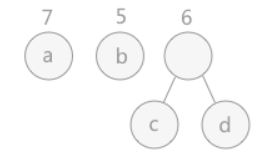

# 树

## 二叉树

- 二叉树具有唯一根节点
- 二叉树每个节点最多有两个孩子，最多有一个父亲

- 二叉树具有天然递归结构

  <div align="center"></div>

- 二叉树不一定是 “满” 的：一个节点也是二叉树、空节点也是二叉树

## 二叉搜索树（BST）

<div align="center"></div>

### BST 的基本功能

```java
public class BST<E extends Comparable<E>> {
    private Node root;
    private int size;

    public BST(){
        root=null;
        size=0;
    }
    
    public int size(){
        return size;
    }
    
    public boolean isEmpty(){
        return size==0;
    }
    
    private class Node{
        public E e;
        public Node left,right;
        public Node(E e){
            this.e=e;
            this.left=null;
            this.right=null;
        }
    }
}
```

### 添加元素

#### 思路

- 对于如下的 BST，向其中添加 28：

<div align="center"></div>

- 28 与根结点 41 比较，应该插入左子树

<div align="center"></div>

- 28 与左子树的根结点 22 比较，应该插入该结点的右子树

<div align="center"></div>

- 28 与 33 比较，应该插入该结点的左子树，该结点的左子树为空，则将值为 28 的结点添加到该结点的左子树中

<div align="center"></div>

- 最终将 28 添加到该 BST 中

<div align="center"></div>

#### 代码

```java
//向BST中添加新元素e
public void add(E e){
    if(root==null){
        root=new Node(e);
        size++;
        return;
    }else{
        add(root,e);
    }
}

//向以node为根节点的BST树种插入元素e
private void add(Node node,E e){
    if(e.equals(node.e)){
        //插入元素与根节点相等，直接返回
        return;
    }else if(e.compareTo(node.e)<0 && node.left==null){
        node.left=new Node(e);
        size++;
        return;
    }else if(e.compareTo(node.e)>0 && node.right==null){
        node.right=new Node(e);
        size++;
        return;
    }
    if(e.compareTo(node.e)<0){
        add(node.left,e);
    }else{ //e.compareTo(node.e)>0
        add(node.right,e);
    }
}
```

### 改进添加元素

前文中的添加操作，对 root==null 的情况进行了特殊处理,并且 add(Node,E) 中的递归条件也太冗长了。
这里我们写一个 add() 方法，返回插入新节点后该 BST 的根节点

```java
//向BST中添加新元素e
public void add(E e){
    root=add(root,e);
}

//向以node为根节点的BST树种插入元素e
//返回插入新元素后该BST的根
private Node add(Node node,E e){
    if(node==null){
        size++;
        return new Node(e);
    }
    //注意：对于e.equals(node.e)不做处理
    if(e.compareTo(node.e)<0){
        node.left=add(node.left,e);
    }else if(e.compareTo(node.e)>0){
        node.right=add(node.right,e);
    }
    return node;
}
```

### 查询元素

```java
//查看BST中是否包含元素e
public boolean contains(E e){
    return contains(root,e);
}

//查看以node为根节点的BST中是否包含元素e
private boolean contains(Node node,E e){
    if(node==null){
        return false;
    }
    if(e.compareTo(node.e)==0){
        return true;
    }else if(e.compareTo(node.e)<0){
        return contains(node.left,e);
    }else{
        return contains(node.right,e);
    }
}
```

### 遍历元素（递归形式）

- 前序遍历

```java
//BST的前序遍历
public void preOrder(){
    preOrder(root);
}

private void preOrder(Node node){
    if(node==null){
        return;
    }
    System.out.println(node.e);
    preOrder(node.left);
    preOrder(node.right);
}
```

```java
/**
* 利用前序遍历打印 BST
*/
@Override
public String toString() {
    StringBuilder res=new StringBuilder();
    generateBST(root,0,res);
    return res.toString();
}

//生成以node为根节点，深度为depth的描述二叉树的字符串（利用前序遍历）
private void generateBST(Node node,int depth,StringBuilder res){
    if(node==null){
        res.append(generateDepth(depth)+"null\n");
        return;
    }
    res.append(generateDepth(depth)+node.e+"\n");
    generateBST(node.left,depth+1,res);
    generateBST(node.right,depth+1,res);
}

private String generateDepth(int depth){
    StringBuilder res=new StringBuilder();
    for(int i=0;i<depth;i++){
        res.append("--");
    }
    return res.toString();
}
```

- 中序遍历

```java
//BST的中序遍历
public void inOrder(){
    inOrder(root);
}

private void inOrder(Node node){
    if(node==null){
        return;
    }
    inOrder(node.left);
    System.out.println(node.e);
    inOrder(node.right);
}
```

- 后序遍历

```java
//BST的后序遍历
public void postOrder(){
    postOrder(root);
}

private void postOrder(Node node){
    if(node==null){
        return;
    }
    postOrder(node.left);
    postOrder(node.right);
    System.out.println(node.e);
}
```

### 遍历元素（非递归形式）

```java
//枚举命令，GO表示访问元素，COUT表示打印元素
private enum Command{GO,COUT};

private class StackNode{
    Command command;
    Node node;
    StackNode(Command command,Node node){
        this.command=command;
        this.node=node;
    }
}
```

- 前序遍历

```java
//BST的前序遍历（非递归方式）
public void preOrderNR(){
    preOrderNR(root);
}

private void preOrderNR(Node node){
    if(node==null){
        return;
    }
    Stack<StackNode> stack=new Stack<>();
    stack.push(new StackNode(Command.GO,node));
    while(!stack.isEmpty()){
        StackNode stackNode=stack.pop();
        Node n=stackNode.node;
        Command command=stackNode.command;
        if(command==Command.COUT){
            System.out.println(stackNode.node.e);
        }else{
            if(n.right!=null){
                stack.push(new StackNode(Command.GO,n.right));
            }
            if(n.left!=null){
                stack.push(new StackNode(Command.GO,n.left));
            }
            stack.push(new StackNode(Command.COUT,n));
        }
    }
}
```

- 中序遍历

```java
//BST的中序遍历（非递归方式）
public void inOrderNR(){
    inOrderNR(root);
}

private void inOrderNR(Node node){
    if(node==null){
        return;
    }
    Stack<StackNode> stack=new Stack<>();
    stack.push(new StackNode(Command.GO,node));
    while(!stack.isEmpty()){
        StackNode stackNode=stack.pop();
        Node n=stackNode.node;
        Command command=stackNode.command;
        if(command==Command.COUT){
            System.out.println(stackNode.node.e);
        }else{
            if(n.right!=null){
                stack.push(new StackNode(Command.GO,n.right));
            }
            stack.push(new StackNode(Command.COUT,n));
            if(n.left!=null){
                stack.push(new StackNode(Command.GO,n.left));
            }
        }
    }
}
```

- 后序遍历

```java
//BST的后序遍历（非递归方式）
public void postOrderNR(){
    postOrderNR(root);
}

private void postOrderNR(Node node){
    if(node==null){
        return;
    }
    Stack<StackNode> stack=new Stack<>();
    stack.push(new StackNode(Command.GO,node));
    while(!stack.isEmpty()){
        StackNode stackNode=stack.pop();
        Node n=stackNode.node;
        Command command=stackNode.command;
        if(command==Command.COUT){
            System.out.println(stackNode.node.e);
        }else{
            stack.push(new StackNode(Command.COUT,n));
            if(n.right!=null){
                stack.push(new StackNode(Command.GO,n.right));
            }
            if(n.left!=null){
                stack.push(new StackNode(Command.GO,n.left));
            }
        }
    }
}
```

### 层序遍历

```java
//BST的层序遍历
public void levelOrder(){
    Queue<Node> q=new LinkedList<>();
    q.add(root);
    while(!q.isEmpty()){
        Node node=q.remove();
        System.out.println(node.e);
        if(node.left!=null){
            q.add(node.left);
        }
        if(node.right!=null){
            q.add(node.right);
        }
    }
}
```

### 删除元素

#### 删除最小值和最大值

- 寻找 BST 中的最小元素和最大元素

```java
//寻找BST中的最小元素
public E min(){
    if(size==0){
        throw new IllegalArgumentException("BST is emmpty");
    }
    return min(root).e;
}

private Node min(Node node){
    if(node.left==null){
        return node;
    }
    return min(node.left);
}

//寻找BST中的最大元素
public E max(){
    if(size==0){
        throw new IllegalArgumentException("BST is emmpty");
    }
    return max(root).e;
}

private Node max(Node node){
    if(node.right==null){
        return node;
    }
    return max(node.right);
}
```

- 删除BST中的最大值和最小值

  情况一：最小值是叶子节点。直接删除该节点

<div align="center"></div>


<div align="center"></div>

情况二：最小值有右子树。删除该节点，再将该节点的右子树连接到原来的 BST 中

<div align="center"></div>


<div align="center"></div>

- 代码：

```java
//删除BST中的最小值
public E delMin(){
    E res=min();
    delMin(root);
    return res;
}

//删除以node为根结点的BST中的最小值元素
//这里考虑最小值只有右子树的情况，因为叶子节点是其特例
private Node delMin(Node node){
    if(node.left==null){
        Node nodeRight=node.right;
        node.right=null;
        size--;
        return nodeRight;
    }
    node.left=delMin(node.left);
    return node;
}

//删除BST中的最大值
public E delMax(){
    E res=max();
    delMax(root);
    return res;
}

//删除以node为根结点的BST中的最大值元素
private Node delMax(Node node){
    if(node.right==null){
        Node nodeLeft=node.left;
        node.left=null;
        size--;
        return nodeLeft;
    }
    node.right=delMax(node.right);
    return node;
}
```

#### 删除任意元素

- 删除只有左孩子的节点。直接删除即可

<div align="center"></div>


<div align="center"></div>

- 删除只有右孩子的节点。直接删除即可

<div align="center"></div>


<div align="center"></div>

- 删除左右孩子都有的节点

<div align="center"></div>

**Habbard-Deletion：**

d 是待删除的节点，s 节点是 d 的后继，也就是 d 的右子树的最小值所在的节点。

> 注意：这里选择左子树的最大值所在的节点效果也是相同的。

<div align="center"></div>

使用 s 代替 d

<div align="center"></div>

最后删除 d 节点

- 代码

```java
//删除BST中任意元素
public void del(E e){
    root=del(root,e);
}


private Node del(Node node,E e){
    if(node==null){
        return null;
    }
    if(e.compareTo(node.e)<0){
        node.left=del(node.left,e);
        return node;
    }else if(e.compareTo(node.e)>0){
        node.right=del(node.right,e);
        return node;
    }else{
        //节点node就是要删除的节点
        //该节点只右有子树
        if(node.left==null){
            Node rightNode=node.right;
            node.right=null;
            size--;
            return rightNode;
        }
        //该节点只有左子树
        if(node.right==null){
            Node leftNode=node.left;
            node.left=null;
            size--;
            return leftNode;
        }
        //删除既有左子树又有右子树的节点
        Node s=min(node.right);
        s.right=delMin(node.right);
        s.left=node.left;

        //删除node
        node.left=node.right=null;
        return s;
    }
}
```


## 哈夫曼树

### 哈夫曼树的构造过程

首先生成一颗哈夫曼树，每次生成过程中选取频率最少的两个节点，生成一个新节点作为它们的父节点，并且新节点的频率为两个节点的和。选取频率最少的原因是，生成过程使得先选取的节点位于树的更低层，那么需要的编码长度更长，频率更少可以使得总编码长度更少。

生成编码时，从根节点出发，向左遍历则添加二进制位 0，向右则添加二进制位 1，直到遍历到叶子节点，叶子节点代表的字符的编码就是这个路径编码。

举例：

- 给定了四个结点a，b，c，d，权值分别为7，5，2，4。

  <div align="center"></div>

- 找出现有权值中最小的两个，2 和 4 ，相应的结点 c 和 d 构建一个新的二叉树，树根的权值为 2 + 4 = 6，同时将原有权值中的 2 和 4 删掉，将新的权值 6 加入。

  <div align="center"></div>

- 重复之前的步骤。

  <div align="center"></div>

- 所有的结点构建成了一个全新的二叉树，这就是哈夫曼树。

  <div align="center"></div>

### 代码

```java
public class Huffman {

    private class Node implements Comparable<Node> {
        char ch;
        int freq;
        boolean isLeaf;
        Node left, right;

        public Node(char ch, int freq) {
            this.ch = ch;
            this.freq = freq;
            isLeaf = true;
        }

        public Node(Node left, Node right, int freq) {
            this.left = left;
            this.right = right;
            this.freq = freq;
            isLeaf = false;
        }

        @Override
        public int compareTo(Node o) {
            return this.freq - o.freq;
        }
    }

    public Map<Character, String> encode(Map<Character, Integer> frequencyForChar) {
        PriorityQueue<Node> priorityQueue = new PriorityQueue<>();
        for (Character c : frequencyForChar.keySet()) {
            priorityQueue.add(new Node(c, frequencyForChar.get(c)));
        }
        while (priorityQueue.size() != 1) {
            Node node1 = priorityQueue.poll();
            Node node2 = priorityQueue.poll();
            priorityQueue.add(new Node(node1, node2, node1.freq + node2.freq));
        }
        return encode(priorityQueue.poll());
    }

    private Map<Character, String> encode(Node root) {
        Map<Character, String> encodingForChar = new HashMap<>();
        encode(root, "", encodingForChar);
        return encodingForChar;
    }

    private void encode(Node node, String encoding, Map<Character, String> encodingForChar) {
        if (node.isLeaf) {
            encodingForChar.put(node.ch, encoding);
            return;
        }
        encode(node.left, encoding + '0', encodingForChar);
        encode(node.right, encoding + '1', encodingForChar);
    }
}
```

