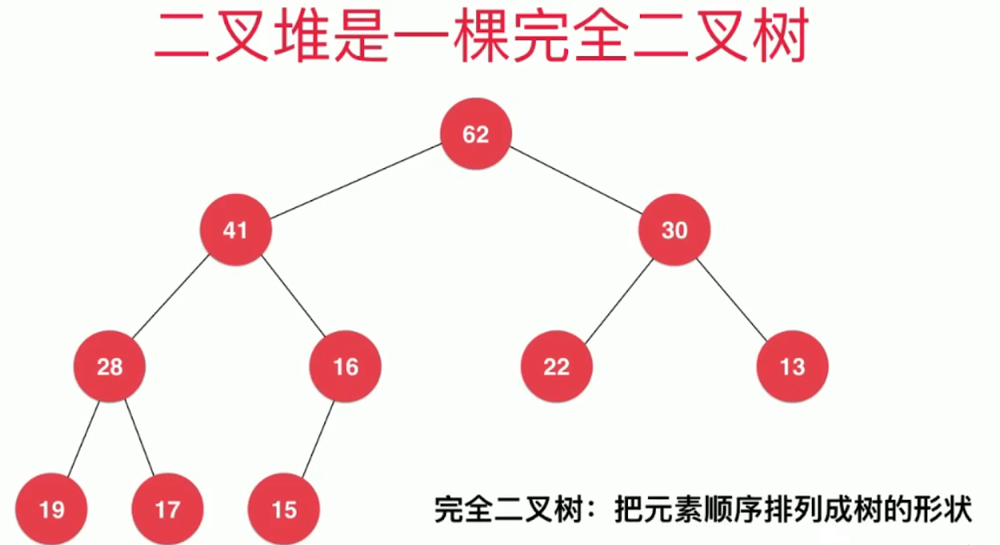
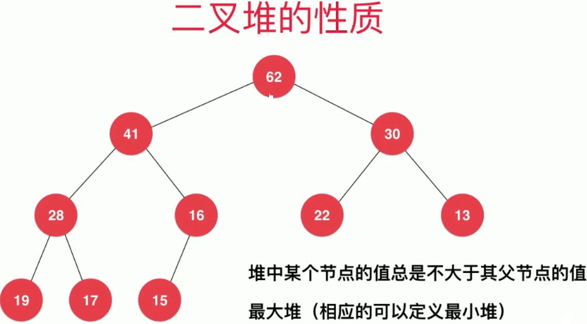
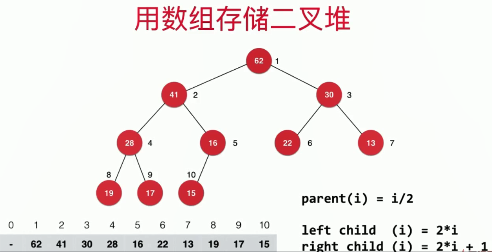
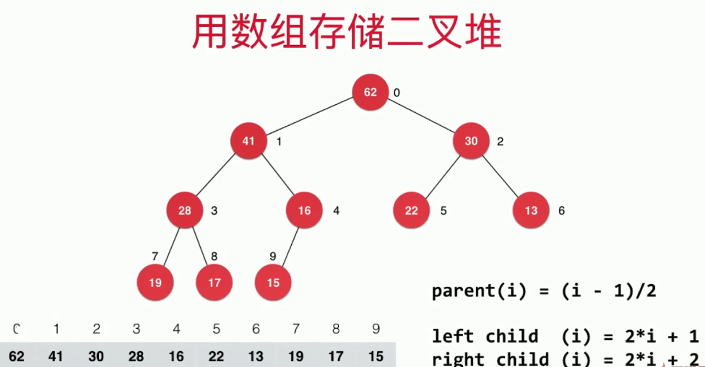
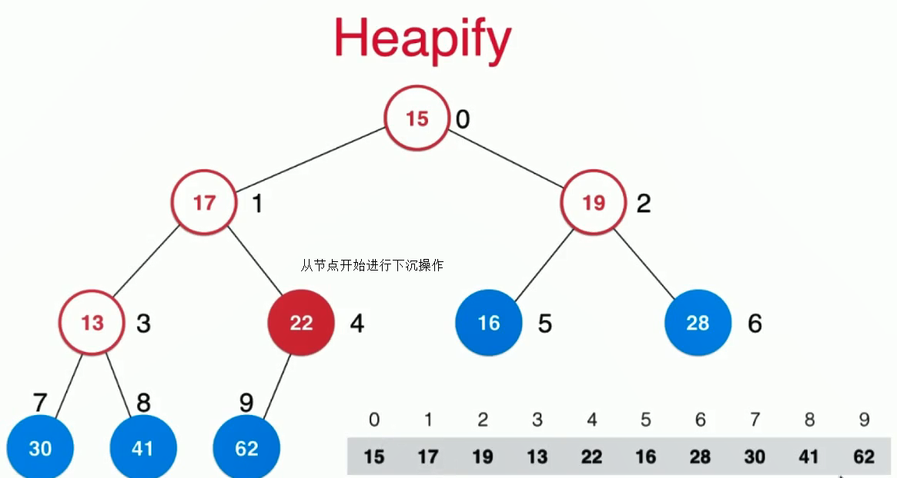

# 优先队列和堆

| 底层结构 | 入队 | 出队（获取最大元素） |
| :---: | :---: | :---: |
| 普通线性结构 | O(1) | O(n) |
| 顺序线性结构 | O(n) | O(1) |
| 堆 | O(log n)| O(log n) |

## 堆
### 二叉堆的性质

* 二叉堆是一棵**完全二叉树**
<div align="center"></div>

* 堆中的某个结点值总是不大于其父节点的值
<div align="center"></div>

### 堆的基本结构

* 使用数组存储二叉堆，下标从1开始

<div align="center"></div>

* 使用数组存储二叉堆，下标从0开始

<div align="center"></div>

白板编程**最大堆**的一些准备工作：
```java
public class MaxHeap<E extends Comparable<E>> {
    private E[] data;
    private int size;
    //记录堆中元素个数

    public MaxHeap(int capacity){
        data=(E[])new Comparable[capacity];
    }

    public MaxHeap(){
        this(10);
    }

    //返回堆中元素个数
    public int size(){
        return size;
    }

    //判断堆是否为空
    public boolean isEmpty(){
        return size==0;
    }

    //返回一个索引的父节点的索引
    private int parent(int index){
        if(index==0){
            throw new IllegalArgumentException("index-0 does not have parment");
        }
        return (index-1)/2;
    }

    //返回一个索引的左孩子节点的索引
    private int leftChild(int index){
        return 2*index+1;
    }

    //返回一个索引的左孩子节点的索引
    private int rightChild(int index){
        return 2*index+2;
    }

    private void swap(int i,int j){
        if(i<0 || i>=size || j<0 || j>=size){
            throw new IllegalArgumentException("Index is illegal");
        }
        E tmp=data[i];
        data[i]=data[j];
        data[j]=tmp;
    }

    //调整数组大小
    private void resize(int newCapacity){
        E[] newData=(E[])new Object[newCapacity];
        for(int i=0;i<size;i++){
            newData[i]=data[i];
        }
        data=newData;
    }
}
```

### 添加元素和取出元素
* 向堆中添加元素和上浮操作

```java
//向堆中添加元素
//时间复杂度 O(log n)
public void add(E e){
    if(size==data.length){
        resize(data.length*2);
    }
    data[size]=e;
    size++;
    swim(size-1);
}

//对索引为k的元素，进行上浮操作，得到一个新的最大堆
private void swim(int k){
    while(k>0 && data[k].compareTo(data[parent(k)])>0){
        swap(k,parent(k));
        k=parent(k);
    }
}
```

* 向堆中取出元素和下沉操作
```java
//查看堆中最大元素
public E findMax(){
    if(size==0){
        throw new IllegalArgumentException("Can not find max when maxheap is empty!");
    }
    return data[0];
}

//从堆中取出元素
//时间复杂度O(log n)
public E extractMax(){
    if(size==0){
        throw new IllegalArgumentException("MaxHeap is empty");
    }
    E ret=findMax();
    swap(0,size-1);
    size--;
    sink(0);
    return ret;
}

private void sink(int k){
    while (leftChild(k)<size){ //leftChild(k)<size 下标为k的元素存在左子树
        int j=leftChild(k);
        if(j+1<size &&
                data[j].compareTo(data[j+1])<0){
            j=j+1;
        }
        //j是data[leftChild(k)]和data[rightChild(k)]的较大值的下标
        if(data[k].compareTo(data[j])>=0){
            break;
        }
        swap(k,j);
        k=j;
    }
}
```

### replace和heapify

* replace：取出最大元素后，放入新元素

实现一：先extractMax(),再add()，两次O(log n)操作

实现二：直接替换堆顶元素，在进行下沉操作,一次O(log n)操作

```java
//replace：取出最大元素后，放入新元素
public E replace(E e){
    E ret=data[0];
    data[0]=e;
    sink(0);
    return ret;
}
```

* heapify：将任意数组整理成堆的形状

将数组看成一颗完全二叉树，从该二叉树的最后一个分叶子节点开始，进行下沉操作。

<div align="center"></div>

```java
//heapify：将任意数组整理成堆的形状
public MaxHeap(E[] arr){
    data=(E[])new Comparable[arr.length];
    for(int i=0;i<arr.length;i++){
        data[i]=arr[i];
    }
    size=arr.length;
    for(int i=parent(arr.length-1);i>=0;i--){
        sink(i);
    }
}
```

## 基于堆的优先队列
```java
public class PriorityQueue<E extends Comparable<E>> implements Queue<E>{
    private MaxHeap<E> maxHeap;

    public PriorityQueue(){
        maxHeap=new MaxHeap<>();
    }

    @Override
    public int getSize() {
        return maxHeap.size();
    }

    @Override
    public boolean isEmpty() {
        return maxHeap.isEmpty();
    }

    @Override
    public void enqueue(E e) {
        maxHeap.add(e);
    }

    @Override
    public E dequeue() {
        return maxHeap.extractMax();
    }

    @Override
    public E getFront() {
        return maxHeap.findMax();
    }
}
```

## Java中的PriorityQueue

LeetCode 347 Top K Frequent Elements
```java
private class Pair implements Comparable<Pair> {
    int numFreq;
    int num;
    Pair(int numFreq,int num){
        this.numFreq=numFreq;
        this.num=num;
    }

    @Override
    public int compareTo(Pair o) {
        return this.numFreq-o.numFreq;
    }
}

public List<Integer> topKFrequent(int[] nums, int k) {
    //统计数字出现的频率
    Map<Integer,Integer> map=new HashMap<>();
    for(int num:nums){
        int freq=map.get(num)==null?0:map.get(num);
        map.put(num,++freq);
    }

    //维护一个优先队列，最小堆，维护当前频率最高的元素
    PriorityQueue<Pair> priorityQueue=new PriorityQueue<>();
    //pair存的是（频率，元素）的形式
    for(Integer num:map.keySet()){
        int numFreq=map.get(num);
        if(priorityQueue.size()==k){
            if(numFreq>priorityQueue.peek().numFreq){
                priorityQueue.poll();
                priorityQueue.add(new Pair(numFreq,num));
            }
        }else{
            priorityQueue.add(new Pair(numFreq,num));
        }
    }

    List<Integer> ret=new ArrayList<>();
    while(!priorityQueue.isEmpty()){
        ret.add(priorityQueue.poll().num);
    }
    return ret;
}
```

使用匿名比较器对象改进：

```java
public List<Integer> topKFrequent(int[] nums, int k) {
    //统计数字出现的频率
    Map<Integer,Integer> map=new HashMap<>();
    for(int num:nums){
        int freq=map.get(num)==null?0:map.get(num);
        map.put(num,++freq);
    }

    //维护一个优先队列，最小堆，维护当前频率最高的元素
    PriorityQueue<Integer> priorityQueue=new PriorityQueue<>(new Comparator<Integer>() {
        @Override
        public int compare(Integer a, Integer b) {
            return map.get(a)-map.get(b);
        }
    });
    //pair存的是（频率，元素）的形式
    for(Integer num:map.keySet()){
        priorityQueue.add(num);
        if(priorityQueue.size()>k) {
            priorityQueue.poll();
        }
    }

    List<Integer> ret=new ArrayList<>();
    while(!priorityQueue.isEmpty()){
        ret.add(priorityQueue.poll());
    }
    Collections.reverse(ret);
    return ret;
}
```
