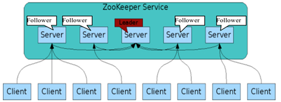

# 分布式锁

在单机场景下，可以使用语言的内置锁来实现进程同步。但是在分布式场景下，需要同步的进程可能位于不同的节点上，那么就需要使用分布式锁。

分布式锁的实现方式：

- 数据库的唯一索引
- Redis 的 SETNX 指令
- Redis 的  RedLock 算法
- 基于 Zookeeper 实现分布式锁

## 数据库的唯一索引

获得锁时向表中插入一条记录，释放锁时删除这条记录。唯一索引可以保证该记录只被插入一次，那么就可以用这个记录是否存在来判断是否存于锁定状态。

存在以下几个问题：

- 锁没有失效时间，解锁失败的话其它进程无法再获得该锁。
- 只能是非阻塞锁，插入失败直接就报错了，无法重试。
- 不可重入，已经获得锁的进程也必须重新获取锁。

## Redis 的 SETNX 指令

使用 SETNX（set if not exist）指令插入一个键值对，如果 Key 已经存在，那么会返回 False，否则插入成功并返回 True。

SETNX 指令和数据库的唯一索引类似，保证了只存在一个 Key 的键值对，那么可以用一个 Key 的键值对是否存在来判断是否存于锁定状态。

EXPIRE 指令可以为一个键值对设置一个过期时间，从而避免了数据库唯一索引实现方式中释放锁失败的问题。

## Redis 的 RedLock 算法

使用了多个 Redis 实例来实现分布式锁，这是为了保证在发生单点故障时仍然可用。

- 尝试从 N 个相互独立 Redis 实例获取锁；
- 计算获取锁消耗的时间，只有当这个时间小于锁的过期时间，并且从大多数（N / 2 + 1）实例上获取了锁，那么就认为锁获取成功了；
- 如果锁获取失败，就到每个实例上释放锁。

## 基于 Zookeeper 实现分布式锁

为了保证高可用，Zookeeper 需要以集群形态来部署，这样只要集群中大部分机器是可用的（能够容忍一定的机器故障），那么 Zookeeper 本身仍然是可用的。

客户端在使用 Zookeeper 时，需要知道集群**机器列表**，通过与集群中的某一台机器建立 TCP 连接来使用服务，客户端使用这个 TCP 连接来发送请求、获取结果、获取监听事件以及发送心跳。如果这个连接断开了，客户端可以连接到另外的机器上。

架构图如下：

客户端的**读请求可以被集群中的任意一台机器处理**，如果读请求在节点上注册了监听器，这个监听器也是由所连接的 Zookeeper 机器来处理。**写请求会同时发给其他 Zookeeper 机器并且达成一致后，请求才会成功**。

因此，随着 Zookeeper 的集群机器增多，读请求的吞吐量会提高，但写请求的吞吐量会下降。

### 1. Zookeeper 抽象模型

Zookeeper 提供了一种树形结构级的命名空间，/app1/p_1 节点的父节点为 /app1。

  
 

### 2. 节点类型

- 永久节点：不会因为会话结束或者超时而消失；
- 临时节点：如果会话结束或者超时就会消失；
- 有序节点：会在节点名的后面加一个数字后缀，并且是有序的，例如生成的有序节点为 /lock/node-0000000000，它的下一个有序节点则为 /lock/node-0000000001，以此类推。

### 3. 监听器

为一个节点注册监听器，在节点状态发生改变时，会给客户端发送消息。当前 Zookeeper 有如下 4 种事件：

- 节点创建
- 节点删除
- 节点数据修改
- 子节点变更

### 4. 分布式锁实现

- 创建一个锁目录 /lock；
- 当一个客户端需要获取锁时，在 /lock 下创建临时的且有序的子节点；
- 客户端获取 /lock 下的子节点列表，判断自己创建的子节点是否为当前子节点列表中序号最小的子节点，如果是则认为获得锁；否则**监听 /lock 子节点**，获得子节点的变更通知后重复此步骤直至获得锁；
- 执行业务代码，完成后，删除对应的子节点。

### 5. 会话超时

如果一个已经获得锁的会话超时了，因为创建的是临时节点，所以该会话对应的临时节点会被删除，其它会话就可以获得锁了。可以看到，Zookeeper 分布式锁不会出现数据库的唯一索引实现的分布式锁释放锁失败问题。

### 6. 羊群效应

一个节点未获得锁，只需要监听自己的前一个子节点，这是因为如果监听所有的子节点，那么任意一个子节点状态改变，其它所有子节点都会收到通知（羊群效应），而我们只希望它的后一个子节点收到通知。

### 7. 调整后的分布式锁实现

- 创建一个锁目录 /lock；
- 当一个客户端需要获取锁时，在 /lock 下创建临时的且有序的子节点；
- 客户端获取 /lock 下的子节点列表，判断自己创建的子节点是否为当前子节点列表中序号最小的子节点，如果是则认为获得锁；否则**监听自己的前一个子节点**，获得子节点的变更通知后重复此步骤直至获得锁；
- 执行业务代码，完成后，删除对应的子节点。

