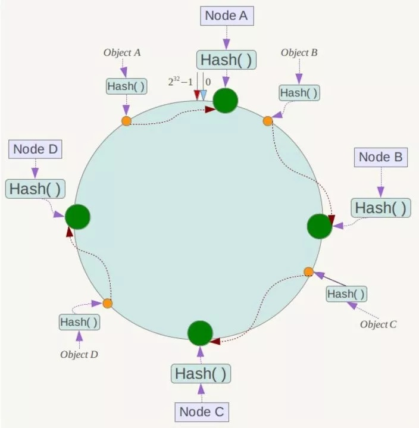
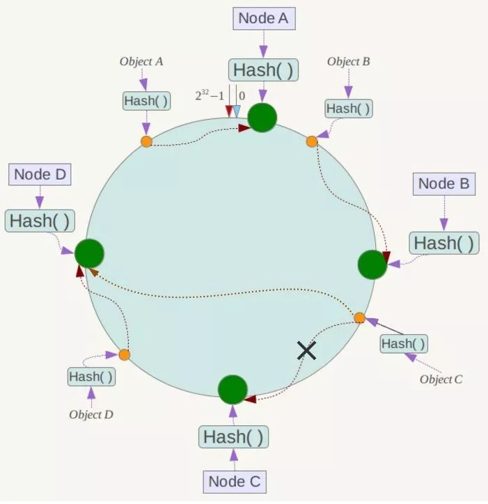
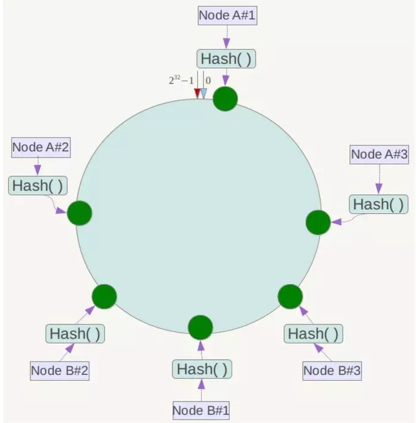

# 分布式缓存的一致性哈希算法

## Hash 算法

根据键值，首先计算哈希值，然后对节点数取模，然后映射在不同的 Master 节点上。

一旦某一个 Master 节点宕机，当请求过来时，会基于最新的剩余 Master 节点数去取模，尝试去获取数据，导致大部分的请求过来，全部无法拿到有效的缓存，大量的流量涌入数据库。

换句话说，**当服务器数量发生改变时，所有缓存在一定时间内是失效的，当应用无法从缓存中获取数据时，则会向后端数据库请求数据**。

## 一致性 Hash 算法

一致性 Hash 算法将整个哈希值空间组织成一个**虚拟的圆环**，假设某哈希函数 H 的值空间为0~2^32-1（即哈希值是一个32位无符号整形）。

整个空间按**顺时针方向**组织，圆环的正上方的点代表0，0 点右侧的第一个点代表1，以此类推，2、3 ... 2^32-1，也就是说 0 点左侧的第一个点代表 2^32-1， 0 和 2^32-1 在零点中方向重合，我们把这个由 2^32 个点组成的圆环称为**哈希环**。

将各个服务器进行哈希，具体可以选择服务器的 IP 或主机名作为关键字进行哈希，这样每台机器就能**确定其在哈希环上的位置**。假设将 4 台服务器的 IP 地址哈希后在哈希环的位置如下：

接下来使用如下算法定位数据访问到相应服务器：

将数据键使用相同的函数 Hash 计算出哈希值，并确定此数据在环上的位置，从此位置**沿环顺时针“行走”，第一台遇到的服务器就是其应该定位到的服务器**。

例如有 Object A、Object B、Object C、Object D 四个数据对象，经过哈希计算后，在哈希环上的位置如下：

根据一致性 Hash 算法：

Object A 会被定位到 Node A 上；

Object B 会被定位到 Node B 上；

Object C 会被定位到 Node C 上；

Object D 会被定位到 Node D 上。

### 容错性和可扩展性

假设 Node C 宕机，可以看到此时对象 A、B、D 不会受到影响，只有对象 C 被重定位到 Node D。

通常情况下，一致性 Hash 算法中，如果一台服务器不可用，则**受影响的数据**仅仅是此服务器到其环空间中前一台服务器（即沿着**逆时针方向行走遇到的第一台服务器**）之间数据，其它数据不会受到影响。

下面考虑另外一种情况：如果在系统中增加一台服务器 Node X。

此时对象 A、B、D 不受影响，只有对象 C 需要重定位到新的Node X 。

通常情况下，一致性 Hash 算法中，如果增加一台服务器，则受影响的数据仅仅是新服务器到其环空间中前一台服务器（即沿着逆时针方向行走遇到的第一台服务器）之间数据，其它数据也不会受到影响。

综上所述，一致性 Hash 算法对于节点的增减都只需**重定位哈希环中的一小部分数据**，具有**较好的容错性和可扩展性**。

### 数据倾斜问题

一致性 Hash 算法在服务节点太少时，容易因为节点分部不均匀而造成数据倾斜（被缓存的对象大部分集中缓存在某一台服务器上）问题。例如系统中只有 2 台服务器，如下所示：

此时必然造成大量数据集中到 Node A 上，而只有极少量会定位到 Node B 上。

为了解决这种数据倾斜问题，一致性 Hash 算法引入了**虚拟节点机制**，即**对每一个服务节点计算多个哈希**，每个计算结果位置都放置一个此服务节点，称为虚拟节点。具体做法可以在服务器 IP 或主机名的后面增加编号来实现。

例如针对上面的情况，可以为每台服务器计算 3 个虚拟节点：

- Node A 的 3 个虚拟节点："Node A#1"、"Node A#2"、"Node A#3"
- Node B 的 3 个虚拟节点："Node B#1"、"Node B#2"、"Node B#3"

进行哈希计算后，六个虚拟节点在哈希环中的位置如下：

同时**数据定位算法不变**，只是多了一步虚拟节点到实际节点的映射过程，例如"Node A#1"、"Node A#2"、"Node A#3" 这 3 个虚拟节点的数据均定位到 Node A 上，解决了服务节点少时数据倾斜的问题。

在实际应用中，通常将虚拟节点数设置为 32 甚至更大，因此即使很少的服务节点也能做到相对均匀的数据分布。
